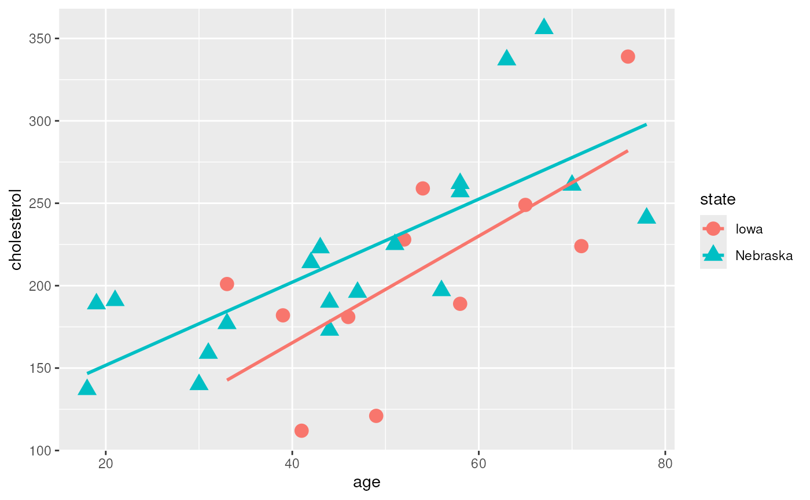
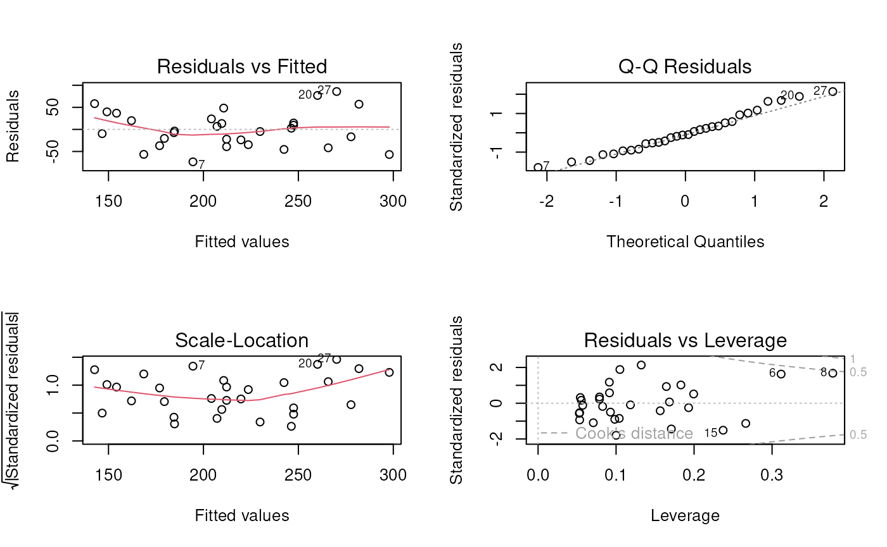

# Session 1 lab: Association between cholesterol and age

**Learning objectives**

1.  Load a tab-separated dataset into R
2.  Create a simple scatterplot using `ggplot2`
3.  Fit and analyze a multiple linear regression model
4.  Compare two nested models using a nested Analysis of Variance
    (partial F test)

**Exercises**

1.  Load the `cholesterol.tsv` dataset into R
2.  Fit linear models with age, state, and interaction terms as
    predictors
3.  Compare a simple linear regression to a multiple linear regression
    using Analysis of Variance partial F-test
4.  Use backwards selection from a full model with interactions to
    choose the best prediction model

## Load the dataset

Figure out this command using `File - Import Dataset`

[`library`](https://rdrr.io/r/base/library.html)`(`[`readr`](https://readr.tidyverse.org)`)`` ``chol`` ``<-`` `[`read_table`](https://readr.tidyverse.org/reference/read_table.html)`(``"cholesterol.tsv"``, `` `` col_types ``=`` `[`cols`](https://readr.tidyverse.org/reference/cols.html)`(``age ``=`` `[`col_double`](https://readr.tidyverse.org/reference/parse_atomic.html)`(``)``)``)`` `[`summary`](https://rdrr.io/r/base/summary.html)`(``chol``)`

    ##   cholesterol         age              state   
    ##  Min.   :112.0   Min.   :18.00   Length   :30  
    ##  1st Qu.:181.2   1st Qu.:39.50   N.unique : 2  
    ##  Median :199.0   Median :48.00   N.blank  : 0  
    ##  Mean   :213.7   Mean   :48.57   Min.nchar: 4  
    ##  3rd Qu.:247.0   3rd Qu.:58.00   Max.nchar: 8  
    ##  Max.   :356.0   Max.   :78.00

## Create a scatterplot of Cholesterol vs. Age

Take Data Science Module 1 “Data Visualization Basics” first if you
aren’t familiar with `ggplot2`:

[`library`](https://rdrr.io/r/base/library.html)`(`[`ggplot2`](https://ggplot2.tidyverse.org)`)`` `[`ggplot`](https://ggplot2.tidyverse.org/reference/ggplot.html)`(``chol``, `[`aes`](https://ggplot2.tidyverse.org/reference/aes.html)`(``x``=``age``, y``=``cholesterol``, shape``=``state``, color``=``state``)``)`` ``+`` `` `` `[`geom_point`](https://ggplot2.tidyverse.org/reference/geom_point.html)`(``size``=``4``)`` ``+`` `` `[`geom_smooth`](https://ggplot2.tidyverse.org/reference/geom_smooth.html)`(``method``=``lm``, se ``=`` ``FALSE``)`

## Fit a linear model with age, state, and interaction as predictors

`cholesterol` as the outcome variable.

`fit`` ``<-`` `[`lm`](https://rdrr.io/r/stats/lm.html)`(``cholesterol`` ``~`` ``age`` ``*`` ``state``, data``=``chol``)`` `[`summary`](https://rdrr.io/r/base/summary.html)`(``fit``)`

    ## 
    ## Call:
    ## lm(formula = cholesterol ~ age * state, data = chol)
    ## 
    ## Residuals:
    ##     Min      1Q  Median      3Q     Max 
    ## -73.480 -31.907  -4.303  22.829  85.833 
    ## 
    ## Coefficients:
    ##                   Estimate Std. Error t value Pr(>|t|)   
    ## (Intercept)        35.8112    55.1166   0.650  0.52156   
    ## age                 3.2381     1.0088   3.210  0.00352 **
    ## stateNebraska      65.4866    61.9834   1.057  0.30045   
    ## age:stateNebraska  -0.7177     1.1628  -0.617  0.54247   
    ## ---
    ## Signif. codes:  0 '***' 0.001 '**' 0.01 '*' 0.05 '.' 0.1 ' ' 1
    ## 
    ## Residual standard error: 43.14 on 26 degrees of freedom
    ## Multiple R-squared:  0.5326, Adjusted R-squared:  0.4786 
    ## F-statistic: 9.875 on 3 and 26 DF,  p-value: 0.00016

## Create an ANOVA table for this fit

[`anova`](https://rdrr.io/r/stats/anova.html)`(``fit``)`

    ## Analysis of Variance Table
    ## 
    ## Response: cholesterol
    ##           Df Sum Sq Mean Sq F value    Pr(>F)    
    ## age        1  48976   48976 26.3124 2.388e-05 ***
    ## state      1   5456    5456  2.9315   0.09877 .  
    ## age:state  1    709     709  0.3809   0.54247    
    ## Residuals 26  48395    1861                      
    ## ---
    ## Signif. codes:  0 '***' 0.001 '**' 0.01 '*' 0.05 '.' 0.1 ' ' 1

## Diagnostic plots for full model

[`par`](https://rdrr.io/r/graphics/par.html)`(``mfrow``=`[`c`](https://rdrr.io/r/base/c.html)`(``2``, ``2``)``)`` `[`plot`](https://rdrr.io/r/graphics/plot.default.html)`(``fit``)`

## Partial F-test for two models

`fit1`` ``<-`` `[`lm`](https://rdrr.io/r/stats/lm.html)`(``cholesterol`` ``~`` ``state``, data``=``chol``)`` ``fit2`` ``<-`` `[`lm`](https://rdrr.io/r/stats/lm.html)`(``cholesterol`` ``~`` ``state`` ``+`` ``age``, data ``=`` ``chol``)`` `[`anova`](https://rdrr.io/r/stats/anova.html)`(``fit1``, ``fit2``)`

    ## Analysis of Variance Table
    ## 
    ## Model 1: cholesterol ~ state
    ## Model 2: cholesterol ~ state + age
    ##   Res.Df    RSS Df Sum of Sq      F    Pr(>F)    
    ## 1     28 102924                                  
    ## 2     27  49104  1     53820 29.593 9.361e-06 ***
    ## ---
    ## Signif. codes:  0 '***' 0.001 '**' 0.01 '*' 0.05 '.' 0.1 ' ' 1

## Backwards selection to select the best prediction model

[`library`](https://rdrr.io/r/base/library.html)`(`[`MASS`](http://www.stats.ox.ac.uk/pub/MASS4/)`)`` ``fit`` ``<-`` `[`lm`](https://rdrr.io/r/stats/lm.html)`(``cholesterol`` ``~`` ``age`` ``*`` ``state``, data``=``chol``)`` ``step`` ``<-`` `[`stepAIC`](https://rdrr.io/pkg/MASS/man/stepAIC.html)`(``fit``, direction ``=`` ``"backward"``)`

    ## Start:  AIC=229.58
    ## cholesterol ~ age * state
    ## 
    ##             Df Sum of Sq   RSS    AIC
    ## - age:state  1    709.05 49104 228.01
    ## <none>                   48395 229.58
    ## 
    ## Step:  AIC=228.01
    ## cholesterol ~ age + state
    ## 
    ##         Df Sum of Sq    RSS    AIC
    ## <none>                49104 228.01
    ## - state  1      5456  54560 229.18
    ## - age    1     53820 102924 248.22

AIC = *Akaike’s Information Criterion*
