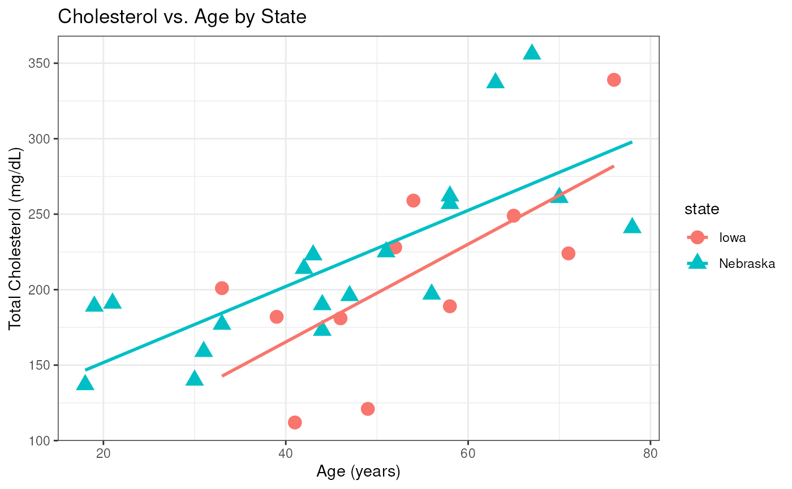

# Session 1 lab: Association between cholesterol and age

**Learning objectives**

1.  Download and load a local tab-separated dataset (`cholesterol.tsv`)
    into R
2.  Create exploratory scatterplots with regression lines using
    `ggplot2`
3.  Fit and interpret multiple linear regression models with interaction
    terms
4.  Evaluate regression assumptions using diagnostic residual plots
5.  Compare nested models using Analysis of Variance (partial F-test)

## Downloading and Locating the Data File

To practice loading datasets from your local machine, download the
`cholesterol.tsv` data file before proceeding:

- **Direct Download Link:**
  [cholesterol.tsv](https://raw.githubusercontent.com/waldronbios2/cunybios2/main/session1/vignettes/cholesterol.tsv)
- **GitHub Repository Location:** Inside the `session1/vignettes/`
  folder of the course repository.

#### Steps to download and set up:

1.  Right-click the link above and choose **“Save Link As…”** (or
    **“Download Linked File As…”**) to save `cholesterol.tsv` into your
    R working directory.

2.  In R / RStudio, you can check your current working directory with:

    [`getwd`](https://rdrr.io/r/base/getwd.html)`(``)`

3.  Alternatively, you can download the file directly into your working
    directory from R:

    [`download.file`](https://rdrr.io/r/utils/download.file.html)`(`` `` url ``=`` ``"https://raw.githubusercontent.com/waldronbios2/cunybios2/main/session1/vignettes/cholesterol.tsv"``,`` `` destfile ``=`` ``"cholesterol.tsv"`` ``)`

## Load the dataset

You can practice loading this file using RStudio’s graphical helper
(**File → Import Dataset → From Text (readr)…**) or by writing the code
directly using the `readr` package:

[`library`](https://rdrr.io/r/base/library.html)`(`[`readr`](https://readr.tidyverse.org)`)`` ``chol`` ``<-`` `[`read_tsv`](https://readr.tidyverse.org/reference/read_delim.html)`(``"cholesterol.tsv"``, `` `` col_types ``=`` `[`cols`](https://readr.tidyverse.org/reference/cols.html)`(`` `` cholesterol ``=`` `[`col_double`](https://readr.tidyverse.org/reference/parse_atomic.html)`(``)``,`` `` age ``=`` `[`col_double`](https://readr.tidyverse.org/reference/parse_atomic.html)`(``)``,`` `` state ``=`` `[`col_factor`](https://readr.tidyverse.org/reference/parse_factor.html)`(``)`` `` ``)``)`` `[`summary`](https://rdrr.io/r/base/summary.html)`(``chol``)`

    ##   cholesterol         age             state   
    ##  Min.   :112.0   Min.   :18.00   Iowa    :11  
    ##  1st Qu.:181.2   1st Qu.:39.50   Nebraska:19  
    ##  Median :199.0   Median :48.00                
    ##  Mean   :213.7   Mean   :48.57                
    ##  3rd Qu.:247.0   3rd Qu.:58.00                
    ##  Max.   :356.0   Max.   :78.00

## Create a scatterplot of Cholesterol vs. Age

Explore the relationship between age and cholesterol levels, stratified
by state:

[`library`](https://rdrr.io/r/base/library.html)`(`[`ggplot2`](https://ggplot2.tidyverse.org)`)`` `[`ggplot`](https://ggplot2.tidyverse.org/reference/ggplot.html)`(``chol``, `[`aes`](https://ggplot2.tidyverse.org/reference/aes.html)`(``x ``=`` ``age``, y ``=`` ``cholesterol``, shape ``=`` ``state``, color ``=`` ``state``)``)`` ``+`` `` `` `[`geom_point`](https://ggplot2.tidyverse.org/reference/geom_point.html)`(``size ``=`` ``4``)`` ``+`` `` `[`geom_smooth`](https://ggplot2.tidyverse.org/reference/geom_smooth.html)`(``method ``=`` ``lm``, se ``=`` ``FALSE``)`` ``+`` `` `[`theme_bw`](https://ggplot2.tidyverse.org/reference/ggtheme.html)`(``)`` ``+`` `` `[`labs`](https://ggplot2.tidyverse.org/reference/labs.html)`(`` `` title ``=`` ``"Cholesterol vs. Age by State"``,`` `` x ``=`` ``"Age (years)"``,`` `` y ``=`` ``"Total Cholesterol (mg/dL)"`` `` ``)`

## Fit a linear model with age, state, and interaction

Fit a multiple linear regression model with `cholesterol` as the
continuous outcome, and `age`, `state`, and their interaction
(`age * state`) as predictors:

`fit`` ``<-`` `[`lm`](https://rdrr.io/r/stats/lm.html)`(``cholesterol`` ``~`` ``age`` ``*`` ``state``, data ``=`` ``chol``)`` `[`summary`](https://rdrr.io/r/base/summary.html)`(``fit``)`

    ## 
    ## Call:
    ## lm(formula = cholesterol ~ age * state, data = chol)
    ## 
    ## Residuals:
    ##     Min      1Q  Median      3Q     Max 
    ## -73.480 -31.907  -4.303  22.829  85.833 
    ## 
    ## Coefficients:
    ##                   Estimate Std. Error t value Pr(>|t|)   
    ## (Intercept)        35.8112    55.1166   0.650  0.52156   
    ## age                 3.2381     1.0088   3.210  0.00352 **
    ## stateNebraska      65.4866    61.9834   1.057  0.30045   
    ## age:stateNebraska  -0.7177     1.1628  -0.617  0.54247   
    ## ---
    ## Signif. codes:  0 '***' 0.001 '**' 0.01 '*' 0.05 '.' 0.1 ' ' 1
    ## 
    ## Residual standard error: 43.14 on 26 degrees of freedom
    ## Multiple R-squared:  0.5326, Adjusted R-squared:  0.4786 
    ## F-statistic: 9.875 on 3 and 26 DF,  p-value: 0.00016

## Create an ANOVA table for this fit

[`anova`](https://rdrr.io/r/stats/anova.html)`(``fit``)`

    ## Analysis of Variance Table
    ## 
    ## Response: cholesterol
    ##           Df Sum Sq Mean Sq F value    Pr(>F)    
    ## age        1  48976   48976 26.3124 2.388e-05 ***
    ## state      1   5456    5456  2.9315   0.09877 .  
    ## age:state  1    709     709  0.3809   0.54247    
    ## Residuals 26  48395    1861                      
    ## ---
    ## Signif. codes:  0 '***' 0.001 '**' 0.01 '*' 0.05 '.' 0.1 ' ' 1

## Diagnostic plots for the full model

Examine the standard regression diagnostic plots (Residuals vs Fitted,
Normal Q-Q, Scale-Location, and Residuals vs Leverage):

[`par`](https://rdrr.io/r/graphics/par.html)`(``mfrow ``=`` `[`c`](https://rdrr.io/r/base/c.html)`(``2``, ``2``)``)`` `[`plot`](https://rdrr.io/r/graphics/plot.default.html)`(``fit``)`

## Partial F-test for nested models

Compare a simpler model containing only `state` against a model
containing both `state` and `age`:

`fit1`` ``<-`` `[`lm`](https://rdrr.io/r/stats/lm.html)`(``cholesterol`` ``~`` ``state``, data ``=`` ``chol``)`` ``fit2`` ``<-`` `[`lm`](https://rdrr.io/r/stats/lm.html)`(``cholesterol`` ``~`` ``state`` ``+`` ``age``, data ``=`` ``chol``)`` `[`anova`](https://rdrr.io/r/stats/anova.html)`(``fit1``, ``fit2``)`

    ## Analysis of Variance Table
    ## 
    ## Model 1: cholesterol ~ state
    ## Model 2: cholesterol ~ state + age
    ##   Res.Df    RSS Df Sum of Sq      F    Pr(>F)    
    ## 1     28 102924                                  
    ## 2     27  49104  1     53820 29.593 9.361e-06 ***
    ## ---
    ## Signif. codes:  0 '***' 0.001 '**' 0.01 '*' 0.05 '.' 0.1 ' ' 1

------------------------------------------------------------------------

## Exercises

Now apply what you’ve learned to answer the following questions:

#### Question 1: Testing for Interaction

Fit an additive model (`fit_additive`) without the interaction term:

1.  Use `anova(fit_additive, fit)` to conduct a partial F-test comparing
    the additive model to the interaction model.

2.  Based on the p-value, is there statistically significant evidence
    that the slope (effect of age on cholesterol) differs between Iowa
    and Nebraska? Which model would you prefer?

#### Question 2: Model Interpretation & Prediction

Using the additive model (`fit_additive`):

1.  Interpret the regression coefficient for `age`: what is the
    estimated change in mean cholesterol for every 1-year increase in
    age, holding state constant?
2.  What is the estimated difference in mean cholesterol between
    residents of Nebraska and Iowa of the same age?
3.  Using the [`predict()`](https://rdrr.io/r/stats/predict.html)
    function, predict the expected cholesterol level for:
    - A 50-year-old living in Iowa
    - A 50-year-old living in Nebraska

*Hint:*

`new_data`` ``<-`` `[`data.frame`](https://rdrr.io/r/base/data.frame.html)`(`` `` age ``=`` `[`c`](https://rdrr.io/r/base/c.html)`(``50``, ``50``)``,`` `` state ``=`` `[`factor`](https://rdrr.io/r/base/factor.html)`(`[`c`](https://rdrr.io/r/base/c.html)`(``"Iowa"``, ``"Nebraska"``)``, levels ``=`` `[`levels`](https://rdrr.io/r/base/levels.html)`(``chol``$``state``)``)`` ``)`` `[`predict`](https://rdrr.io/r/stats/predict.html)`(``fit_additive``, newdata ``=`` ``new_data``)`

#### Question 3: Residual Diagnostics

Generate diagnostic plots for the additive model (`plot(fit_additive)`).
Do the assumptions of linearity, equal variance (homoscedasticity), and
normality of residuals appear reasonably satisfied?
