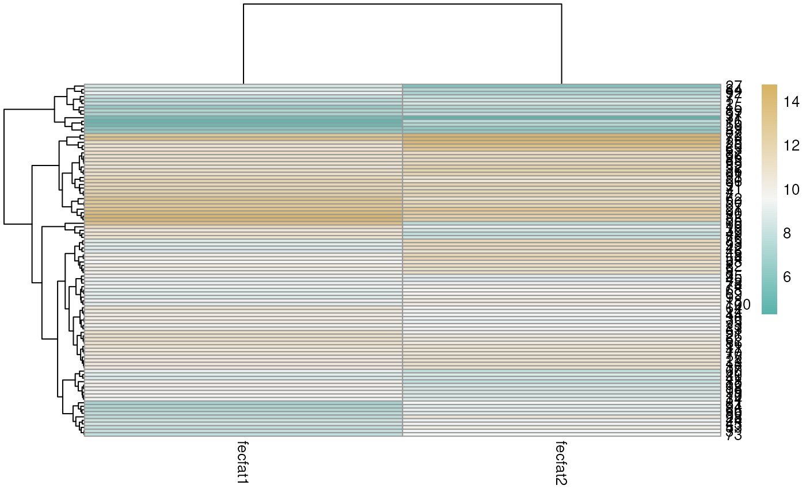
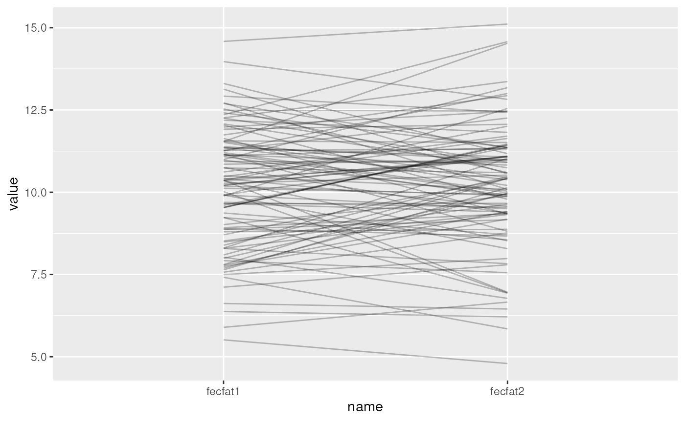
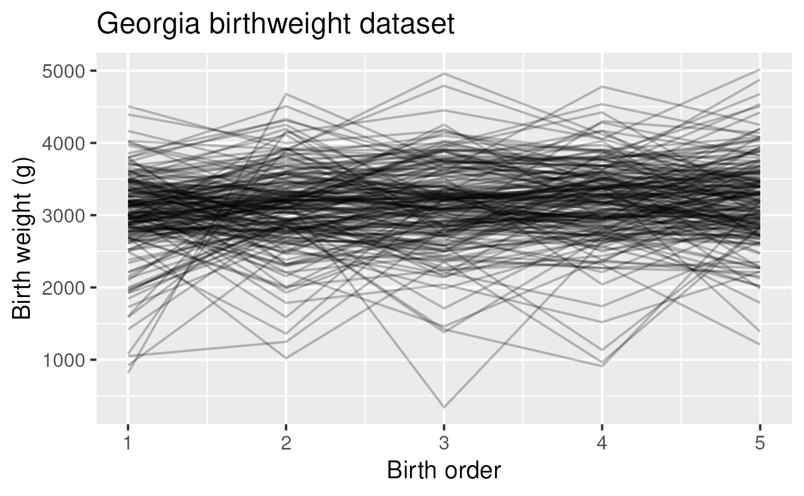
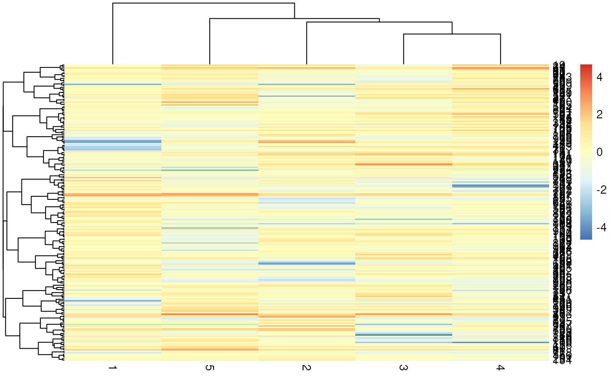

# Session 10 lab exercise: Repeated Measures and Longitudinal Analysis II

**Learning objectives**

1.  Gain an intuitive understanding of ICC through simulated data
2.  Simulate correlated grouped data
3.  Use a heatmap and spaghetti plot to visualize correlated grouped
    data
4.  Create a custom color-blind friendly palette for any plot using
    <https://colorbrewer2.org/> and the RColorBrewer library
5.  Fit random and mixed-effects models to correlated grouped data
6.  Make QQ plots for mixed-effects models
7.  Calculate ICC from a random or mixed-effects model
8.  Fit a population average model, aka marginal model, using GEE

**Exercises**

1.  Simulation of correlated grouped data
2.  Create a heatmap of simulated data to visualize the group effect
3.  Create a spaghetti plot of the simulated data to visualize the group
    effect
4.  Fit a random effects model with no covariates and a random
    intercept. Does it recover the group and residual variances you
    simulated?
5.  Estimate ICC from the model above. Is it what you expected from the
    group and residual variances you simulated?
6.  Estimate ICC simply by calculating the correlation between fecfat1
    and fecfat2. Is it similar to the estimate above?
7.  Load and do basic cleaning of the Georgia Birthweights dataset.
8.  Make a boxplot and spaghetti plot for the Georgia Birthweights
    dataset
9.  Test the null hypotheses that baseline birth weights do not vary by
    mother
10. Create QQ plots of residuals and random intercepts for this model.
11. Test the null hypotheses that the effect of birth order not modified
    by mother’s age at first birth or weight of first infant.
12. Repeat above hypothesis tests using GEE

## Simulation of correlated grouped data

Simulate a dataset with two fecal fat measurements on each of `n` study
subjects, where the measurement is the sum of a subject mean plus random
measurement error. Subject means are distributed
$`N(10, \sigma_{subj})`$ and measurement errors are distributed
$`N(0, \sigma_{resid})`$. Start with the following values:

`sigma_subj`` ``<-`` `[`sqrt`](https://rdrr.io/r/base/MathFun.html)`(``3``)`` ``sigma_resid`` ``<-`` ``1`` ``n`` ``<-`` ``100`

[`library`](https://rdrr.io/r/base/library.html)`(`[`tidyverse`](https://tidyverse.tidyverse.org)`)`

    ## ── Attaching core tidyverse packages ──────────────────────── tidyverse 2.0.0 ──
    ## ✔ dplyr     1.2.1     ✔ readr     2.2.0
    ## ✔ forcats   1.0.1     ✔ stringr   1.6.0
    ## ✔ ggplot2   4.0.3     ✔ tibble    3.3.1
    ## ✔ lubridate 1.9.5     ✔ tidyr     1.3.2
    ## ✔ purrr     1.2.2     
    ## ── Conflicts ────────────────────────────────────────── tidyverse_conflicts() ──
    ## ✖ dplyr::filter() masks stats::filter()
    ## ✖ dplyr::lag()    masks stats::lag()
    ## ℹ Use the conflicted package (<http://conflicted.r-lib.org/>) to force all conflicts to become errors

[`set.seed`](https://rdrr.io/r/base/Random.html)`(``1``)`` ``# try a different seed!`` ``df`` ``<-`` `[`tibble`](https://tibble.tidyverse.org/reference/tibble.html)`(``subj_mean ``=`` `[`rnorm`](https://rdrr.io/r/stats/Normal.html)`(``n``, mean ``=`` ``10``, sd ``=`` ``sigma_subj``)``)`` `[`%>%`](https://magrittr.tidyverse.org/reference/pipe.html)` `` `[`mutate`](https://dplyr.tidyverse.org/reference/mutate.html)`(``id ``=`` `[`factor`](https://rdrr.io/r/base/factor.html)`(``1``:``n``)``)`` `[`%>%`](https://magrittr.tidyverse.org/reference/pipe.html)` `` `[`mutate`](https://dplyr.tidyverse.org/reference/mutate.html)`(``fecfat1 ``=`` `[`rnorm`](https://rdrr.io/r/stats/Normal.html)`(``n``, mean ``=`` ``0``, sd ``=`` ``sigma_resid``)`` ``+`` ``subj_mean``)`` `[`%>%`](https://magrittr.tidyverse.org/reference/pipe.html)` `` `[`mutate`](https://dplyr.tidyverse.org/reference/mutate.html)`(``fecfat2 ``=`` `[`rnorm`](https://rdrr.io/r/stats/Normal.html)`(``n``, mean ``=`` ``0``, sd ``=`` ``sigma_resid``)`` ``+`` ``subj_mean``)`

`simfun`` ``<-`` ``function``(``n`` ``=`` ``100``,`` `` ``sigma_subj`` ``=`` `[`sqrt`](https://rdrr.io/r/base/MathFun.html)`(``3``)``,`` `` ``sigma_resid`` ``=`` ``1``)`` ``{`` `` `[`library`](https://rdrr.io/r/base/library.html)`(`[`dplyr`](https://dplyr.tidyverse.org)`)`` `` ``df`` ``<-`` `[`tibble`](https://tibble.tidyverse.org/reference/tibble.html)`(``subj_mean ``=`` `[`rnorm`](https://rdrr.io/r/stats/Normal.html)`(``n``, mean ``=`` ``10``, sd ``=`` ``sigma_subj``)``)`` `[`%>%`](https://magrittr.tidyverse.org/reference/pipe.html)` `` `[`mutate`](https://dplyr.tidyverse.org/reference/mutate.html)`(``id ``=`` `[`factor`](https://rdrr.io/r/base/factor.html)`(``1``:``n``)``)`` `[`%>%`](https://magrittr.tidyverse.org/reference/pipe.html)` `` `[`mutate`](https://dplyr.tidyverse.org/reference/mutate.html)`(``fecfat1 ``=`` `[`rnorm`](https://rdrr.io/r/stats/Normal.html)`(``n``, mean ``=`` ``0``, sd ``=`` ``sigma_resid``)`` ``+`` ``subj_mean``)`` `[`%>%`](https://magrittr.tidyverse.org/reference/pipe.html)` `` `[`mutate`](https://dplyr.tidyverse.org/reference/mutate.html)`(``fecfat2 ``=`` `[`rnorm`](https://rdrr.io/r/stats/Normal.html)`(``n``, mean ``=`` ``0``, sd ``=`` ``sigma_resid``)`` ``+`` ``subj_mean``)`` `` `[`return`](https://rdrr.io/r/base/function.html)`(``df``)`` ``}`

`simfun``(``n``=``10``, sigma_subj ``=`` `[`sqrt`](https://rdrr.io/r/base/MathFun.html)`(``3``)``)`

    ## # A tibble: 10 × 4
    ##    subj_mean id    fecfat1 fecfat2
    ##        <dbl> <fct>   <dbl>   <dbl>
    ##  1     11.5  1       12.6    12.9 
    ##  2      8.19 2        8.29    9.68
    ##  3     13.4  3       13.0    14.2 
    ##  4      9.34 4        8.68    7.47
    ##  5     12.9  5       12.8    13.3 
    ##  6     12.6  6       13.7    13.1 
    ##  7     10.1  7        9.66    9.79
    ##  8     11.0  8       10.9    11.2 
    ##  9      8.23 9        6.93    7.36
    ## 10     10.6  10      11.1    11.2

## Create a heatmap of simulated data to visualize the group effect

[`library`](https://rdrr.io/r/base/library.html)`(``pheatmap``)`` `[`library`](https://rdrr.io/r/base/library.html)`(``RColorBrewer``)`` ``mycol`` ``<-`` `[`rev`](https://rdrr.io/r/base/rev.html)`(`[`colorRampPalette`](https://rdrr.io/r/grDevices/colorRamp.html)`(``colors ``=`` `[`c`](https://rdrr.io/r/base/c.html)`(``'#d8b365'``,``'#f5f5f5'``,``'#5ab4ac'``)``)``(``100``)``)`` `[`pheatmap`](https://rdrr.io/pkg/pheatmap/man/pheatmap.html)`(`[`select`](https://dplyr.tidyverse.org/reference/select.html)`(``simfun``(``sigma_subj ``=`` `[`sqrt`](https://rdrr.io/r/base/MathFun.html)`(``3``)``, sigma_resid ``=`` ``1``)``, ``fecfat1``:``fecfat2``)``, color ``=`` ``mycol``)`



Also play with the values of `sigma_subj` and `sigma_resid` to see what
effect this has on the heatmap.

## Create a spaghetti plot of the simulated data to visualize the group effect

[`library`](https://rdrr.io/r/base/library.html)`(`[`ggplot2`](https://ggplot2.tidyverse.org)`)`` `[`set.seed`](https://rdrr.io/r/base/Random.html)`(``1``)`` `[`library`](https://rdrr.io/r/base/library.html)`(`[`tidyr`](https://tidyr.tidyverse.org)`)`` ``simfun``(``sigma_subj ``=`` `[`sqrt`](https://rdrr.io/r/base/MathFun.html)`(``3``)``, sigma_resid ``=`` `[`sqrt`](https://rdrr.io/r/base/MathFun.html)`(``1``)``)`` `[`%>%`](https://magrittr.tidyverse.org/reference/pipe.html)` `` `[`pivot_longer`](https://tidyr.tidyverse.org/reference/pivot_longer.html)`(``cols ``=`` `[`starts_with`](https://tidyselect.r-lib.org/reference/starts_with.html)`(``"fecfat"``)``)`` `[`%>%`](https://magrittr.tidyverse.org/reference/pipe.html)` `` `[`ggplot`](https://ggplot2.tidyverse.org/reference/ggplot.html)`(`[`aes`](https://ggplot2.tidyverse.org/reference/aes.html)`(``x``=``name``, y``=``value``, group``=``id``)``)`` ``+`` `[`geom_line`](https://ggplot2.tidyverse.org/reference/geom_path.html)`(``alpha ``=`` ``0.25``)`



Also play with the values of `sigma_subj` and `sigma_resid` to see what
effect this has on the spaghetti plot

## Fit a random effects model with no covariates and a random intercept. Does it recover the group and residual variances you simulated?

[`set.seed`](https://rdrr.io/r/base/Random.html)`(``1``)`` ``df_wide`` ``<-`` ``simfun``(``n ``=`` ``10000``, sigma_subj ``=`` `[`sqrt`](https://rdrr.io/r/base/MathFun.html)`(``4``)``, sigma_resid ``=`` `[`sqrt`](https://rdrr.io/r/base/MathFun.html)`(``1``)``)`` ``df`` ``<-`` `[`pivot_longer`](https://tidyr.tidyverse.org/reference/pivot_longer.html)`(``df_wide``, cols ``=`` `[`starts_with`](https://tidyselect.r-lib.org/reference/starts_with.html)`(``"fecfat"``)``)`` `[`library`](https://rdrr.io/r/base/library.html)`(`[`nlme`](https://svn.r-project.org/R-packages/trunk/nlme/)`)`

    ## 
    ## Attaching package: 'nlme'

    ## The following object is masked from 'package:dplyr':
    ## 
    ##     collapse

`fit`` ``<-`` `[`lme`](https://rdrr.io/pkg/nlme/man/lme.html)`(``value`` ``~`` ``1``, data ``=`` ``df``, random ``=`` ``~``1``|``id``)`` `[`summary`](https://rdrr.io/r/base/summary.html)`(``fit``)`

    ## Linear mixed-effects model fit by REML
    ##   Data: df 
    ##        AIC      BIC    logLik
    ##   78952.58 78976.29 -39473.29
    ## 
    ## Random effects:
    ##  Formula: ~1 | id
    ##         (Intercept)  Residual
    ## StdDev:    2.026972 0.9988032
    ## 
    ## Fixed effects:  value ~ 1 
    ##                Value Std.Error    DF  t-value p-value
    ## (Intercept) 9.988608 0.0214649 10000 465.3462       0
    ## 
    ## Standardized Within-Group Residuals:
    ##          Min           Q1          Med           Q3          Max 
    ## -2.695148176 -0.506748373  0.004597944  0.511724285  2.743338857 
    ## 
    ## Number of Observations: 20000
    ## Number of Groups: 10000

[`intervals`](https://rdrr.io/pkg/nlme/man/intervals.html)`(``fit``)`

    ## Approximate 95% confidence intervals
    ## 
    ##  Fixed effects:
    ##                lower     est.    upper
    ## (Intercept) 9.946533 9.988608 10.03068
    ## 
    ##  Random Effects:
    ##   Level: id 
    ##                   lower     est.    upper
    ## sd((Intercept)) 1.99574 2.026972 2.058692
    ## 
    ##  Within-group standard error:
    ##     lower      est.     upper 
    ## 0.9860565 0.9988032 1.0117147

## Estimate ICC from the model above. Is it what you expected from the group and residual variances you simulated?

Recall ICC for subject $`i`$, measurements $`j`$ and $`k`$:
``` math
\begin{equation*}
\begin{aligned}
ICC & = corr(x_{ij}, x_{ik}) \\
    & = \frac{\sigma_{subj}^2}{\sigma_{subj}^2 + \sigma_{\epsilon}^2} \\
    & = \frac{\tau_{00}^2}{\tau_{00}^2 + \sigma_\epsilon^2}
\end{aligned}
\end{equation*}
```

`2.026972``^``2`` ``/`` ``(``2.026972``^``2`` ``+`` ``0.9988031``^``2``)`

    ## [1] 0.8046291

`ICClme`` ``<-`` ``function``(``fit``)``{`` `` ``cors`` ``<-`` `[`as.numeric`](https://rdrr.io/r/base/numeric.html)`(`[`VarCorr`](https://rdrr.io/pkg/nlme/man/VarCorr.html)`(``fit``)``)`` `` ``cors``[``1``]`` ``/`` ``(``cors``[``1``]`` ``+`` ``cors``[``2``]``)`` ``}`` ``ICClme``(``fit``)`

    ## [1] 0.8046289

## Estimate ICC simply by calculating the correlation between `fecfat1` and `fecfat2`. Is it similar to the estimate above?

[`select`](https://dplyr.tidyverse.org/reference/select.html)`(``df_wide``, `[`starts_with`](https://tidyselect.r-lib.org/reference/starts_with.html)`(``"fec"``)``)`` `[`%>%`](https://magrittr.tidyverse.org/reference/pipe.html)` `[`cor`](https://rdrr.io/r/stats/cor.html)`(``)`

    ##          fecfat1  fecfat2
    ## fecfat1 1.000000 0.804624
    ## fecfat2 0.804624 1.000000

## Load and do basic cleaning of the Georgia Birthweights dataset.

1.  Fix NA values for `momage`
2.  Create a categorical age variable with cut at age \<18 vs \>=18
3.  Convert `momid` to a factor
4.  Recode the low birthweight variable to a factor, with “0” to
    “normal” as the reference group and “1” to “low”.

[`library`](https://rdrr.io/r/base/library.html)`(`[`readr`](https://readr.tidyverse.org)`)`` ``ga`` ``<-`` `[`read_csv`](https://readr.tidyverse.org/reference/read_delim.html)`(``"gababies.csv"``)`` `[`%>%`](https://magrittr.tidyverse.org/reference/pipe.html)` `` `` `[`mutate`](https://dplyr.tidyverse.org/reference/mutate.html)`(``momage ``=`` `[`na_if`](https://dplyr.tidyverse.org/reference/na_if.html)`(``momage``, ``99``)``)`` `[`%>%`](https://magrittr.tidyverse.org/reference/pipe.html)` `` `[`mutate`](https://dplyr.tidyverse.org/reference/mutate.html)`(``agebin ``=`` `[`cut`](https://rdrr.io/r/base/cut.html)`(``initage``, breaks ``=`` `[`c`](https://rdrr.io/r/base/c.html)`(``0``, ``17``, ``100``)``)``)`` `[`%>%`](https://magrittr.tidyverse.org/reference/pipe.html)` `` `` `[`mutate`](https://dplyr.tidyverse.org/reference/mutate.html)`(``momid ``=`` `[`factor`](https://rdrr.io/r/base/factor.html)`(``momid``)``)`` `[`%>%`](https://magrittr.tidyverse.org/reference/pipe.html)` `` `[`mutate`](https://dplyr.tidyverse.org/reference/mutate.html)`(``lowbrth ``=`` `[`recode_factor`](https://dplyr.tidyverse.org/reference/recode.html)`(``lowbrth``` , `0`  ```=`` ``"normal"``` , `1`  ```=`` ``"low"``)``)`

## Make a boxplot and spaghetti plot for the Georgia Birthweights dataset

[`ggplot`](https://ggplot2.tidyverse.org/reference/ggplot.html)`(``ga``, `[`aes`](https://ggplot2.tidyverse.org/reference/aes.html)`(``x ``=`` ``birthord``, y``=``bweight``, group ``=`` ``birthord``)``)`` ``+`` `` `` `[`geom_boxplot`](https://ggplot2.tidyverse.org/reference/geom_boxplot.html)`(``outlier.shape ``=`` ``NA``)`` ``+`` `` `[`geom_jitter`](https://ggplot2.tidyverse.org/reference/geom_jitter.html)`(``width``=``0.2``, alpha ``=`` ``0.25``)`` ``+`` `` `[`labs`](https://ggplot2.tidyverse.org/reference/labs.html)`(``title ``=`` ``"Georgia birthweight dataset"``)`` ``+`` `` `[`xlab`](https://ggplot2.tidyverse.org/reference/labs.html)`(``"Birth order"``)`` ``+`` `[`ylab`](https://ggplot2.tidyverse.org/reference/labs.html)`(``"Birth weight (g)"``)`` ``+`` `` `[`theme_grey`](https://ggplot2.tidyverse.org/reference/ggtheme.html)`(``base_size ``=`` ``16``)`


Figure 3: Birth weight as a function of birth order in the Georgia
birthweight dataset.

[`ggplot`](https://ggplot2.tidyverse.org/reference/ggplot.html)`(``ga``, `[`aes`](https://ggplot2.tidyverse.org/reference/aes.html)`(``x``=``birthord``, y ``=`` ``bweight``, group ``=`` ``momid``)``)`` ``+`` `` `[`geom_line`](https://ggplot2.tidyverse.org/reference/geom_path.html)`(``alpha ``=`` ``0.25``)`` ``+`` `` `[`labs`](https://ggplot2.tidyverse.org/reference/labs.html)`(``title ``=`` ``"Georgia birthweight dataset"``)`` ``+`` `` `[`xlab`](https://ggplot2.tidyverse.org/reference/labs.html)`(``"Birth order"``)`` ``+`` `[`ylab`](https://ggplot2.tidyverse.org/reference/labs.html)`(``"Birth weight (g)"``)`` ``+`` `` `[`theme_grey`](https://ggplot2.tidyverse.org/reference/ggtheme.html)`(``base_size ``=`` ``16``)`



## Test the null hypotheses that baseline birth weights do not vary by mother

[`library`](https://rdrr.io/r/base/library.html)`(`[`nlme`](https://svn.r-project.org/R-packages/trunk/nlme/)`)`` ``gafit1`` ``<-`` `[`lme`](https://rdrr.io/pkg/nlme/man/lme.html)`(``bweight`` ``~`` ``birthord``, data ``=`` ``ga``, random ``=`` ``~``1``|``momid``)`` `[`intervals`](https://rdrr.io/pkg/nlme/man/intervals.html)`(``gafit1``)`

    ## Approximate 95% confidence intervals
    ## 
    ##  Fixed effects:
    ##                  lower     est.      upper
    ## (Intercept) 2913.20418 2995.640 3078.07582
    ## birthord      27.07478   46.608   66.14122
    ## 
    ##  Random Effects:
    ##   Level: momid 
    ##                    lower     est.    upper
    ## sd((Intercept)) 323.1724 367.2676 417.3794
    ## 
    ##  Within-group standard error:
    ##    lower     est.    upper 
    ## 423.7298 445.0228 467.3859

## Create QQ plots of residuals and random intercepts for this model.

[`qqnorm`](https://rdrr.io/r/stats/qqnorm.html)`(`[`residuals`](https://rdrr.io/r/stats/residuals.html)`(``gafit1``, type ``=`` ``"pearson"``)``, main ``=`` ``"Pearson residuals QQ plot"``)`` `[`qqline`](https://rdrr.io/r/stats/qqnorm.html)`(`[`residuals`](https://rdrr.io/r/stats/residuals.html)`(``gafit1``, type ``=`` ``"pearson"``)``)`


[`qqnorm`](https://rdrr.io/r/stats/qqnorm.html)`(`[`ranef`](https://rdrr.io/pkg/nlme/man/random.effects.html)`(``gafit1``)``[``, ``1``]``, main ``=`` ``"Random Intercepts QQ plot"``)`` `[`qqline`](https://rdrr.io/r/stats/qqnorm.html)`(`[`ranef`](https://rdrr.io/pkg/nlme/man/random.effects.html)`(``gafit1``)``[``, ``1``]``)`


## Test the null hypotheses that the effect of birth order is not modified by mother’s age at first birth or weight of first infant.

`gafit2`` ``<-`` `[`lme`](https://rdrr.io/pkg/nlme/man/lme.html)`(``bweight`` ``~`` ``birthord``*``agebin``, data ``=`` ``ga``, random ``=`` ``~``1``|``momid``)`` `[`summary`](https://rdrr.io/r/base/summary.html)`(``gafit2``)`

    ## Linear mixed-effects model fit by REML
    ##   Data: ga 
    ##        AIC      BIC    logLik
    ##   15303.27 15332.69 -7645.635
    ## 
    ## Random effects:
    ##  Formula: ~1 | momid
    ##         (Intercept) Residual
    ## StdDev:    364.4842 444.9955
    ## 
    ## Fixed effects:  bweight ~ birthord * agebin 
    ##                             Value Std.Error  DF  t-value p-value
    ## (Intercept)             2978.3873  52.75519 798 56.45676  0.0000
    ## birthord                  38.6175  12.53633 798  3.08044  0.0021
    ## agebin(17,100]            46.6289  86.72900 198  0.53764  0.5914
    ## birthord:agebin(17,100]   21.5961  20.60960 798  1.04786  0.2950
    ##  Correlation: 
    ##                         (Intr) brthrd a(17,1
    ## birthord                -0.713              
    ## agebin(17,100]          -0.608  0.434       
    ## birthord:agebin(17,100]  0.434 -0.608 -0.713
    ## 
    ## Standardized Within-Group Residuals:
    ##         Min          Q1         Med          Q3         Max 
    ## -5.24250712 -0.43312124  0.04338865  0.53148398  3.30316603 
    ## 
    ## Number of Observations: 1000
    ## Number of Groups: 200

`gafit3`` ``<-`` `[`lme`](https://rdrr.io/pkg/nlme/man/lme.html)`(``bweight`` ``~`` ``birthord``*``initwght``, data ``=`` ``ga``, random ``=`` ``~``1``|``momid``)`` `[`summary`](https://rdrr.io/r/base/summary.html)`(``gafit3``)`

    ## Linear mixed-effects model fit by REML
    ##   Data: ga 
    ##        AIC     BIC    logLik
    ##   15198.28 15227.7 -7593.138
    ## 
    ## Random effects:
    ##  Formula: ~1 | momid
    ##         (Intercept) Residual
    ## StdDev:     274.526  431.555
    ## 
    ## Fixed effects:  bweight ~ birthord * initwght 
    ##                      Value Std.Error  DF   t-value p-value
    ## (Intercept)       600.3298 199.59828 798  3.007690  0.0027
    ## birthord          409.8405  51.45612 798  7.964855  0.0000
    ## initwght            0.7941   0.06499 198 12.217420  0.0000
    ## birthord:initwght  -0.1204   0.01676 798 -7.186579  0.0000
    ##  Correlation: 
    ##                   (Intr) brthrd intwgh
    ## birthord          -0.773              
    ## initwght          -0.982  0.760       
    ## birthord:initwght  0.760 -0.982 -0.773
    ## 
    ## Standardized Within-Group Residuals:
    ##          Min           Q1          Med           Q3          Max 
    ## -5.329582374 -0.455327000  0.007433181  0.531084518  4.791970708 
    ## 
    ## Number of Observations: 1000
    ## Number of Groups: 200

## Repeat above hypothesis tests using GEE

[`library`](https://rdrr.io/r/base/library.html)`(``gee``)`` ``gagee1`` ``<-`` `[`gee`](https://rdrr.io/pkg/gee/man/gee.html)`(``bweight`` ``~`` ``birthord``*``agebin``, data ``=`` ``ga``, id ``=`` ``momid``, corstr ``=`` ``"unstructured"``)`

    ## Beginning Cgee S-function, @(#) geeformula.q 4.13 98/01/27

    ## running glm to get initial regression estimate

    ##             (Intercept)                birthord          agebin(17,100] 
    ##              2978.38730                38.61746                46.62891 
    ## birthord:agebin(17,100] 
    ##                21.59605

[`summary`](https://rdrr.io/r/base/summary.html)`(``gagee1``)`

    ## 
    ##  GEE:  GENERALIZED LINEAR MODELS FOR DEPENDENT DATA
    ##  gee S-function, version 4.13 modified 98/01/27 (1998) 
    ## 
    ## Model:
    ##  Link:                      Identity 
    ##  Variance to Mean Relation: Gaussian 
    ##  Correlation Structure:     Unstructured 
    ## 
    ## Call:
    ## gee(formula = bweight ~ birthord * agebin, id = momid, data = ga, 
    ##     corstr = "unstructured")
    ## 
    ## Summary of Residuals:
    ##         Min          1Q      Median          3Q         Max 
    ## -2863.40368  -294.16890    29.24113   339.16644  1756.59632 
    ## 
    ## 
    ## Coefficients:
    ##                           Estimate Naive S.E.    Naive z Robust S.E.   Robust z
    ## (Intercept)             2978.92557   48.99654 60.7986933    45.82626 65.0047740
    ## birthord                  37.24333   12.48136  2.9839156    12.24704  3.0410073
    ## agebin(17,100]            52.18848   80.54981  0.6479032    82.95506  0.6291175
    ## birthord:agebin(17,100]   20.18655   20.51923  0.9837866    20.41810  0.9886593
    ## 
    ## Estimated Scale Parameter:  330087.7
    ## Number of Iterations:  3
    ## 
    ## Working Correlation
    ##           [,1]      [,2]      [,3]      [,4]      [,5]
    ## [1,] 1.0000000 0.2153033 0.3092689 0.2545510 0.3836927
    ## [2,] 0.2153033 1.0000000 0.4809124 0.4351138 0.3949443
    ## [3,] 0.3092689 0.4809124 1.0000000 0.6344401 0.4349807
    ## [4,] 0.2545510 0.4351138 0.6344401 1.0000000 0.4484055
    ## [5,] 0.3836927 0.3949443 0.4349807 0.4484055 1.0000000

`gagee2`` ``<-`` `[`gee`](https://rdrr.io/pkg/gee/man/gee.html)`(``bweight`` ``~`` ``birthord``*``initwght``, data ``=`` ``ga``, id ``=`` ``momid``, corstr ``=`` ``"unstructured"``)`

    ## Beginning Cgee S-function, @(#) geeformula.q 4.13 98/01/27

    ## running glm to get initial regression estimate

    ##       (Intercept)          birthord          initwght birthord:initwght 
    ##       600.3298240       409.8405317         0.7940549        -0.1204130

[`summary`](https://rdrr.io/r/base/summary.html)`(``gagee2``)`

    ## 
    ##  GEE:  GENERALIZED LINEAR MODELS FOR DEPENDENT DATA
    ##  gee S-function, version 4.13 modified 98/01/27 (1998) 
    ## 
    ## Model:
    ##  Link:                      Identity 
    ##  Variance to Mean Relation: Gaussian 
    ##  Correlation Structure:     Unstructured 
    ## 
    ## Call:
    ## gee(formula = bweight ~ birthord * initwght, id = momid, data = ga, 
    ##     corstr = "unstructured")
    ## 
    ## Summary of Residuals:
    ##         Min          1Q      Median          3Q         Max 
    ## -2748.50271  -242.04489    11.70037   278.75451  2920.36648 
    ## 
    ## 
    ## Coefficients:
    ##                      Estimate   Naive S.E.   Naive z  Robust S.E.  Robust z
    ## (Intercept)       852.1852972 168.85833158  5.046747 193.39200182  4.406518
    ## birthord          207.2267183  50.87766438  4.073039  56.85291664  3.644962
    ## initwght            0.7119308   0.05498405 12.947951   0.06172936 11.533099
    ## birthord:initwght  -0.0547416   0.01656691 -3.304274   0.01818505 -3.010253
    ## 
    ## Estimated Scale Parameter:  268548.1
    ## Number of Iterations:  7
    ## 
    ## Working Correlation
    ##             [,1]       [,2]       [,3]       [,4]        [,5]
    ## [1,]  1.00000000 -0.1644909 -0.1041232 -0.1045992 -0.02349959
    ## [2,] -0.16449093  1.0000000  0.6376520  0.5986444  0.43603797
    ## [3,] -0.10412317  0.6376520  1.0000000  0.7606906  0.41963808
    ## [4,] -0.10459919  0.5986444  0.7606906  1.0000000  0.46289783
    ## [5,] -0.02349959  0.4360380  0.4196381  0.4628978  1.00000000

## Heatmap of GA babies dataset

[`pivot_wider`](https://tidyr.tidyverse.org/reference/pivot_wider.html)`(``ga``, values_from ``=`` ``bweight``, names_from``=``birthord``, id_cols ``=`` ``momid``)`` `[`%>%`](https://magrittr.tidyverse.org/reference/pipe.html)` `` `[`select`](https://dplyr.tidyverse.org/reference/select.html)`(``-``momid``)`` `[`%>%`](https://magrittr.tidyverse.org/reference/pipe.html)` `` `[`pheatmap`](https://rdrr.io/pkg/pheatmap/man/pheatmap.html)`(``clustering_distance_rows ``=`` ``"correlation"``, clustering_distance_cols ``=`` ``"correlation"``, scale ``=`` ``"column"``)`


