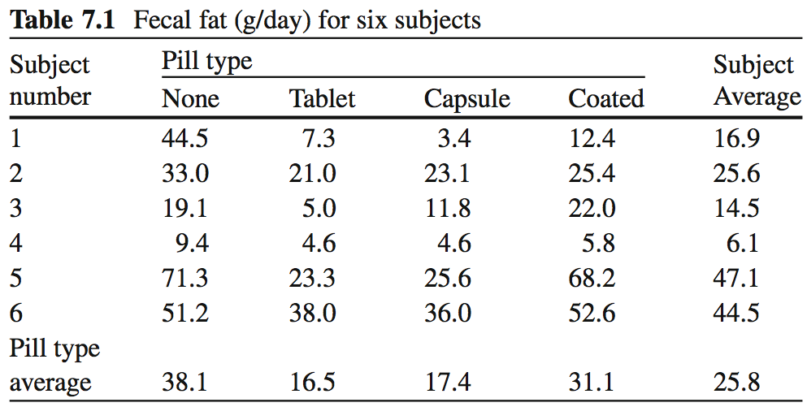
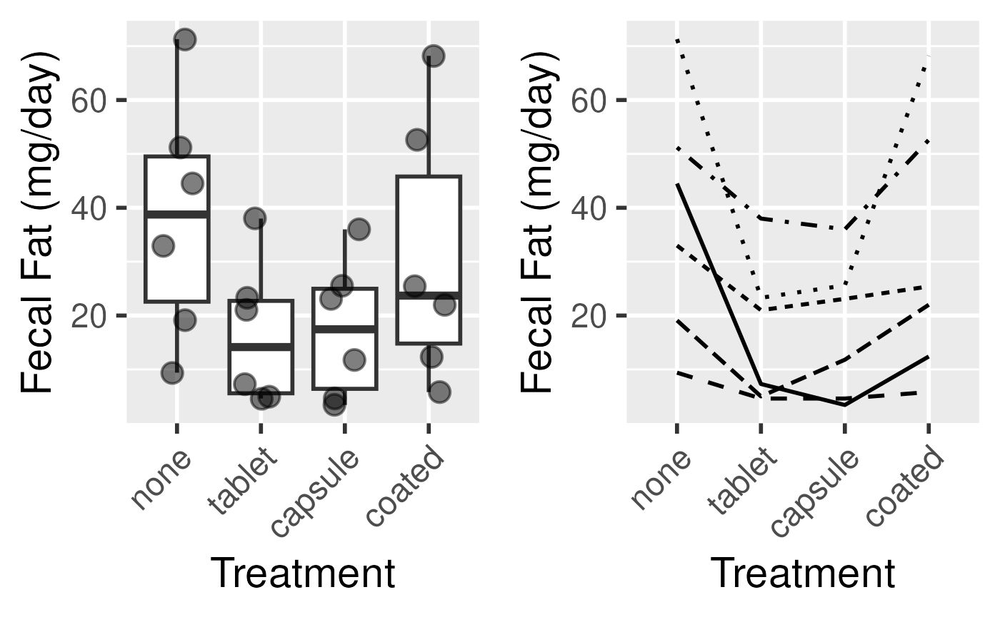
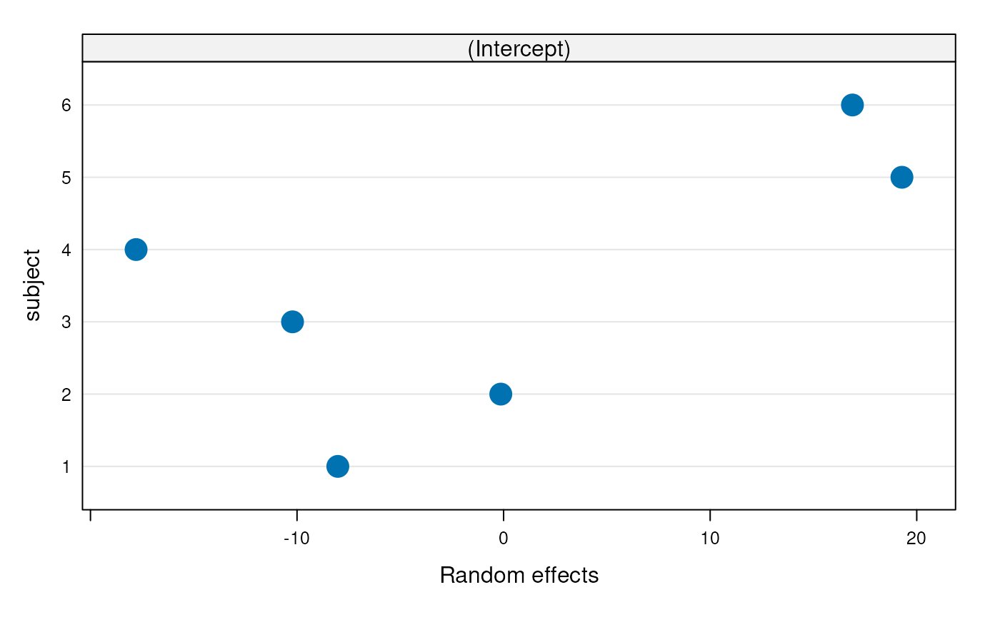
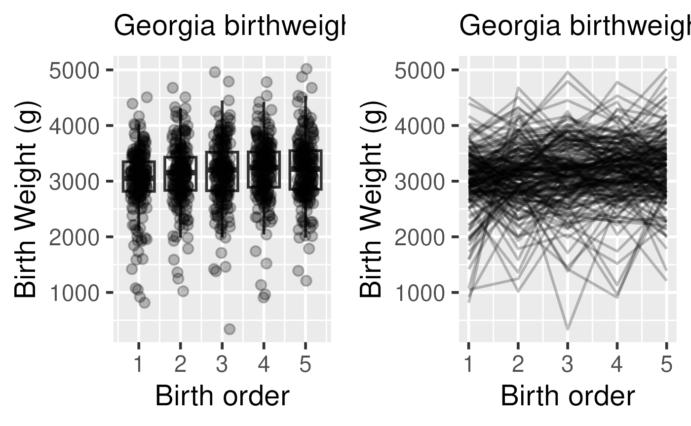
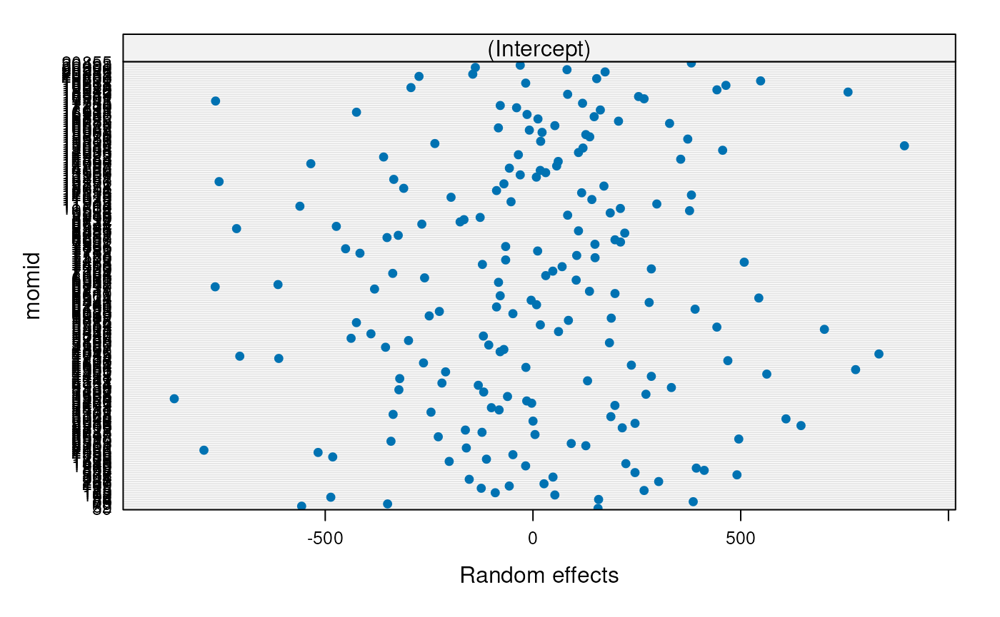

# Session 10: Repeated Measures and Longitudinal Analysis II

## Learning objectives and outline

### Learning objectives

1.  Define mixed effects models and population average models
2.  Perform model diagnostics for random effects models
3.  Interpret random intercepts and random slopes
4.  Define and perform population average models
5.  Define assumptions on correlation structure in hierarchical models
6.  Choose between hierarchical modeling strategies

### Outline

1.  Review of fecal fat dataset
2.  Summary of non-hierarchical approaches
3.  Mixed effects models
4.  Longitudinal data and the Georgia Birthweights dataset
5.  Population average models and Generalized Estimating Equations (GEE)

- Vittinghoff sections 7.2, 7.3, 7.5

## Review

### Fecal fat dataset

- Lack of digestive enzymes in the intestine can cause bowel absorption
  problems.
  - This will be indicated by excess fat in the feces.
  - Pancreatic enzyme supplements can alleviate the problem.
  - fecfat.csv: a study of fecal fat quantity (g/day) for individuals
    given each of a placebo and 3 types of pills



Fecal Fat dataset

### Fecal fat dataset

    ## Warning: Using `size` aesthetic for lines was deprecated in ggplot2 3.4.0.
    ## ℹ Please use `linewidth` instead.
    ## This warning is displayed once per session.
    ## Call `lifecycle::last_lifecycle_warnings()` to see where this warning was
    ## generated.



### Analysis strategies for hierarchical data

- Fixed effects and other non-hierarchical strategies
- Random / mixed effects models
  - model certain regression coefficients (intercept, slopes) as random
    variables
- Population average models
  - using Generalized Estimating Equations (GEE)

## Non-hierarchical analysis strategies

### Non-hierarchical analysis strategies for hierarchical data

- Analyses for each subgroup
  - e.g., look at each patient independently
  - doesn’t work at all in this example, and in general is not an
    integrated analysis of the whole data
  - could sort of work for an example with many patients per doctor, a
    few doctors
- Analysis at the highest level in the hierarchy
  - first summarize data to highest level
  - doesn’t work at all in this example
  - could sort of work for an example with few patients per doctor, many
    doctors
- Analysis on “Derived Variables”
  - consider each treatment type separately, take differences in fat
    levels between treatment/control for each patient and use paired
    t-tests
  - can work, but not for unbalanced groups
- Fixed-effects models

### When is hierarchical analysis definitely needed?

1.  the correlation structure is of interest, *e.g.* familial
    aggregation of disease, or consistency of treatment within centers
2.  we wish to “borrow strength” across the levels of a hierarchy in
    order to improve estimates
3.  dealing with unbalanced data
4.  we want to benefit from software designed for hierarchical data

## Mixed effects models

### Mixed effects models

- Model looks like two-way ANOVA:
  ``` math
  FECFAT_{ij} = \beta_0 + \beta_{subject i} SUBJECT_i + \beta_{pilltype j} PILLTYPE_j + \epsilon_{ij}
  ```
  - Assumption:
    $`\epsilon_i \stackrel{iid}{\sim} N(0, \sigma_\epsilon^2)`$
- But instead of fitting a $`\beta`$ to each individual, we assume that
  the subject effects are selected from a distribution of possible
  subject effects:
  ``` math
  FECFAT_{ij} = \beta_0 + SUBJECT_i + \beta_{pilltype j} PILLTYPE_j + \epsilon_{ij}
  ```

Where we assume: $`SUBJECT_i \stackrel{iid}{\sim} N(0, \tau_{00}^2)`$

- This is a *mixed effects* model because:
  - the “true” intercept varies randomly from patient to patient
  - the “true” (population) coefficient of treatment is fixed (the same
    for everyone)

### Fit this mixed-effects model

[`library`](https://rdrr.io/r/base/library.html)`(`[`nlme`](https://svn.r-project.org/R-packages/trunk/nlme/)`)`` ``fitmix`` ``<-`` ``nlme``::`[`lme`](https://rdrr.io/pkg/nlme/man/lme.html)`(``fecfat`` ``~`` ``pilltype``, `` `` data ``=`` ``dat``, `` `` random ``=`` ``~`` ``1`` ``|`` ``subject``)`

Note: the `lme4` package is another popular alternative

### Mixed effects model coeffients, variances, ICC

    ## Linear mixed-effects model fit by REML
    ##   Data: dat 
    ##   Log-restricted-likelihood: -84.55594
    ##   Fixed: fecfat ~ pilltype 
    ##     (Intercept)  pilltypetablet pilltypecapsule  pilltypecoated 
    ##       38.083334      -21.550001      -20.666667       -7.016668 
    ## 
    ## Random effects:
    ##  Formula: ~1 | subject
    ##         (Intercept) Residual
    ## StdDev:    15.89557 10.34403
    ## 
    ## Number of Observations: 24
    ## Number of Groups: 6

$`ICC = 15.9^2 / (15.9^2 + 10.34^2)`$ = 0.7 = 0.7.

- Recall ICC is a measure of how large the subject effect is, in
  relation to the error term
- Variances were estimated directly by the model!

### Assumptions of the mixed model

``` math
FECFAT_{ij} = \beta_0 + SUBJECT_i + \beta_{pilltype j} PILLTYPE_j + \epsilon_{ij}
```

- Normally distributed residuals as in fixed effects model:
  - $`\epsilon_i \stackrel{iid}{\sim} N(0, \sigma_\epsilon^2)`$
- Normally distributed **latent variable**:
  - $`SUBJECT_i \stackrel{iid}{\sim} N(0, \tau_{00}^2)`$

### Mixed effects model results

A plot of the random intercept:


### Mixed effects model diagnostics

\`\` 

### Mixed effects model results

    ## Linear mixed-effects model fit by REML
    ##   Data: dat 
    ##        AIC      BIC    logLik
    ##   181.1119 187.0863 -84.55594
    ## 
    ## Random effects:
    ##  Formula: ~1 | subject
    ##         (Intercept) Residual
    ## StdDev:    15.89557 10.34403
    ## 
    ## Fixed effects:  fecfat ~ pilltype 
    ##                     Value Std.Error DF   t-value p-value
    ## (Intercept)      38.08333  7.742396 15  4.918805  0.0002
    ## pilltypetablet  -21.55000  5.972127 15 -3.608430  0.0026
    ## pilltypecapsule -20.66667  5.972127 15 -3.460521  0.0035
    ## pilltypecoated   -7.01667  5.972127 15 -1.174903  0.2583
    ##  Correlation: 
    ##                 (Intr) plltypt plltypcp
    ## pilltypetablet  -0.386                 
    ## pilltypecapsule -0.386  0.500          
    ## pilltypecoated  -0.386  0.500   0.500  
    ## 
    ## Standardized Within-Group Residuals:
    ##          Min           Q1          Med           Q3          Max 
    ## -1.210052934 -0.615068039 -0.002727166  0.457105344  1.725618643 
    ## 
    ## Number of Observations: 24
    ## Number of Groups: 6

- Note: correlation of the estimator of the fixed effects
  - high correlations may (but not necessarily) be due to collinearity
  - not usually useful, not included in output of some packages

### Mixed effects model results

Inference for variance terms (and fixed effects):

    ## Approximate 95% confidence intervals
    ## 
    ##  Fixed effects:
    ##                     lower       est.     upper
    ## (Intercept)      21.58081  38.083334 54.585860
    ## pilltypetablet  -34.27929 -21.550001 -8.820714
    ## pilltypecapsule -33.39595 -20.666667 -7.937381
    ## pilltypecoated  -19.74595  -7.016668  5.712618
    ## 
    ##  Random Effects:
    ##   Level: subject 
    ##                   lower     est.    upper
    ## sd((Intercept)) 8.00117 15.89557 31.57904
    ## 
    ##  Within-group standard error:
    ##    lower     est.    upper 
    ##  7.23240 10.34403 14.79438

- Would conclude that variation of the intercept between subjects is
  non-zero
  - not attributable to within-subject variation

## Longitudinal data

### Longitudinal data

- Interested in the change in the value of a variable within a “subject”
- Collect data repeatedly through time.
- For hierarchical longitudinal analysis to be effective, before/after
  measurements need to be positively correlated

### Longitudinal data

- Interested in the change in the value of a variable within a “subject”
- Collect data repeatedly through time.
- For hierarchical longitudinal analysis to be effective, before/after
  measurements need to be positively correlated

### Longitudinal data examples

- Example 1: a measure of sleepiness before and after administration of
  treatment or placebo
- Example 2: Study of Osteoporotic Fractores (SOF dataset)
  - 9,704 women tracked with clinical visits every two years
  - Bone Mineral Density (BMD), Body Mass Index (BMI), many other
    variables
- Questions for Example 2:
  1.  Is change in BMD related to age at menopause? This is a
      time-invariant predictor, age at menopause, with time-dependent
      changes in the outcome, BMD.
  2.  Is change in BMD related to change in BMI? This is an analysis
      relating a time-varying predictor, BMI, with changes in the
      outcome, BMD. BMI varies quite a lot between women, but also
      varies within a woman over time.

### Longitudinal data examples

- birthweight and birth order
- provides birthweights and order of infants from mothers who had 5
  children in Georgia
  - interested in whether birthweight of babies changes with order
  - whether this difference depends on the *mother’s age at first
    childbirth* or on the *weight of initial baby*.

### Georgia Birthweights dataset

Boxplot and “Spaghetti” plot:


### Georgia Birthweights dataset

- Does baseline birth weight vary by mother?
  - random intercept

[`library`](https://rdrr.io/r/base/library.html)`(`[`nlme`](https://svn.r-project.org/R-packages/trunk/nlme/)`)`` ``gafit1`` ``<-`` `[`lme`](https://rdrr.io/pkg/nlme/man/lme.html)`(``bweight`` ``~`` ``birthord``, data``=``ga``, `` `` random``=``~``1``|``momid``)`

Note: there are not enough degrees of freedom to also fit a random
coefficient for birth order

### Georgia Birthweights dataset



### Georgia Birthweights dataset

[`summary`](https://rdrr.io/r/base/summary.html)`(``gafit1``)`

    ## Linear mixed-effects model fit by REML
    ##   Data: ga 
    ##        AIC      BIC    logLik
    ##   15321.65 15341.28 -7656.826
    ## 
    ## Random effects:
    ##  Formula: ~1 | momid
    ##         (Intercept) Residual
    ## StdDev:    367.2676 445.0228
    ## 
    ## Fixed effects:  bweight ~ birthord 
    ##                Value Std.Error  DF  t-value p-value
    ## (Intercept) 2995.640  41.99615 799 71.33130       0
    ## birthord      46.608   9.95101 799  4.68374       0
    ##  Correlation: 
    ##          (Intr)
    ## birthord -0.711
    ## 
    ## Standardized Within-Group Residuals:
    ##         Min          Q1         Med          Q3         Max 
    ## -5.26801358 -0.43683345  0.05028638  0.52703429  3.30770805 
    ## 
    ## Number of Observations: 1000
    ## Number of Groups: 200

### Georgia Birthweights dataset

[`intervals`](https://rdrr.io/pkg/nlme/man/intervals.html)`(``gafit1``, which ``=`` ``"all"``)`

    ## Approximate 95% confidence intervals
    ## 
    ##  Fixed effects:
    ##                  lower     est.      upper
    ## (Intercept) 2913.20418 2995.640 3078.07582
    ## birthord      27.07478   46.608   66.14122
    ## 
    ##  Random Effects:
    ##   Level: momid 
    ##                    lower     est.    upper
    ## sd((Intercept)) 323.1724 367.2676 417.3794
    ## 
    ##  Within-group standard error:
    ##    lower     est.    upper 
    ## 423.7298 445.0228 467.3859

- Does baseline birth weight vary by mother?
  - yes: the subject variance is significantly greater than zero
  - The variance between mothers is too much to be explained by
    within-mother variation in birth weights

## Population Average Models

### Population Average Models

- An alternative to random / mixed-effects models that is more robust to
  assumptions of:
  - distribution of random effects
  - correlation structure
- Estimates correlation structure from the data rather than assuming
  normality
  - Requires more clusters than observations per cluster
- Estimates regression coefficients and robust standard errors
  - commonly by Generalized Estimating Equations (GEE)

### Population Average Models

- Compare mixed model multiple linear regression:
  ``` math
  E[Y_{ij}|X_{ij}] = \beta_0 + \alpha_{0j} + \beta_1 X_{ij}, \alpha_{0j} \sim N(0, \sigma)
  ```
  for subject $`i`$ in group $`j`$.

- to a population average model:
  ``` math
  E[Y_{ij}|X_{ij}] = \beta_0^* + \beta_1^* X_{ij}
  ```

- Interpretations of $`\beta^*`$ and $`\beta`$ are equivalent

- Numerically equivalent for linear and log-linear models (if
  specification of mixed model is correct), but not for logistic link.

### Fit a population average model

`gafit.gee`` ``<-`` ``gee``::`[`gee`](https://rdrr.io/pkg/gee/man/gee.html)`(``bweight`` ``~`` ``birthord``,`` `` corstr ``=`` ``"exchangeable"``,`` `` id ``=`` ``momid``,`` `` data ``=`` ``ga``)`

### 

[`summary`](https://rdrr.io/r/base/summary.html)`(``gafit.gee``)`

    ## 
    ##  GEE:  GENERALIZED LINEAR MODELS FOR DEPENDENT DATA
    ##  gee S-function, version 4.13 modified 98/01/27 (1998) 
    ## 
    ## Model:
    ##  Link:                      Identity 
    ##  Variance to Mean Relation: Gaussian 
    ##  Correlation Structure:     Exchangeable 
    ## 
    ## Call:
    ## gee::gee(formula = bweight ~ birthord, id = momid, data = ga, 
    ##     corstr = "exchangeable")
    ## 
    ## Summary of Residuals:
    ##       Min        1Q    Median        3Q       Max 
    ## -2795.464  -299.126    48.840   341.144  1824.536 
    ## 
    ## 
    ## Coefficients:
    ##             Estimate Naive S.E.   Naive z Robust S.E.  Robust z
    ## (Intercept) 2995.640  41.973695 71.369462   38.808066 77.191170
    ## birthord      46.608   9.958128  4.680398    9.996256  4.662546
    ## 
    ## Estimated Scale Parameter:  332525.3
    ## Number of Iterations:  1
    ## 
    ## Working Correlation
    ##           [,1]      [,2]      [,3]      [,4]      [,5]
    ## [1,] 1.0000000 0.4035684 0.4035684 0.4035684 0.4035684
    ## [2,] 0.4035684 1.0000000 0.4035684 0.4035684 0.4035684
    ## [3,] 0.4035684 0.4035684 1.0000000 0.4035684 0.4035684
    ## [4,] 0.4035684 0.4035684 0.4035684 1.0000000 0.4035684
    ## [5,] 0.4035684 0.4035684 0.4035684 0.4035684 1.0000000

### Correlation assumptions for GEE

Must make some assumption about the form of correlation among grouped
observations. Some options are:

- Independence:
  - no correlation between measurements within group
- Exchangeable:
  - all pairwise correlations are the same (in large-N limit)
  - nothing distinguishes one member of a cluster from another
  - appropriate in the absence of other data structures such as
    measurements taken through time or space
- Auto-regressive (*AR-M*):
  - observations taken more closely in time are more highly correlated

### Correlation assumptions for GEE (cont’d)

- Unstructured:
  - estimates a separate correlation between observations taken on each
    pair of “times”
- Non-stationary (“non_stat_M_dep”):
  - similar to unstructured, but assumes all correlations for pairs
    separated far enough in time are zero
- Stationary (“stat_M_dep”):
  - e.g. stationary of order 2: observations taken at time points 1 and
    3 have the same correlation as time points 2 and 4
  - but this might be different from the correlation between
    observations taken at times 2 and 3
  - correlations for observations 3 or more time periods apart assumed
    to be zero

*Fewer assumptions requires more data, and good assumptions improve
results*

### Help in choosing a method


Hierarchical modeling decision table from Moen *et al.*

### Conclusions

- Ignoring within-subject correlations can produce very wrong results,
  and is not always “conservative”
- Hierarchical analysis strategies are needed for any of:
  1.  When the correlation structure is of primary interest, *e.g.*
      familial aggregation of disease, or consistency of treatment
      within centers,
  2.  When we wish to “borrow strength” across the levels of a hierarchy
      in order to improve estimates, and
  3.  When dealing with unbalanced correlated data. E.g., no requirement
      that each Georgia mother have exactly 5 children.
- Population average models provide a robust alternative to mixed models
  - for one level of hierarchy

### A final note on reporting results of hypothesis tests

- Include test statistic, a measure of “effect size”, and test name if
  unclear from test statistic
- Write in plain language and let the statistics support, not lead.
  E.g.:
  - *do*: The 36 study participants had a mean age of 27.4 (SD = 12.6),
    significantly older than the university mean of 21.2 years (t(35) =
    2.95, p = 0.01).
  - *don’t*: A p-value of 0.01 indicated significant difference in age
    of study participants compared to all university students.
  - *do*: report confidence intervals where possible

&nbsp;

- [UW “Reporting Results of Common Statistical Tests in APA
  Format”](https://psych.uw.edu/storage/writing_center/stats.pdf):
  specific examples of reporting a hypothesis test result
- STROBE guidelines for reporting observational studies:
  <https://www.strobe-statement.org/>
- [A Guideline for Reporting Results of Statistical Analysis in Japanese
  Journal of Clinical
  Oncology](https://academic.oup.com/DocumentLibrary/JJCO/eng.guideline.pdf):
  helpful guidelines for all parts of a manuscript

### CONGRATULATIONS!!!
