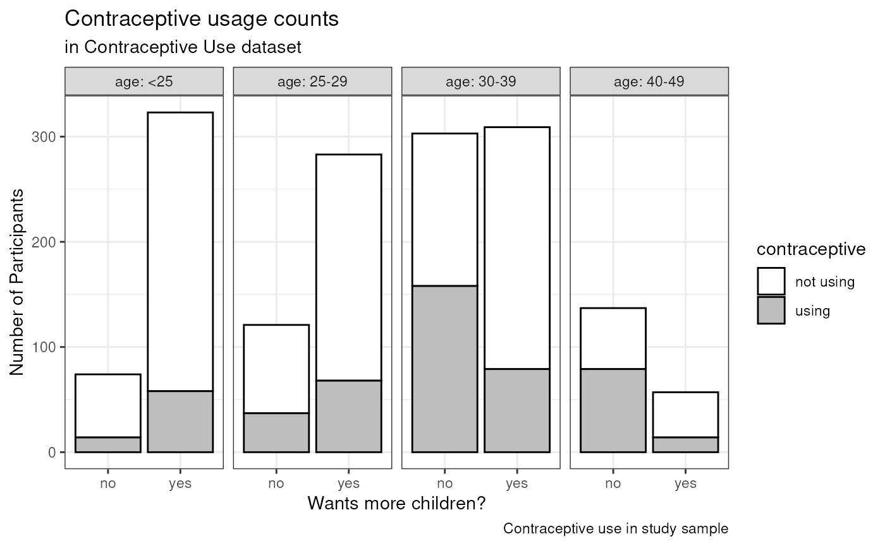

# Session 2 lab exercise: Exploration of contraceptive use data

**Learning Objectives**

1.  Define “tidy” data
2.  Load a dataset in R and perform basic exploratory data analysis
3.  Create descriptive “Table 1” of a study sample using the `table1`
    package
4.  Create a customized bar plot using the `ggplot2` package

**Exercises**

1.  Load the contraceptive use dataset into R
2.  Create an “Epi Table 1” of sample characteristics
3.  Create a barplot stratified by age and showing the relative
    proportions of participants using contraceptives among those who do
    and do not want more children.
4.  Repeat the barplot showing percentages instead of counts

## Load the contraceptive use data

Load the data from <http://data.princeton.edu/wws509/datasets/#cuse>.
From this page:

> These data show the distribution of 1607 currently married and fecund
> women interviewed in the Fiji Fertility Survey, according to age,
> education, desire for more children and current use of contraception.

Unlike in the lecture, here I demonstrate reading the dataset using the
*readr* package. It identifies some warnings because the header of this
file has extra spaces at the end which appear like an extra column,
making it appear like the dataset has 6 columns instead of 5. But the
dataset reads with 5 columns as we want it to anyways, because I chose
to skip the blank column 6 in the graphical interface (which added the
code `X6 = col_skip()` below). *readr* is good for identifying problems
like this in text data files.

`# traditional method for loading data:`` ``# cuse <- read.table("cuse.dat", header=TRUE)`` ``# Using readr package with "File - Import Dataset" and manually setting factor levels.`` ``# Note, you don't have to write all this code by hand! It was produced by the File - Import Dataset helper.`` `[`library`](https://rdrr.io/r/base/library.html)`(`[`readr`](https://readr.tidyverse.org)`)`` `[`library`](https://rdrr.io/r/base/library.html)`(`[`readr`](https://readr.tidyverse.org)`)`` ``cuse`` ``<-`` `` `[`read_table`](https://readr.tidyverse.org/reference/read_table.html)`(`` `` ``"cuse.dat"``,`` `` col_types ``=`` `[`cols`](https://readr.tidyverse.org/reference/cols.html)`(`` `` age ``=`` `[`col_factor`](https://readr.tidyverse.org/reference/parse_factor.html)`(``levels ``=`` `[`c`](https://rdrr.io/r/base/c.html)`(``"<25"``, ``"25-29"``, ``"30-39"``, ``"40-49"``)``)``,`` `` education ``=`` `[`col_factor`](https://readr.tidyverse.org/reference/parse_factor.html)`(``levels ``=`` `[`c`](https://rdrr.io/r/base/c.html)`(``"low"``, ``"high"``)``)``,`` `` wantsMore ``=`` `[`col_factor`](https://readr.tidyverse.org/reference/parse_factor.html)`(``levels ``=`` `[`c`](https://rdrr.io/r/base/c.html)`(``"no"``, ``"yes"``)``)``,`` `` X6 ``=`` `[`col_skip`](https://readr.tidyverse.org/reference/col_skip.html)`(``)`` `` ``)`` `` ``)`

    ## Warning: Missing column names filled in: 'X6' [6]

    ## Warning: 16 parsing failures.
    ## row col  expected    actual       file
    ##   1  -- 6 columns 5 columns 'cuse.dat'
    ##   2  -- 6 columns 5 columns 'cuse.dat'
    ##   3  -- 6 columns 5 columns 'cuse.dat'
    ##   4  -- 6 columns 5 columns 'cuse.dat'
    ##   5  -- 6 columns 5 columns 'cuse.dat'
    ## ... ... ......... ......... ..........
    ## See problems(...) for more details.

Note, these warnings relate to the presence of an empty column in the
dataset, which I dropped using `X6 = col_skip()`

[`problems`](https://readr.tidyverse.org/reference/problems.html)`(``)`

[`summary`](https://rdrr.io/r/base/summary.html)`(``cuse``)`

    ##     age    education wantsMore    notUsing          using      
    ##  <25  :4   low :8    no :8     Min.   :  8.00   Min.   : 4.00  
    ##  25-29:4   high:8    yes:8     1st Qu.: 31.00   1st Qu.: 9.50  
    ##  30-39:4                       Median : 56.50   Median :29.00  
    ##  40-49:4                       Mean   : 68.75   Mean   :31.69  
    ##                                3rd Qu.: 85.75   3rd Qu.:49.00  
    ##                                Max.   :212.00   Max.   :80.00

## Create an epi “Table 1”

Here’s a simple way to create the summary table that is required for
your assignments, and for any epidemiological analysis you do. The text
format is fine, and convenient for moving into another pubication or
presentation document. See the [table1
vignette](https://cran.r-project.org/web/packages/table1/vignettes/table1-examples.html)
for more examples.

WARNING: the counts in this table are incorrect, because each row
corresponds to a number of counts of women using and not using
contraceptives. We do this just to demo the table1 package, then make a
correct table below after reshaping this dataset.

[`library`](https://rdrr.io/r/base/library.html)`(`[`table1`](https://github.com/benjaminrich/table1)`)`` `[`table1`](https://rdrr.io/pkg/table1/man/table1.html)`(``~`` ``.``, data ``=`` ``cuse``)`

[TABLE]

**Table 1: characteristics of the contraceptive use dataset. Note, these
counts correspond to number of rows in the dataset, *not* numbers of
participants**

## Definition of tidy data

*Excerpted from the [seminal paper by Hadley
Wickam](https://vita.had.co.nz/papers/tidy-data.pdf)*

> Happy families are all alike; every unhappy family is unhappy in its
> own way - Leo Tolstoy

To summarize, in **tidy data**: 1. Each variable forms a column. 2. Each
observation forms a row. 3. Each type of observational unit forms a
table.

**Messy data** is any other arrangement of the data. (according to
Hadley and the tidyverse!)

## Tidy the data

First let’s do some work on the data to get it in shape for plotting. I
do these one step at a time to show what’s happening, but you could also
do chain these steps all together using the pipe operator (`%>%`).

First, group by age and whether the participant reports wanting more
children, and sum the number wanting or not wanting more children in
each of these groups. Also rename “notUsing” to “not using” to make a
nicer legend later.

[`library`](https://rdrr.io/r/base/library.html)`(`[`tidyverse`](https://tidyverse.tidyverse.org)`)`` ``cusebyage0`` ``<-`` `[`group_by`](https://dplyr.tidyverse.org/reference/group_by.html)`(``cuse``, ``age``, ``education``, ``wantsMore``)`` `[`%>%`](https://magrittr.tidyverse.org/reference/pipe.html)` `` `[`summarise`](https://dplyr.tidyverse.org/reference/summarise.html)`(``using ``=`` `[`sum`](https://rdrr.io/r/base/sum.html)`(``using``)``, ``"not using"`` ``=`` `[`sum`](https://rdrr.io/r/base/sum.html)`(``notUsing``)``)`` `[`print`](https://rdrr.io/r/base/print.html)`(``cusebyage0``)`

    ## # A tibble: 16 × 5
    ## # Groups:   age, education [8]
    ##    age   education wantsMore using `not using`
    ##    <fct> <fct>     <fct>     <dbl>       <dbl>
    ##  1 <25   low       no            4          10
    ##  2 <25   low       yes           6          53
    ##  3 <25   high      no           10          50
    ##  4 <25   high      yes          52         212
    ##  5 25-29 low       no           10          19
    ##  6 25-29 low       yes          14          60
    ##  7 25-29 high      no           27          65
    ##  8 25-29 high      yes          54         155
    ##  9 30-39 low       no           80          77
    ## 10 30-39 low       yes          33         112
    ## 11 30-39 high      no           78          68
    ## 12 30-39 high      yes          46         118
    ## 13 40-49 low       no           48          46
    ## 14 40-49 low       yes           6          35
    ## 15 40-49 high      no           31          12
    ## 16 40-49 high      yes           8           8

Next, pivot this into a longer table by putting the “using” and “not
using” columns into a single column called “contraceptive”. This pivot
is necessary to make the data “tidy”.

`cusebyage`` ``<-`` `[`pivot_longer`](https://tidyr.tidyverse.org/reference/pivot_longer.html)`(``cusebyage0``,`` `` cols ``=`` ``using``:``"not using"``,`` `` values_to ``=`` ``"n"``,`` `` names_to ``=`` ``"contraceptive"``)`` ``cusebyage`

    ## # A tibble: 32 × 5
    ## # Groups:   age, education [8]
    ##    age   education wantsMore contraceptive     n
    ##    <fct> <fct>     <fct>     <chr>         <dbl>
    ##  1 <25   low       no        using             4
    ##  2 <25   low       no        not using        10
    ##  3 <25   low       yes       using             6
    ##  4 <25   low       yes       not using        53
    ##  5 <25   high      no        using            10
    ##  6 <25   high      no        not using        50
    ##  7 <25   high      yes       using            52
    ##  8 <25   high      yes       not using       212
    ##  9 25-29 low       no        using            10
    ## 10 25-29 low       no        not using        19
    ## # ℹ 22 more rows

## A correct table 1

We can finally make a correct table1 with *one* more transformation,
uncounting on the `n` column (using the tidyr package again). Also, we
use `label` from the `table1` package to make more informative and
readable labels. For interest, this time we stratify based on wanting
more children, and add a caption. See
[`?table`](https://rdrr.io/r/base/table.html) for more options.

`cuseverylong`` ``<-`` `[`uncount`](https://tidyr.tidyverse.org/reference/uncount.html)`(``cusebyage``, ``n``)`` ``#from the tidyr package`` `[`label`](https://rdrr.io/pkg/table1/man/label.html)`(``cuseverylong``$``age``)`` ``<-`` ``"Age (years)"`` `[`label`](https://rdrr.io/pkg/table1/man/label.html)`(``cuseverylong``$``education``)`` ``<-`` ``"Education level"`` `[`label`](https://rdrr.io/pkg/table1/man/label.html)`(``cuseverylong``$``wantsMore``)`` ``<-`` ``"Wants more children?"`` `[`label`](https://rdrr.io/pkg/table1/man/label.html)`(``cuseverylong``$``contraceptive``)`` ``<-`` ``"Using contraceptives?"`` `[`table1`](https://rdrr.io/pkg/table1/man/table1.html)`(``~`` ``.`` ``|`` ``wantsMore``, rowlabelhead ``=`` ``"Wants more children?"``, `` `` caption ``=`` ``"Table 1: Participants in the contraceptive use study"``,`` `` data ``=`` ``cuseverylong``)`

[TABLE]

Table 1: Participants in the contraceptive use study {.table .Rtable1}

Note, there are at least several other packages for making the epi
“Table 1”. Take a look to see if any of them appeal to you: \*
[desctable](https://cran.r-project.org/web/packages/desctable/vignettes/desctable.html):
powerful, provides a “download Excel” button in html output. \*
[kableExtra](https://cran.r-project.org/web/packages/kableExtra/vignettes/awesome_table_in_html.html):
very powerful and flexible for formatting and features. Requires a
little more code to get to your table 1. \*
[tableone](https://cran.r-project.org/web/packages/tableone/vignettes/introduction.html):
simple and text-based, but works quite well and has options for
exporting to Excel for use in a manuscript.

## Create a barplot

See the [Data Visualization with ggplot2
Cheatsheet](https://raw.githubusercontent.com/rstudio/cheatsheets/main/data-visualization.pdf)
for help on enhancing this barplot.

Now, make a sort of fancy greyscale barplot using ggplot2. You can make
a nice plot without using nearly so many options, but I want to
demonstrate the flexibility of making a bar plot with ggplot2.

[`ggplot`](https://ggplot2.tidyverse.org/reference/ggplot.html)`(``cusebyage``, `[`aes`](https://ggplot2.tidyverse.org/reference/aes.html)`(``x ``=`` ``wantsMore``, weight ``=`` ``n``, fill ``=`` ``contraceptive``)``)`` ``+`` `` ``# create a stacked bar plot, where the values provided are counts/frequencies,`` `` ``# and use black outlines for the bars.`` `` `[`geom_bar`](https://ggplot2.tidyverse.org/reference/geom_bar.html)`(``position ``=`` ``"stack"``, stat ``=`` ``"count"``, color ``=`` ``"black"``)`` ``+`` `` `` ``# use facet_grid to separate the plots by age group`` `` `[`facet_grid`](https://ggplot2.tidyverse.org/reference/facet_grid.html)`(``.``~``age``, labeller ``=`` ``label_both``)`` ``+`` `` `[`labs`](https://ggplot2.tidyverse.org/reference/labs.html)`(``title ``=`` ``"Contraceptive usage counts"``,`` `` subtitle ``=`` ``"in Contraceptive Use dataset"``,`` `` caption ``=`` ``"Contraceptive use in study sample"``)`` ``+`` `` `` `[`xlab`](https://ggplot2.tidyverse.org/reference/labs.html)`(``"Wants more children?"``)`` ``+`` `` `` `[`ylab`](https://ggplot2.tidyverse.org/reference/labs.html)`(``"Number of Participants"``)`` ``+`` `` ``# there are lots of scale_fill_* options for automatic color schemes, but I `` `` ``# just want to specify the colors manually here.`` `` `[`scale_fill_manual`](https://ggplot2.tidyverse.org/reference/scale_manual.html)`(``values``=`[`c`](https://rdrr.io/r/base/c.html)`(``"white"``, ``"grey"``)``)`` ``+`` `` `[`theme_bw`](https://ggplot2.tidyverse.org/reference/ggtheme.html)`(``)`

**Figure 1: contraceptive use in the study sample.** Bar plot is
organized by age group and stacked by self-report of whether participant
wants more children. The fraction of women wanting more children
decreases with age, becoming a minority in the 40-49 age group. One
unexpected observation in this bar chart is that in the \<25 age group,
those reporting wanting more children appear *more* likely to report
using contraceptives. Is this the case? One way to make this more
visually clear would be to use percentages, instead of counts, on the
vertical scale. Try this, by changing `weight = n` to `weight = percent`
to use the “percent” column as heights instead of the “n” column. While
you’re at it, change the y label to reflect this change.

*Note*: The caption option in *ggplot2* is suitable for smaller,
embedded captions. But for publication the caption usually needs to be
in separated text.

## Try yourself: plot percentages instead of counts

Here’s some code to calculate the percentages.

`cusebyage`` ``<-`` `[`group_by`](https://dplyr.tidyverse.org/reference/group_by.html)`(``cusebyage``, ``age``, ``wantsMore``)`` `[`%>%`](https://magrittr.tidyverse.org/reference/pipe.html)` `` `` `[`mutate`](https://dplyr.tidyverse.org/reference/mutate.html)`(``percent ``=`` ``n`` ``/`` `[`sum`](https://rdrr.io/r/base/sum.html)`(``n``)`` ``*`` ``100``)`` ``cusebyage`

    ## # A tibble: 32 × 6
    ## # Groups:   age, wantsMore [8]
    ##    age   education wantsMore contraceptive     n percent
    ##    <fct> <fct>     <fct>     <chr>         <dbl>   <dbl>
    ##  1 <25   low       no        using             4    5.41
    ##  2 <25   low       no        not using        10   13.5 
    ##  3 <25   low       yes       using             6    1.86
    ##  4 <25   low       yes       not using        53   16.4 
    ##  5 <25   high      no        using            10   13.5 
    ##  6 <25   high      no        not using        50   67.6 
    ##  7 <25   high      yes       using            52   16.1 
    ##  8 <25   high      yes       not using       212   65.6 
    ##  9 25-29 low       no        using            10    8.26
    ## 10 25-29 low       no        not using        19   15.7 
    ## # ℹ 22 more rows

Now, can you repeat the barplot, but showing percentages instead of
counts?
