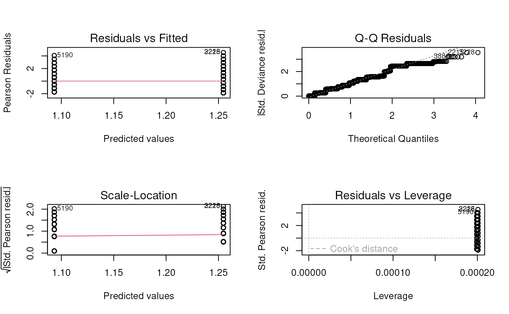
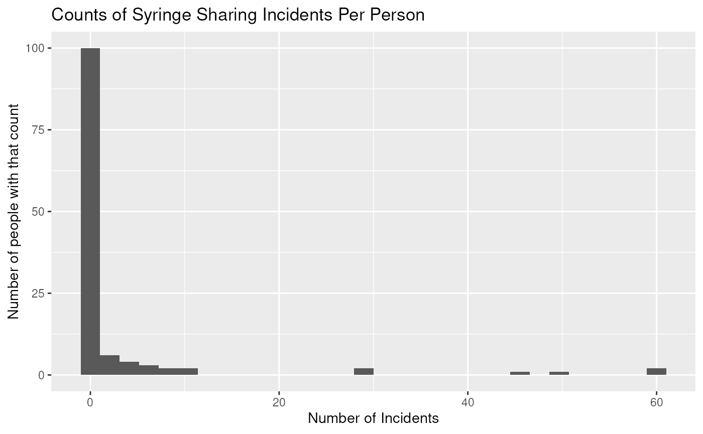
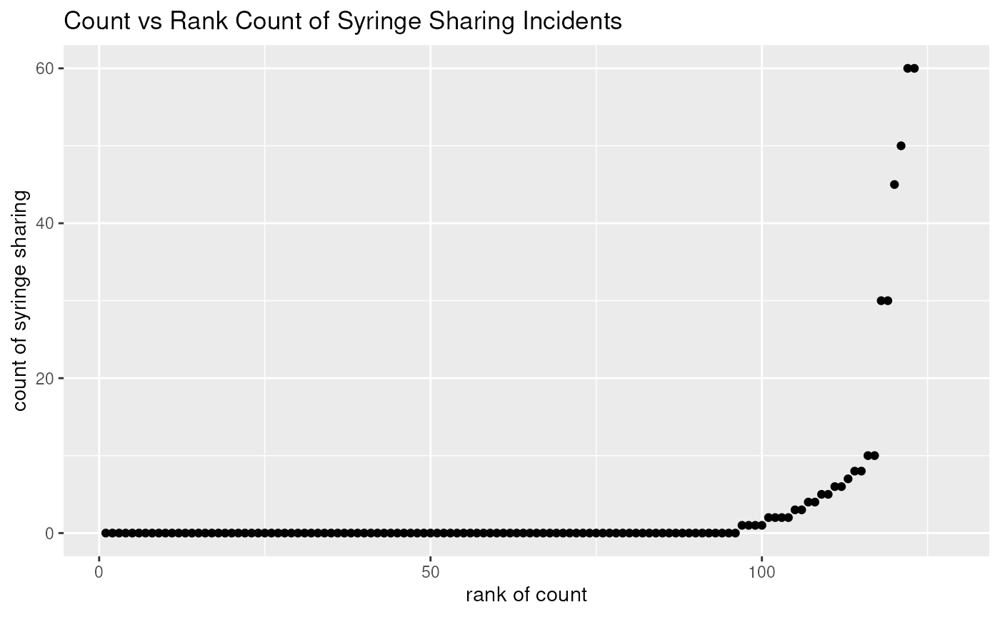
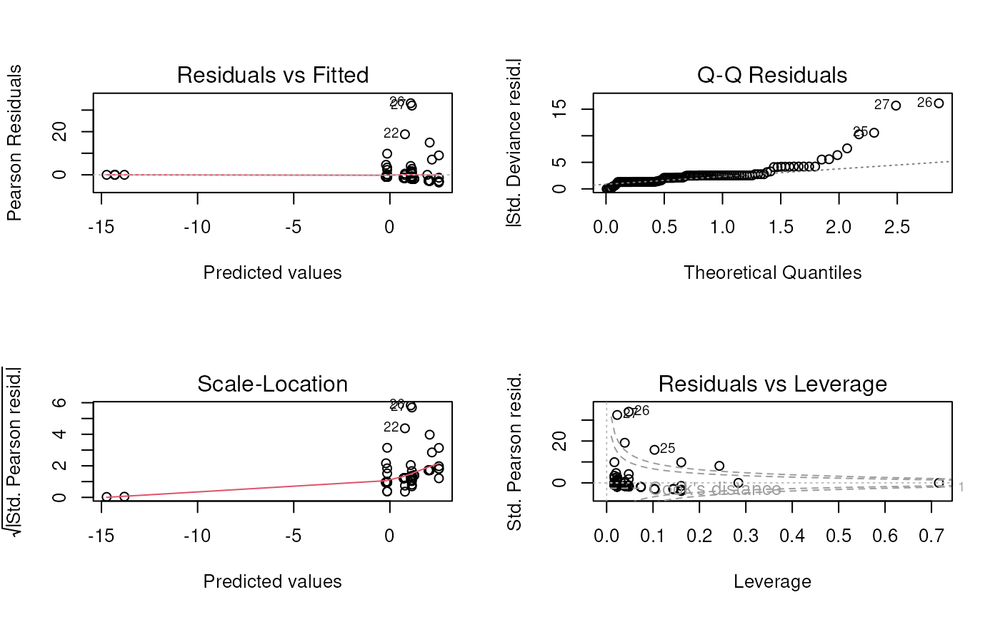

# Session 4 lab exercise: Poisson log-linear regression

**Learning objectives**

1.  Simulate Poisson-distributed data with a relevant covariate
2.  Fit a Poisson log-linear GLM
3.  Create and interpret diagnostic plots for a log-linear GLM
4.  Use analysis of deviance to compare two log-linear GLMs
5.  Practice recoding and creating tables and plots

**Exercises**

1.  Simulate count data from a Poisson distribution (for example number
    of hospital visits by persons over 70 in a 3-year period), where:
    1.  10,000 persons annotated with “race” as “white” or “non-white”
    2.  “white” persons have an average of 3.5 hospital visits during
        this time period
    3.  “non-white” persons have an average of 3 hospital visits

[`library`](https://rdrr.io/r/base/library.html)`(`[`tidyverse`](https://tidyverse.tidyverse.org)`)`

    ## ── Attaching core tidyverse packages ──────────────────────── tidyverse 2.0.0 ──
    ## ✔ dplyr     1.2.1     ✔ readr     2.2.0
    ## ✔ forcats   1.0.1     ✔ stringr   1.6.0
    ## ✔ ggplot2   4.0.3     ✔ tibble    3.3.1
    ## ✔ lubridate 1.9.5     ✔ tidyr     1.3.2
    ## ✔ purrr     1.2.2     
    ## ── Conflicts ────────────────────────────────────────── tidyverse_conflicts() ──
    ## ✖ dplyr::filter() masks stats::filter()
    ## ✖ dplyr::lag()    masks stats::lag()
    ## ℹ Use the conflicted package (<http://conflicted.r-lib.org/>) to force all conflicts to become errors

[`set.seed`](https://rdrr.io/r/base/Random.html)`(``1``)`` ``N`` ``<-`` ``10000`` ``simdat`` ``<-`` `[`data.frame`](https://rdrr.io/r/base/data.frame.html)`(``race ``=`` `[`sample`](https://rdrr.io/r/base/sample.html)`(`[`c`](https://rdrr.io/r/base/c.html)`(``"white"``, ``"non-white"``)``, ``N``, replace ``=`` ``TRUE``)``)`` `[`%>%`](https://magrittr.tidyverse.org/reference/pipe.html)` `` `[`mutate`](https://dplyr.tidyverse.org/reference/mutate.html)`(``race ``=`` `[`factor`](https://rdrr.io/r/base/factor.html)`(``race``, levels ``=`` `[`c`](https://rdrr.io/r/base/c.html)`(``"white"``, ``"non-white"``)``)``)`` `[`%>%`](https://magrittr.tidyverse.org/reference/pipe.html)` `` `[`mutate`](https://dplyr.tidyverse.org/reference/mutate.html)`(``y ``=`` `[`rpois`](https://rdrr.io/r/stats/Poisson.html)`(``N``, lambda ``=`` `[`ifelse`](https://rdrr.io/r/base/ifelse.html)`(``race`` ``==`` ``"white"``, ``3.5``, ``3.0``)``)``)`

2.  Fit a log-linear Poisson model of count outcomes with “race” as the
    predictor. Note, in this context I tend to use the terms “predictor”
    and “covariate” interchangeably, to mean any variable used as a
    predictor in the regression model.

`fit`` ``<-`` `[`glm`](https://rdrr.io/r/stats/glm.html)`(``y`` ``~`` ``race``, data ``=`` ``simdat``, family ``=`` `[`poisson`](https://rdrr.io/r/stats/family.html)`(``link ``=`` ``"log"``)``)`` `[`summary`](https://rdrr.io/r/base/summary.html)`(``fit``)`

    ## 
    ## Call:
    ## glm(formula = y ~ race, family = poisson(link = "log"), data = simdat)
    ## 
    ## Coefficients:
    ##                Estimate Std. Error z value Pr(>|z|)    
    ## (Intercept)    1.254710   0.007564  165.88   <2e-16 ***
    ## racenon-white -0.161428   0.011137  -14.49   <2e-16 ***
    ## ---
    ## Signif. codes:  0 '***' 0.001 '**' 0.01 '*' 0.05 '.' 0.1 ' ' 1
    ## 
    ## (Dispersion parameter for poisson family taken to be 1)
    ## 
    ##     Null deviance: 11041  on 9999  degrees of freedom
    ## Residual deviance: 10831  on 9998  degrees of freedom
    ## AIC: 39419
    ## 
    ## Number of Fisher Scoring iterations: 5

3.  Use a chi-square test on deviance residuals to test null hypothesis
    of no relationship between mean hospital visits and race.

- The difference in total deviance between two nested models is
  $`\chi^2`$ distributed under $`H_0`$ that the more complex model is no
  better at explaining the response.
  - The difference in deviance residuals is (11041 - 10831) = 210, with
    a difference of 1 degrees of freedom.

The critical threshold for rejection at p=0.05 is:

[`qchisq`](https://rdrr.io/r/stats/Chisquare.html)`(``0.95``, df``=``1``)`

    ## [1] 3.841459

So we reject $`H_0`$

BEWARE OF MISSING DATA: THIS IS SAFER

`fit0`` ``<-`` `[`glm`](https://rdrr.io/r/stats/glm.html)`(``y`` ``~`` ``1``, data ``=`` ``simdat``, family ``=`` `[`poisson`](https://rdrr.io/r/stats/family.html)`(``link ``=`` ``"log"``)``)`` `[`anova`](https://rdrr.io/r/stats/anova.html)`(``fit0``, ``fit``, test ``=`` ``"LRT"``)`

    ## Analysis of Deviance Table
    ## 
    ## Model 1: y ~ 1
    ## Model 2: y ~ race
    ##   Resid. Df Resid. Dev Df Deviance  Pr(>Chi)    
    ## 1      9999      11042                          
    ## 2      9998      10831  1   210.76 < 2.2e-16 ***
    ## ---
    ## Signif. codes:  0 '***' 0.001 '**' 0.01 '*' 0.05 '.' 0.1 ' ' 1

3.  Create and discuss standard fit diagnostics plots

4.  Example: Risky Drug Use Behavior

- Download the “needle_sharing” dataset (see Vittinghoff 8.3.1)
- Outcome is \# times the drug user shared a syringe in the past month
  (`shared_syr`)
- Predictors: sex, ethn, homeless

[`library`](https://rdrr.io/r/base/library.html)`(`[`readxl`](https://readxl.tidyverse.org)`)`` ``needledat`` ``<-`` `[`read_excel`](https://readxl.tidyverse.org/reference/read_excel.html)`(``"needle_sharing.xlsx"``)`` `[`summary`](https://rdrr.io/r/base/summary.html)`(``needledat``$``shared_syr``)`

    ##    Min. 1st Qu.  Median    Mean 3rd Qu.    Max.     NAs 
    ##   0.000   0.000   0.000   2.976   0.000  60.000       5

[`var`](https://rdrr.io/r/stats/cor.html)`(``needledat``$``shared_syr``, na.rm``=``TRUE``)`

    ## [1] 106.5978

Some recoding:

[`suppressPackageStartupMessages`](https://rdrr.io/r/base/message.html)`(`[`library`](https://rdrr.io/r/base/library.html)`(`[`dplyr`](https://dplyr.tidyverse.org)`)``)`` ``needledat_cleaned`` ``<-`` `` `[`mutate`](https://dplyr.tidyverse.org/reference/mutate.html)`(``needledat``,`` `` homeless ``=`` `[`factor`](https://rdrr.io/r/base/factor.html)`(``homeless``, levels ``=`` ``0``:``1``, labels ``=`` `[`c`](https://rdrr.io/r/base/c.html)`(``"No"``, ``"Yes"``)``)``,`` `` sex ``=`` `[`factor`](https://rdrr.io/r/base/factor.html)`(``sex``, levels ``=`` `[`c`](https://rdrr.io/r/base/c.html)`(``"M"``, ``"F"``)``, labels ``=`` `[`c`](https://rdrr.io/r/base/c.html)`(``"Male"``, ``"Female"``)``)``,`` `` ethnicity ``=`` `[`factor`](https://rdrr.io/r/base/factor.html)`(``ethn``)`` `` ``)`` `[`%>%`](https://magrittr.tidyverse.org/reference/pipe.html)` `` `[`select`](https://dplyr.tidyverse.org/reference/select.html)`(`[`all_of`](https://tidyselect.r-lib.org/reference/all_of.html)`(`[`c`](https://rdrr.io/r/base/c.html)`(``"shared_syr"``, ``"ethnicity"``, ``"sex"``, ``"homeless"``)``)``)`

5.  Create a table of the risky drug use behavior dataset

[`library`](https://rdrr.io/r/base/library.html)`(`[`table1`](https://github.com/benjaminrich/table1)`)`

    ## 
    ## Attaching package: 'table1'

    ## The following objects are masked from 'package:base':
    ## 
    ##     units, units<-

[`table1`](https://rdrr.io/pkg/table1/man/table1.html)`(``~`` ``.``, data ``=`` ``needledat_cleaned``)`

[TABLE]

6.  Plots of Risky Drug Use Behavior

&nbsp;

1.  Create a histogram number of syringe uses

2.  Create a scatter plot of number of syringe uses versus rank of
    number of syringe uses

[`library`](https://rdrr.io/r/base/library.html)`(`[`ggplot2`](https://ggplot2.tidyverse.org)`)`` `[`ggplot`](https://ggplot2.tidyverse.org/reference/ggplot.html)`(``needledat``, `[`aes`](https://ggplot2.tidyverse.org/reference/aes.html)`(``shared_syr``)``)`` ``+`` `` `[`geom_histogram`](https://ggplot2.tidyverse.org/reference/geom_histogram.html)`(``)`` ``+`` `` `[`labs`](https://ggplot2.tidyverse.org/reference/labs.html)`(``title ``=`` ``"Counts of Syringe Sharing Incidents Per Person"``)`` ``+`` `` `[`xlab`](https://ggplot2.tidyverse.org/reference/labs.html)`(``"Number of Incidents"``)`` ``+`` `` `[`ylab`](https://ggplot2.tidyverse.org/reference/labs.html)`(``"Number of people with that count"``)`

    ## `stat_bin()` using `bins = 30`. Pick better value `binwidth`.

    ## Warning: Removed 5 rows containing non-finite outside the scale range
    ## (`stat_bin()`).

[`library`](https://rdrr.io/r/base/library.html)`(`[`dplyr`](https://dplyr.tidyverse.org)`)`` `[`mutate`](https://dplyr.tidyverse.org/reference/mutate.html)`(``needledat``, rnk ``=`` `[`rank`](https://rdrr.io/r/base/rank.html)`(``shared_syr``, ties.method ``=`` ``"first"``)``)`` `[`%>%`](https://magrittr.tidyverse.org/reference/pipe.html)` `` `[`ggplot`](https://ggplot2.tidyverse.org/reference/ggplot.html)`(`[`aes`](https://ggplot2.tidyverse.org/reference/aes.html)`(``x ``=`` ``rnk``, y ``=`` ``shared_syr``)``)`` ``+`` `` `[`geom_point`](https://ggplot2.tidyverse.org/reference/geom_point.html)`(``)`` ``+`` `` `[`labs`](https://ggplot2.tidyverse.org/reference/labs.html)`(``title ``=`` ``"Count vs Rank Count of Syringe Sharing Incidents"``)`` ``+`` `` `[`xlab`](https://ggplot2.tidyverse.org/reference/labs.html)`(``"rank of count"``)`` ``+`` `` `[`ylab`](https://ggplot2.tidyverse.org/reference/labs.html)`(``"count of syringe sharing"``)`

    ## Warning: Removed 5 rows containing missing values or values outside the scale range
    ## (`geom_point()`).

- There are a *lot* of zeros - Poisson model is not a good fit

7.  Fit a Poisson model to the risky drug use behavior dataset anyways

Even though we know it is a bad fit

`fit.pois`` ``<-`` `[`glm`](https://rdrr.io/r/stats/glm.html)`(``shared_syr`` ``~`` ``sex`` ``+`` ``ethn`` ``+`` ``homeless``,`` `` data ``=`` ``needledat``,`` `` family ``=`` `[`poisson`](https://rdrr.io/r/stats/family.html)`(``link ``=`` ``"log"``)``)`` `[`summary`](https://rdrr.io/r/base/summary.html)`(``fit.pois``)`

    ## 
    ## Call:
    ## glm(formula = shared_syr ~ sex + ethn + homeless, family = poisson(link = "log"), 
    ##     data = needledat)
    ## 
    ## Coefficients:
    ##                     Estimate Std. Error z value Pr(>|z|)    
    ## (Intercept)          0.72332    0.14462   5.002 5.69e-07 ***
    ## sexM                -0.92480    0.12133  -7.622 2.50e-14 ***
    ## sexTrans           -15.08655  773.78384  -0.019   0.9844    
    ## ethnFilipino       -14.52887  510.68253  -0.028   0.9773    
    ## ethnHispanic         1.46454    0.16004   9.151  < 2e-16 ***
    ## ethnIndian         -14.10111  773.78385  -0.018   0.9855    
    ## ethnIndian & White -15.02591  773.78384  -0.019   0.9845    
    ## ethnWhite            0.06064    0.13348   0.454   0.6496    
    ## ethnWhite & Hispa    0.86195    0.39872   2.162   0.0306 *  
    ## homeless             1.28543    0.12664  10.150  < 2e-16 ***
    ## ---
    ## Signif. codes:  0 '***' 0.001 '**' 0.01 '*' 0.05 '.' 0.1 ' ' 1
    ## 
    ## (Dispersion parameter for poisson family taken to be 1)
    ## 
    ##     Null deviance: 1621.9  on 120  degrees of freedom
    ## Residual deviance: 1364.8  on 111  degrees of freedom
    ##   (7 observations deleted due to missingness)
    ## AIC: 1483.8
    ## 
    ## Number of Fisher Scoring iterations: 12

8.  Create and discuss Poisson model diagnostic plots

[`par`](https://rdrr.io/r/graphics/par.html)`(``mfrow ``=`` `[`c`](https://rdrr.io/r/base/c.html)`(``2``, ``2``)``)`` `[`plot`](https://rdrr.io/r/graphics/plot.default.html)`(``fit.pois``)`

    ## Warning: not plotting observations with leverage one:
    ##   17, 38, 72, 86

