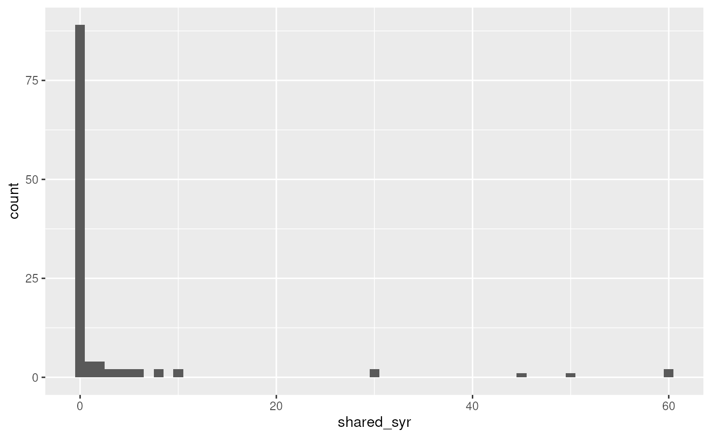
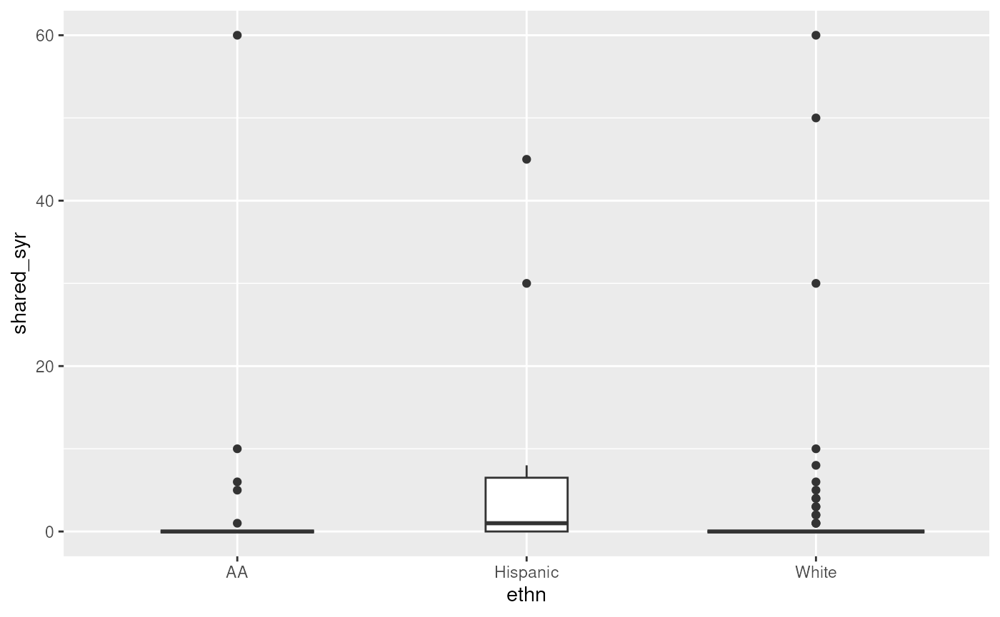
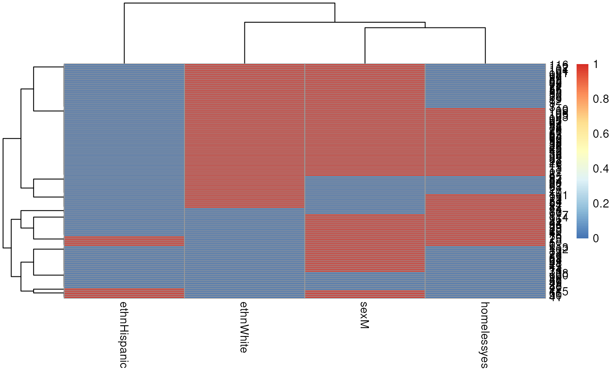
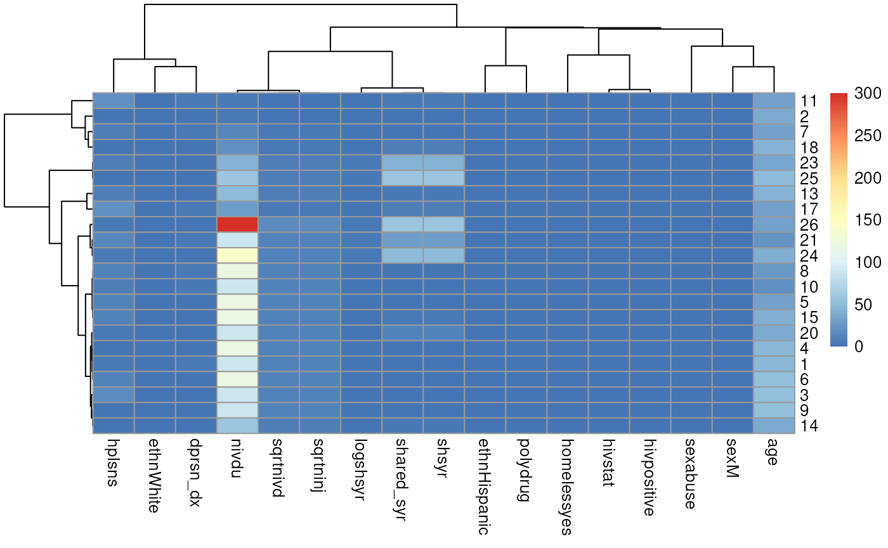
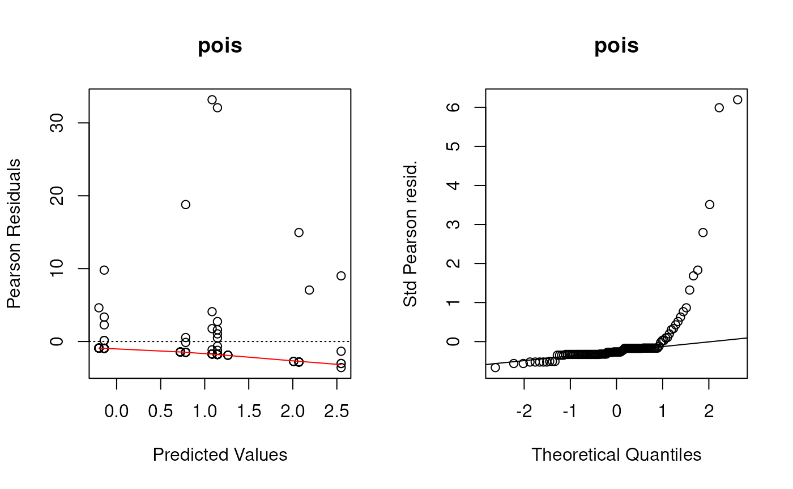
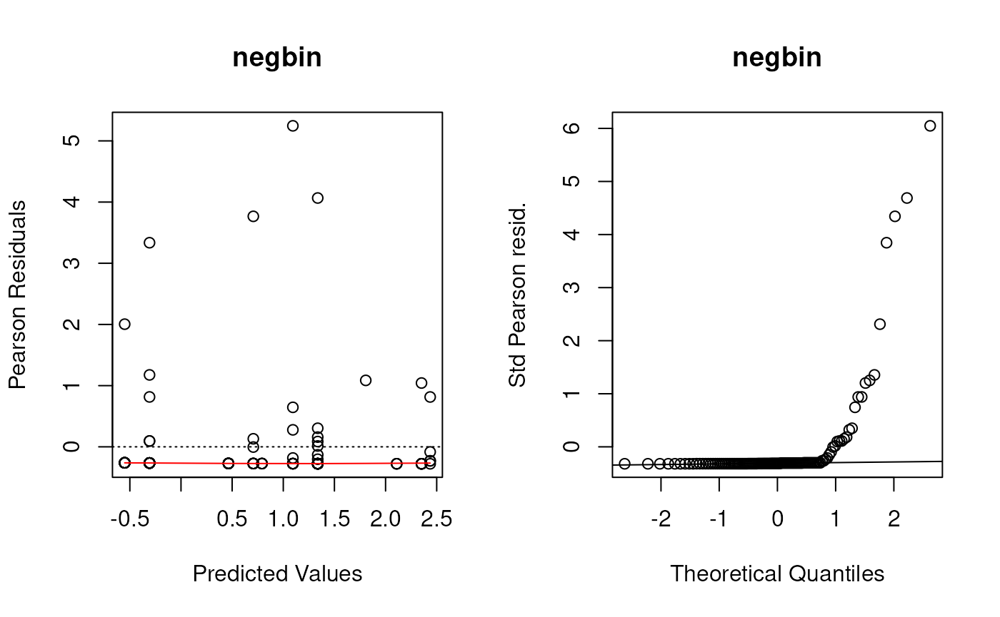
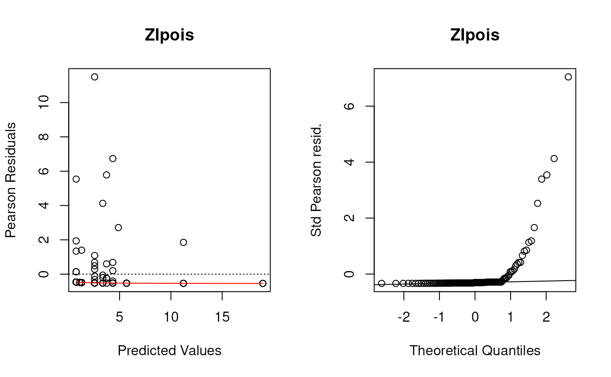
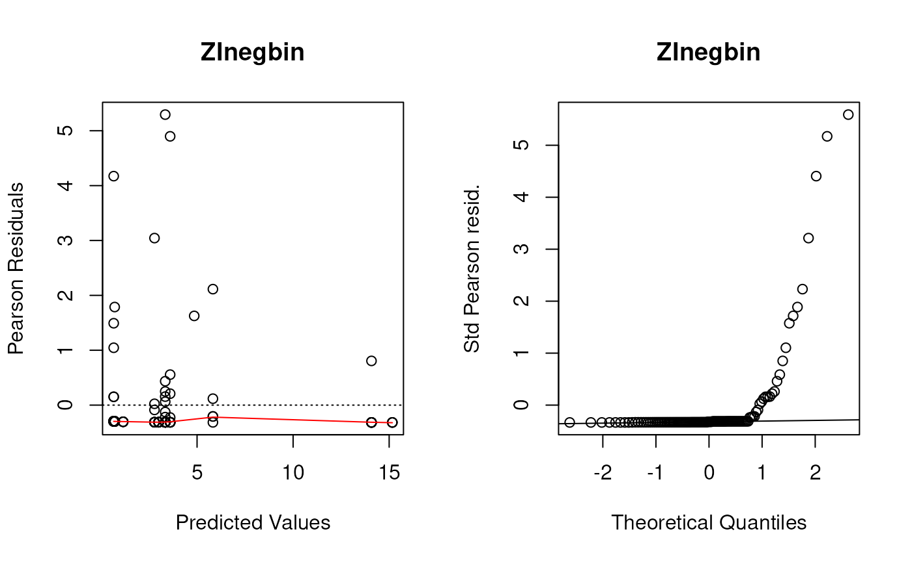
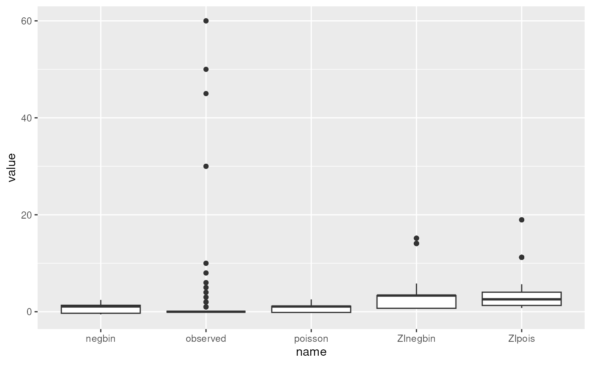
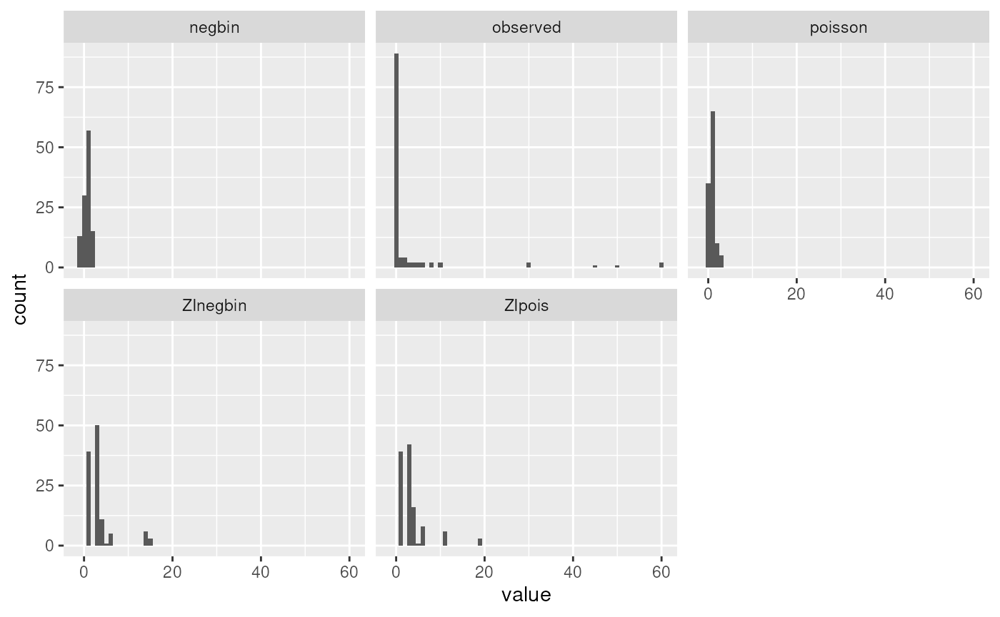

# Session 5 lab exercise: loglinear regression part 2

## Learning objectives

1.  Fit Poisson, NB, and zero-inflated loglinear models
2.  Perform nested deviance test for model selection
3.  Make diagnostic plots of loglinear models
4.  Visually assess multicollinearity among predictors

## Load the needle-sharing dataset

[`suppressPackageStartupMessages`](https://rdrr.io/r/base/message.html)`(``{`` `` `[`library`](https://rdrr.io/r/base/library.html)`(`[`tidyverse`](https://tidyverse.tidyverse.org)`)`` ``}``)`` ``needledat`` ``<-`` ``readr``::`[`read_csv`](https://readr.tidyverse.org/reference/read_delim.html)`(``"needle_sharing.csv"``)`` ``needledat2`` ``<-`` ``needledat`` `[`%>%`](https://magrittr.tidyverse.org/reference/pipe.html)` `` ``dplyr``::`[`filter`](https://dplyr.tidyverse.org/reference/filter.html)`(``sex`` `[`%in%`](https://rdrr.io/r/base/match.html)` `[`c`](https://rdrr.io/r/base/c.html)`(``"M"``, ``"F"``)`` ``&`` `` ``ethn`` `[`%in%`](https://rdrr.io/r/base/match.html)` `[`c`](https://rdrr.io/r/base/c.html)`(``"White"``, ``"AA"``, ``"Hispanic"``)`` ``&`` `` ``!`[`is.na`](https://rdrr.io/r/base/NA.html)`(``homeless``)``)`` `[`%>%`](https://magrittr.tidyverse.org/reference/pipe.html)` `` `[`mutate`](https://dplyr.tidyverse.org/reference/mutate.html)`(`` `` homeless ``=`` `[`recode_factor`](https://dplyr.tidyverse.org/reference/recode.html)`(``homeless``, ``"0"`` ``=`` ``"no"``, ``"1"`` ``=`` ``"yes"``)``,`` `` hiv ``=`` `[`recode_factor`](https://dplyr.tidyverse.org/reference/recode.html)`(`` `` ``hivstat``,`` `` ``"0"`` ``=`` ``"negative"``,`` `` ``"1"`` ``=`` ``"positive"``,`` `` ``"2"`` ``=`` ``"positive"`` `` ``)`` `` ``)`

## Compare the mean to the variance of the outcome variable. Calculate what fraction of the counts are zero.

`meanvarzeros`` ``<-`` `[`filter`](https://dplyr.tidyverse.org/reference/filter.html)`(``needledat2``,``!`[`is.na`](https://rdrr.io/r/base/NA.html)`(``shared_syr``)``)`` `[`%>%`](https://magrittr.tidyverse.org/reference/pipe.html)` `` `[`summarise`](https://dplyr.tidyverse.org/reference/summarise.html)`(`` `` mean ``=`` `[`mean`](https://rdrr.io/r/base/mean.html)`(``shared_syr``)``,`` `` var ``=`` `[`var`](https://rdrr.io/r/stats/cor.html)`(``shared_syr``)``,`` `` fraczero ``=`` `[`sum`](https://rdrr.io/r/base/sum.html)`(``shared_syr`` ``==`` ``0``)`` ``/`` `[`n`](https://dplyr.tidyverse.org/reference/context.html)`(``)`` `` ``)`` ``meanvarzeros`

    ## # A tibble: 1 × 3
    ##    mean   var fraczero
    ##   <dbl> <dbl>    <dbl>
    ## 1  3.12  113.    0.774

The mean number of needle sharing events per participant is 3.12, the
variance is 113, and the fraction of participants who never shared a
needle is 0.774. (Note how I put computed results in the text here
rather than writing in numbers manually - they will change automatically
if the analysis is changed!)

## Create a histogram of the outcome variable.

This was done in the lecture using base R, but let’s do it here with
ggplot2. Note the filtering of complete cases only is unnecessary
because ggplot does it anyways, but this gets rid of a warning (try it
without filtering). Specifying the binwidth is also unnecessary, but by
default geom_histogram creates histogram bins of size 2 (ie 0 and 1 in
the same bin, 2 and 3 together, …)

[`library`](https://rdrr.io/r/base/library.html)`(`[`ggplot2`](https://ggplot2.tidyverse.org)`)`` `[`filter`](https://dplyr.tidyverse.org/reference/filter.html)`(``needledat2``, ``!`[`is.na`](https://rdrr.io/r/base/NA.html)`(``shared_syr``)``)`` `[`%>%`](https://magrittr.tidyverse.org/reference/pipe.html)` `` `[`ggplot`](https://ggplot2.tidyverse.org/reference/ggplot.html)`(`[`aes`](https://ggplot2.tidyverse.org/reference/aes.html)`(``x ``=`` ``shared_syr``)``)`` ``+`` `` `[`geom_histogram`](https://ggplot2.tidyverse.org/reference/geom_histogram.html)`(``binwidth ``=`` ``1``)`

## Fit Poisson and Negative Binomial models as in the lecture, with and without zero inflation.

### Poisson

`fit.pois`` ``<-`` `[`glm`](https://rdrr.io/r/stats/glm.html)`(``shared_syr`` ``~`` ``sex`` ``+`` ``ethn`` ``+`` ``homeless``,`` `` data ``=`` ``needledat2``,`` `` family ``=`` `[`poisson`](https://rdrr.io/r/stats/family.html)`(``link ``=`` ``"log"``)``)`

### Negative Binomial

[`library`](https://rdrr.io/r/base/library.html)`(`[`MASS`](http://www.stats.ox.ac.uk/pub/MASS4/)`)`

    ## 
    ## Attaching package: 'MASS'

    ## The following object is masked from 'package:dplyr':
    ## 
    ##     select

`fit.negbin`` ``<-`` `[`glm.nb`](https://rdrr.io/pkg/MASS/man/glm.nb.html)`(``shared_syr`` ``~`` ``sex`` ``+`` ``ethn`` ``+`` ``homeless``,`` `` data ``=`` ``needledat2``)`

### Zero-inflated Poisson

The `|1` creates an intercept-only zero inflation model. Substitute it
with a variable name to add that variable to the count model, and use
regular model formula syntax to create any zero-inflation logistic
regression model you want. Or omit the `|` for a full zero-inflation
model.

[`library`](https://rdrr.io/r/base/library.html)`(`[`pscl`](https://github.com/atahk/pscl)`)`

    ## Classes and Methods for R originally developed in the
    ## Political Science Computational Laboratory
    ## Department of Political Science
    ## Stanford University (2002-2015),
    ## by and under the direction of Simon Jackman.
    ## hurdle and zeroinfl functions by Achim Zeileis.

`fit.ZIpoisfull`` ``<-`` `[`zeroinfl`](https://rdrr.io/pkg/pscl/man/zeroinfl.html)`(``shared_syr`` ``~`` ``sex`` ``+`` ``ethn`` ``+`` ``homeless``,`` `` data ``=`` ``needledat2``,`` `` dist ``=`` ``"poisson"``)`

### Intercept-only ZI Poisson model

`fit.ZIpois`` ``<-`` `[`zeroinfl`](https://rdrr.io/pkg/pscl/man/zeroinfl.html)`(``shared_syr`` ``~`` ``sex`` ``+`` ``ethn`` ``+`` ``homeless`` ``|`` ``1``,`` `` data ``=`` ``needledat2``,`` `` dist ``=`` ``"poisson"``)`

### Intercept-only ZI Negative Binomial model

`fit.ZInegbin`` ``<-`` `[`zeroinfl`](https://rdrr.io/pkg/pscl/man/zeroinfl.html)`(``shared_syr`` ``~`` ``sex`` ``+`` ``ethn`` ``+`` ``homeless`` ``|`` ``1``,`` `` data ``=`` ``needledat2``,`` `` dist ``=`` ``"negbin"``)`

### Make a boxplot of needle sharing by homelessness (and other predictors)

[`ggplot`](https://ggplot2.tidyverse.org/reference/ggplot.html)`(``needledat2``, `[`aes`](https://ggplot2.tidyverse.org/reference/aes.html)`(``x ``=`` ``ethn``, y ``=`` ``shared_syr``)``)`` ``+`` `` `[`geom_boxplot`](https://ggplot2.tidyverse.org/reference/geom_boxplot.html)`(``varwidth ``=`` ``TRUE``)`

    ## Warning: Removed 2 rows containing non-finite outside the scale range
    ## (`stat_boxplot()`).

## Assess whether there may be multicollinearity among the predictors

This uses `model.matrix` as a trick to produce a numeric matrix
containing numeric and dummy variables, that can be used for calculating
correlations and plotting heatmaps or dendrograms. First, assessing only
three variables. Note, the first column of `mm` is the intercept, which
must be removed.

`mm`` ``<-`` `[`model.matrix`](https://rdrr.io/r/stats/model.matrix.html)`(``~`` ``sex`` ``+`` ``ethn`` ``+`` ``homeless``, data ``=`` ``needledat2``)`` `[`plot`](https://rdrr.io/r/graphics/plot.default.html)`(`[`hclust`](https://rdrr.io/r/stats/hclust.html)`(`[`as.dist`](https://rdrr.io/r/stats/dist.html)`(``1`` ``-`` `[`cor`](https://rdrr.io/r/stats/cor.html)`(``mm``[``, ``-``1``]``)``)``)``)`

Now embed the dendrogram in a heatmap, which may be more or less
informative, but worth trying. Here I use Euclidian distance for rows
(patients) because some rows have zero variance and produce an error
when attempting to calculate correlation, but use Pearson correlation
for columns. The choice of distance metric makes this clustering look
very different. See
[`?pheatmap`](https://rdrr.io/pkg/pheatmap/man/pheatmap.html) for other
distance metric options. There are also other heatmap packages, but
[`?pheatmap`](https://rdrr.io/pkg/pheatmap/man/pheatmap.html) makes it
easy to produce a basic heatmap.

[`library`](https://rdrr.io/r/base/library.html)`(``pheatmap``)`` `[`pheatmap`](https://rdrr.io/pkg/pheatmap/man/pheatmap.html)`(``mm``[``, ``-``1``]``,`` `` clustering_distance_cols ``=`` ``"correlation"``,`` `` clustering_distance_rows ``=`` ``"euclidean"``)`

Now repeat but assessing all variables, removing `id` because it’s just
an identifier, and `shsyryn` because it has zero variance.

`mm`` ``<-`` `[`model.matrix`](https://rdrr.io/r/stats/model.matrix.html)`(``~`` ``.`` ``-`` ``id`` ``-`` ``shsyryn``, data ``=`` ``needledat2``)``[``, ``-``1``]`` ``#[, -1] gets rid of intercept`` `[`plot`](https://rdrr.io/r/graphics/plot.default.html)`(`[`hclust`](https://rdrr.io/r/stats/hclust.html)`(`[`as.dist`](https://rdrr.io/r/stats/dist.html)`(``1`` ``-`` `[`cor`](https://rdrr.io/r/stats/cor.html)`(``mm``)``)``)``)`

[`library`](https://rdrr.io/r/base/library.html)`(``pheatmap``)`` `[`pheatmap`](https://rdrr.io/pkg/pheatmap/man/pheatmap.html)`(``mm``,`` `` clustering_distance_cols ``=`` ``"correlation"``,`` `` clustering_distance_rows ``=`` ``"correlation"``)`

## Use chi-square nested deviance tests to assess which model seems to fit best.

I want to calculate the log-likelihood from each model. The simplest way
is to call the `logLik` function one at a time:

[`logLik`](https://rdrr.io/r/stats/logLik.html)`(``fit.pois``)`

    ## 'log Lik.' -730.0133 (df=5)

[`logLik`](https://rdrr.io/r/stats/logLik.html)`(``fit.negbin``)`

    ## 'log Lik.' -147.1277 (df=6)

[`logLik`](https://rdrr.io/r/stats/logLik.html)`(``fit.ZIpois``)`

    ## 'log Lik.' -303.0276 (df=6)

[`logLik`](https://rdrr.io/r/stats/logLik.html)`(``fit.ZInegbin``)`

    ## 'log Lik.' -146.7677 (df=7)

Just to demonstrate a fancier way that could be used on many models,
I’ll create a list of model objects:

`listoffits`` ``<-`` `` `[`list`](https://rdrr.io/r/base/list.html)`(`` `` pois ``=`` ``fit.pois``,`` `` negbin ``=`` ``fit.negbin``,`` `` ZIpois ``=`` ``fit.ZIpois``,`` `` ZInegbin ``=`` ``fit.ZInegbin`` `` ``)`

Then demonstrate how the `lapply` (also related functions like `sapply`)
can be used to implicitly loop over elements of a list, to do exactly
the same thing:

[`lapply`](https://rdrr.io/r/base/lapply.html)`(``listoffits``, ``logLik``)`

    ## $pois
    ## 'log Lik.' -730.0133 (df=5)
    ## 
    ## $negbin
    ## 'log Lik.' -147.1277 (df=6)
    ## 
    ## $ZIpois
    ## 'log Lik.' -303.0276 (df=6)
    ## 
    ## $ZInegbin
    ## 'log Lik.' -146.7677 (df=7)

OK now to actually answer the question. Just to get an idea of how big a
difference in $`-2 \times log(likelihood)`$ would be statistically
significant on one difference of degrees of freedom:

[`qchisq`](https://rdrr.io/r/stats/Chisquare.html)`(``0.95``, df ``=`` ``1``)`

    ## [1] 3.841459

Or two degrees of freedom:

[`qchisq`](https://rdrr.io/r/stats/Chisquare.html)`(``0.95``, df ``=`` ``2``)`

    ## [1] 5.991465

All the differences in double log-likelihoods above are *much* larger
(in the hundreds) than these critical significance values, except for
the difference between Negative Binomial and zero-inflated negative
binomial models. So it doesn’t look like zero inflation helped the
Negative Binomial distribution model, but it helped the Poisson model,
and the Negative Binomial model fits better than the Poisson model.

## Create residual deviance plots using the functions defined in the lecture.

These were the (base graphics) functions defined to create the first two
panels of residuals plots for all of these types of models.

`plotpanel1`` ``<-`` ``function``(``fit``, ``...``)`` ``{`` `` `[`plot`](https://rdrr.io/r/graphics/plot.default.html)`(`` `` x ``=`` `[`predict`](https://rdrr.io/r/stats/predict.html)`(``fit``)``,`` `` y ``=`` `[`residuals`](https://rdrr.io/r/stats/residuals.html)`(``fit``, type ``=`` ``"pearson"``)``,`` `` xlab ``=`` ``"Predicted Values"``,`` `` ylab ``=`` ``"Pearson Residuals"``,`` `` ``...`` `` ``)`` `` `[`abline`](https://rdrr.io/r/graphics/abline.html)`(``h ``=`` ``0``, lty ``=`` ``3``)`` `` `[`lines`](https://rdrr.io/r/graphics/lines.html)`(`[`lowess`](https://rdrr.io/r/stats/lowess.html)`(``x ``=`` `[`predict`](https://rdrr.io/r/stats/predict.html)`(``fit``)``, y ``=`` `[`resid`](https://rdrr.io/r/stats/residuals.html)`(``fit``, type ``=`` ``"pearson"``)``)``,`` `` col ``=`` ``"red"``)`` ``}`` ``plotpanel2`` ``<-`` ``function``(``fit``, ``...``)`` ``{`` `` ``resids`` ``<-`` `[`scale`](https://rdrr.io/r/base/scale.html)`(`[`residuals`](https://rdrr.io/r/stats/residuals.html)`(``fit``, type ``=`` ``"pearson"``)``)`` `` `[`qqnorm`](https://rdrr.io/r/stats/qqnorm.html)`(``resids``, ylab ``=`` ``"Std Pearson resid."``, ``...``)`` `` `[`qqline`](https://rdrr.io/r/stats/qqnorm.html)`(``resids``)`` ``}`

Let’s make these plots. As a shortcut, remember that list of models? I’m
going to use an explicit `for` loop this time instead of `lapply` so
that I can use the vector names as plot titles.

Although we saw some evidence from the chi-square test that the Negative
Binomial distribution fit better than the Poisson distribution (not
surprising since these data are very over-dispersed), these diagnostic
plots show the Negative Binomial distribution still does not fit well at
all. I would take any interpretation of the coefficients of these models
with plenty of skepticism. But this dataset is tricky and I’m not sure
offhand of a good model to fit it.

Note, the line `par(mfrow=c(1, 2))` only works for base graphics (not
ggplot2), and creates a 1 row by 2 column plot panel.

[`par`](https://rdrr.io/r/graphics/par.html)`(``mfrow``=`[`c`](https://rdrr.io/r/base/c.html)`(``1``, ``2``)``)`` ``for`` ``(``i`` ``in`` `[`seq_along`](https://rdrr.io/r/base/seq.html)`(``listoffits``)``)``{`` `` ``plotpanel1``(``listoffits``[[``i``]``]``, main ``=`` `[`names`](https://rdrr.io/r/base/names.html)`(``listoffits``)``[``i``]``)`` `` ``plotpanel2``(``listoffits``[[``i``]``]``, main ``=`` `[`names`](https://rdrr.io/r/base/names.html)`(``listoffits``)``[``i``]``)`` ``}`

## Plot predicted and observed counts

Here is a `data.frame` that we can use to make histograms, density
plots, etc.

`preds`` ``<-`` `[`data.frame`](https://rdrr.io/r/base/data.frame.html)`(``observed ``=`` ``fit.pois``$``y``,`` `` poisson ``=`` `[`predict`](https://rdrr.io/r/stats/predict.html)`(``fit.pois``)``,`` `` negbin ``=`` `[`predict`](https://rdrr.io/r/stats/predict.html)`(``fit.negbin``)``,`` `` ZIpois ``=`` `[`predict`](https://rdrr.io/r/stats/predict.html)`(``fit.ZIpois``)``,`` `` ZInegbin ``=`` `[`predict`](https://rdrr.io/r/stats/predict.html)`(``fit.ZInegbin``)``)`

Just to help with pivoting, let’s pivot this into long-format:

`preds.long`` ``<-`` `[`pivot_longer`](https://tidyr.tidyverse.org/reference/pivot_longer.html)`(``preds``, `[`everything`](https://tidyselect.r-lib.org/reference/everything.html)`(``)``)`

What did this do?

[`summary`](https://rdrr.io/r/base/summary.html)`(``preds.long``)`

    ##         name         value        
    ##  Length   :575   Min.   :-0.5506  
    ##  N.unique :  5   1st Qu.: 0.0000  
    ##  N.blank  :  0   Median : 1.1446  
    ##  Min.nchar:  6   Mean   : 2.3125  
    ##  Max.nchar:  8   3rd Qu.: 2.5691  
    ##                  Max.   :60.0000

Boxplot

[`ggplot`](https://ggplot2.tidyverse.org/reference/ggplot.html)`(``preds.long``, `[`aes`](https://ggplot2.tidyverse.org/reference/aes.html)`(``x ``=`` ``name``, y ``=`` ``value``)``)`` ``+`` `[`geom_boxplot`](https://ggplot2.tidyverse.org/reference/geom_boxplot.html)`(``)`

Histogram with facet_wrap

[`ggplot`](https://ggplot2.tidyverse.org/reference/ggplot.html)`(``preds.long``, `[`aes`](https://ggplot2.tidyverse.org/reference/aes.html)`(``x ``=`` ``value``)``)`` ``+`` `` `` `[`facet_wrap`](https://ggplot2.tidyverse.org/reference/facet_wrap.html)`(``~``name``)`` ``+`` `` `[`geom_histogram`](https://ggplot2.tidyverse.org/reference/geom_histogram.html)`(``binwidth ``=`` ``1``)`

We can see that none of the models come close to modeling the extreme
observed counts of 30+. In reality, these might require a more complex
mixture model: for example a mixture of zero-inflation plus two
different count distributions, one with a much higher mean. This is
beyond the scope of the course, but it is possible to fit more complex
mixture models that could fit this dataset better.
