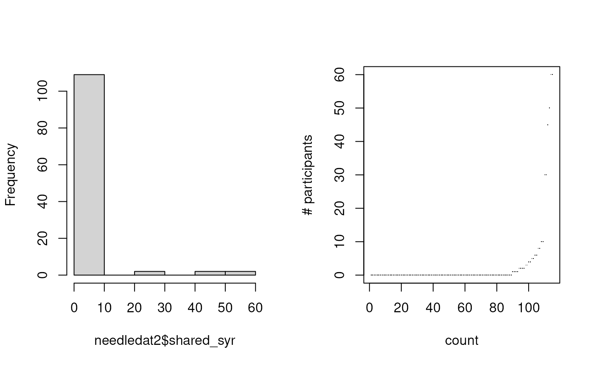
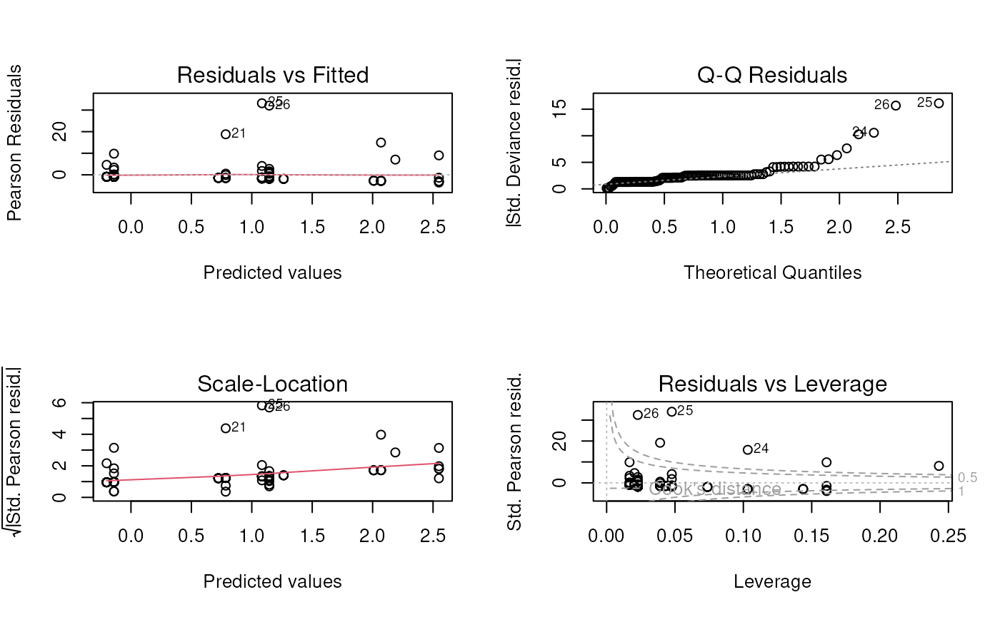
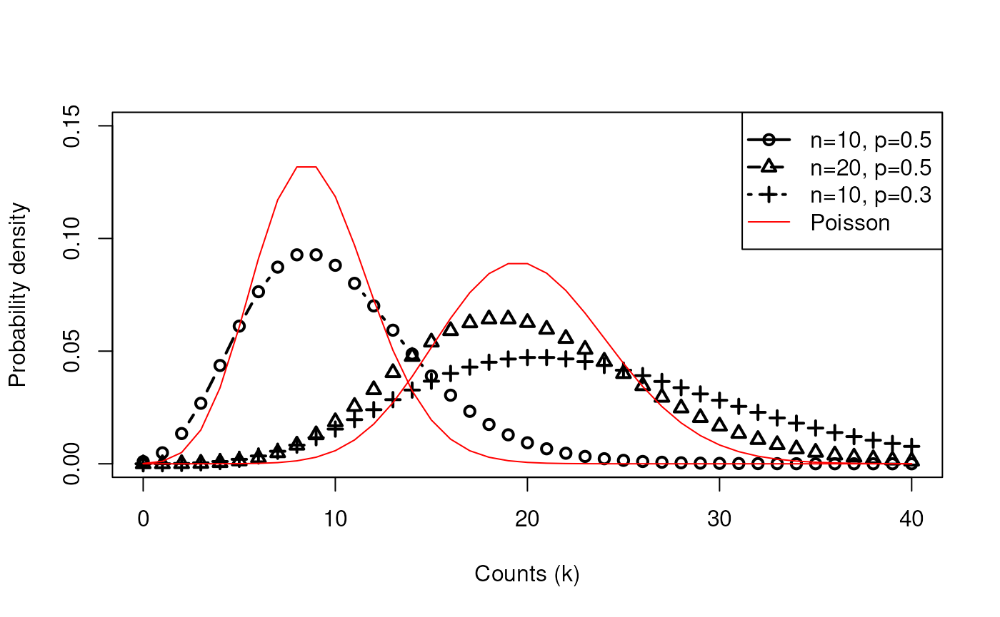
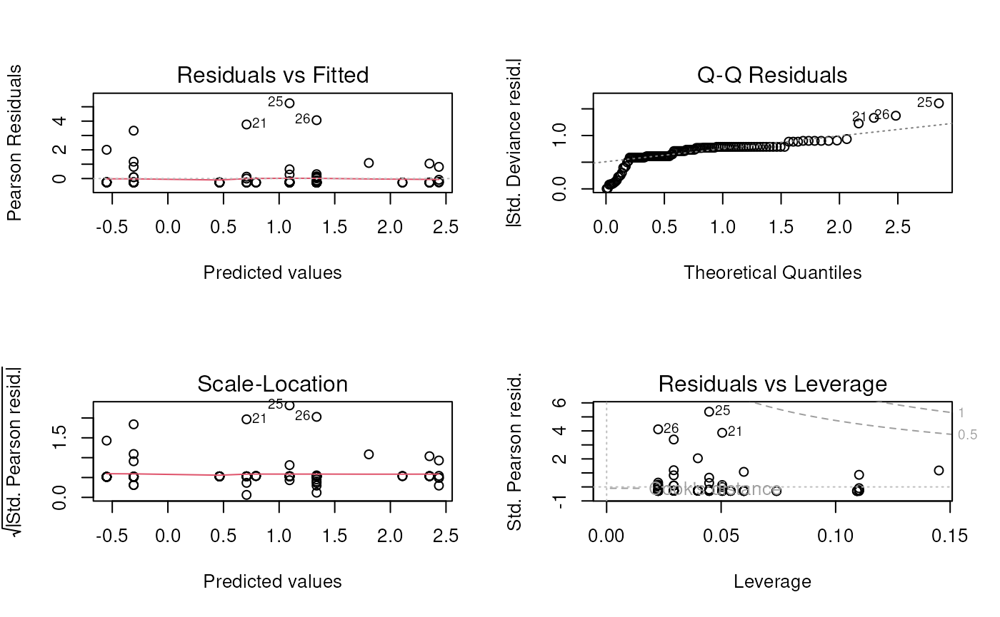
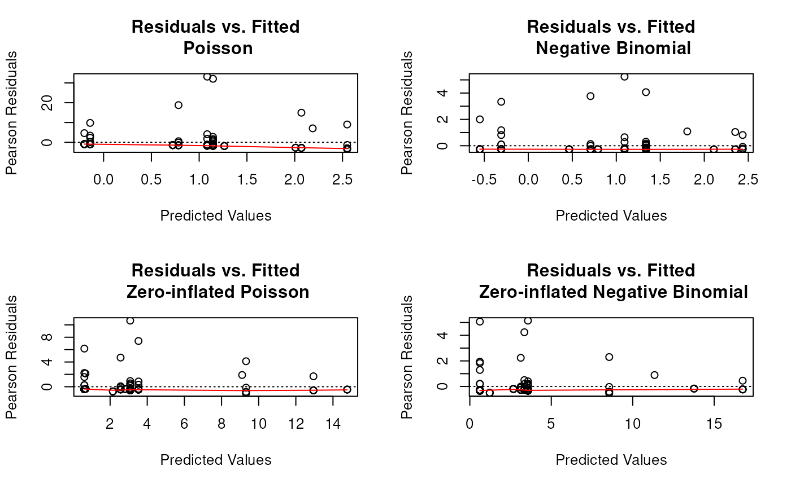

# Session 5: loglinear regression part 2

## Learning objectives and outline

### Learning objectives

1.  Define and identify over-dispersion in count data
2.  Define the negative binomial (NB) distribution and identify
    applications for it
3.  Define zero-inflated count models
4.  Fit and interpret Poisson and NB, with and without zero inflation

### Outline

1.  Review of log-linear Poisson glm
2.  Review of diagnostics and interpretation of coefficients
3.  Over-dispersion
    - Negative Binomial distribution
4.  Zero-inflated models

Resources:

- Vittinghoff section 8.1-8.3
- Short tutorials on regression in R (and Stata, SAS, SPSS, Mplus)
  - <https://stats.idre.ucla.edu/other/dae/>

## Review

### Components of GLM

- **Random component** specifies the conditional distribution for the
  response variable - it doesn’t have to be normal but can be any
  distribution that belongs to the “exponential” family of distributions
- **Systematic component** specifies linear function of predictors
  (linear predictor)
- **Link** \[denoted by g(.)\] specifies the relationship between the
  expected value of the random component and the systematic component,
  can be linear or nonlinear

### Motivating example: Choice of Distribution

- Count data are often modeled as Poisson distributed:
  - mean $`\lambda`$ is greater than 0
  - variance is also $`\lambda`$
  - Probability density
    $`P(k, \lambda) = \frac{\lambda^k}{k!} e^{-\lambda}`$


### Poisson model: the GLM

The **systematic part** of the GLM is:
``` math
log(\lambda_i) = \beta_0 + \beta_1 \textrm{RACE}_i + \beta_2 \textrm{TRT}_i + \beta_3 \textrm{ALCH}_i + \beta_4 \textrm{DRUG}_i
```
Or alternatively:
``` math
\lambda_i = exp \left( \beta_0 + \beta_1 \textrm{RACE}_i + \beta_2 \textrm{TRT}_i + \beta_3 \textrm{ALCH}_i + \beta_4 \textrm{DRUG}_i \right)
```

The **random part** is (Recall the $`\lambda_i`$ is both the mean and
variance of a Poisson distribution):
``` math
y_i \sim Poisson(\lambda_i)
```

### Example: Risky Drug Use Behavior

- Outcome is \# times the drug user shared a syringe in the past month
  (`shared_syr`)
- Predictors: `sex`, `ethn`, `homeless`
  - filtered to `sex` “M” or “F”, `ethn` “White”, “AA”, “Hispanic”

[`summary`](https://rdrr.io/r/base/summary.html)`(``needledat2``$``shared_syr``)`

    ##    Min. 1st Qu.  Median    Mean 3rd Qu.    Max.     NAs 
    ##   0.000   0.000   0.000   3.122   0.000  60.000       2

[`var`](https://rdrr.io/r/stats/cor.html)`(``needledat2``$``shared_syr``, na.rm ``=`` ``TRUE``)`

    ## [1] 113.371

### Example: Risky Drug Use Behavior

Exploratory plots



- There are a *lot* of zeros and variance is much greater than mean
  - Poisson model is probably not a good fit

### Fitting a Poisson model

`fit.pois`` ``<-`` `[`glm`](https://rdrr.io/r/stats/glm.html)`(``shared_syr`` ``~`` ``sex`` ``+`` ``ethn`` ``+`` ``homeless``,`` `` data ``=`` ``needledat2``,`` `` family ``=`` `[`poisson`](https://rdrr.io/r/stats/family.html)`(``link ``=`` ``"log"``)``)`

### Residuals plots

 \* Poisson
model is definitely not a good fit.

## Over-dispersion

### When the Poisson model doesn’t fit

1.  Variance \> mean (over-dispersion)
    - Negative binomial distribution
2.  Excess zeros (zero inflation)
    - Can introduce zero-inflation

### Negative binomial distribution

- The binomial distribution is the number of successes in n trials:
  - Roll a die ten times, how many times do you see a 6?
- The negative binomial distribution is the number of successes it takes
  to observe r failures:
  - How many times do you have to roll the die to see a 6 ten times?
  - Note that the number of rolls is no longer fixed.
  - In this example, p=5/6 and a 6 is a “failure”

### Negative binomial GLM

*One way* to parametrize a NB model is with a **systematic part**
equivalent to the Poisson model:
``` math
log(\lambda_i) = \beta_0 + \beta_1 \textrm{RACE}_i + \beta_2 \textrm{TRT}_i + \beta_3 \textrm{ALCH}_i + \beta_4 \textrm{DRUG}_i
```
Or:
``` math
\lambda_i = exp \left( \beta_0 + \beta_1 \textrm{RACE}_i + \beta_2 \textrm{TRT}_i + \beta_3 \textrm{ALCH}_i + \beta_4 \textrm{DRUG}_i \right)
```

And a **random part**:
``` math
y_i \sim NB(\lambda_i, \theta)
```

- $`\theta`$ is a **dispersion parameter** that is estimated
- When $`\theta = 0`$ it is equivalent to Poisson model
- [`MASS::glm.nb()`](https://rdrr.io/pkg/MASS/man/glm.nb.html) uses this
  parametrization,
  [`dnbinom()`](https://rdrr.io/r/stats/NegBinomial.html) does not
- The Poisson model can be considered **nested** within the Negative
  Binomial model

### Negative Binomial Random Distribution


### Compare Poisson vs. Negative Binomial

Negative Binomial Distribution has two parameters: \# of trials n, and
probability of success p



### Negative Binomial Regression

[`library`](https://rdrr.io/r/base/library.html)`(`[`MASS`](http://www.stats.ox.ac.uk/pub/MASS4/)`)`` ``fit.negbin`` ``<-`` ``MASS``::`[`glm.nb`](https://rdrr.io/pkg/MASS/man/glm.nb.html)`(``shared_syr`` ``~`` ``sex`` ``+`` `` ``ethn`` ``+`` ``homeless``,`` `` data ``=`` ``needledat2``)`

### 

[`summary`](https://rdrr.io/r/base/summary.html)`(``fit.negbin``)`

    ## 
    ## Call:
    ## MASS::glm.nb(formula = shared_syr ~ sex + ethn + homeless, data = needledat2, 
    ##     init.theta = 0.07743871374, link = log)
    ## 
    ## Coefficients:
    ##              Estimate Std. Error z value Pr(>|z|)  
    ## (Intercept)    0.4641     0.8559   0.542   0.5876  
    ## sexM          -1.0148     0.8294  -1.224   0.2211  
    ## ethnHispanic   1.3424     1.3201   1.017   0.3092  
    ## ethnWhite      0.2429     0.7765   0.313   0.7544  
    ## homelessyes    1.6445     0.7073   2.325   0.0201 *
    ## ---
    ## Signif. codes:  0 '***' 0.001 '**' 0.01 '*' 0.05 '.' 0.1 ' ' 1
    ## 
    ## (Dispersion parameter for Negative Binomial(0.0774) family taken to be 1)
    ## 
    ##     Null deviance: 62.365  on 114  degrees of freedom
    ## Residual deviance: 56.232  on 110  degrees of freedom
    ##   (2 observations deleted due to missingness)
    ## AIC: 306.26
    ## 
    ## Number of Fisher Scoring iterations: 1
    ## 
    ## 
    ##               Theta:  0.0774 
    ##           Std. Err.:  0.0184 
    ## 
    ##  2 x log-likelihood:  -294.2550

### Likelihood ratio test

Basis: Under $`H_0`$: no improvement in fit by more complex model,
difference in model residual deviances is $`\chi^2`$-distributed.

Deviance:
$`\Delta (\textrm{D}) = -2 * \Delta (\textrm{log likelihood})`$

`(``ll.negbin`` ``<-`` `[`logLik`](https://rdrr.io/r/stats/logLik.html)`(``fit.negbin``)``)`

    ## 'log Lik.' -147.1277 (df=6)

`(``ll.pois`` ``<-`` `[`logLik`](https://rdrr.io/r/stats/logLik.html)`(``fit.pois``)``)`

    ## 'log Lik.' -730.0133 (df=5)

[`pchisq`](https://rdrr.io/r/stats/Chisquare.html)`(``2`` ``*`` ``(``ll.negbin`` ``-`` ``ll.pois``)``, df``=``1``, `` `` lower.tail``=``FALSE``)`

    ## 'log Lik.' 1.675949e-255 (df=6)

### NB regression residuals plots



## Zero Inflation

### Zero inflated “two-step” models

**Step 1**: logistic model to determine whether count is zero or
Poisson/NB

**Step 2**: Poisson or NB regression distribution for $`y_i`$ not set to
zero by *1.*

### Poisson Distribution with Zero Inflation


### Zero-inflated Poisson regression

[`library`](https://rdrr.io/r/base/library.html)`(`[`pscl`](https://github.com/atahk/pscl)`)`` ``fit.ZIpois`` ``<-`` `` ``pscl``::`[`zeroinfl`](https://rdrr.io/pkg/pscl/man/zeroinfl.html)`(``shared_syr``~``sex``+``ethn``+``homeless``,`` `` dist ``=`` ``"poisson"``,`` `` data ``=`` ``needledat2``)`

### 

[`summary`](https://rdrr.io/r/base/summary.html)`(``fit.ZIpois``)`

    ## 
    ## Call:
    ## pscl::zeroinfl(formula = shared_syr ~ sex + ethn + homeless, data = needledat2, 
    ##     dist = "poisson")
    ## 
    ## Pearson residuals:
    ##     Min      1Q  Median      3Q     Max 
    ## -1.0761 -0.5784 -0.4030 -0.3341 10.6835 
    ## 
    ## Count model coefficients (poisson with log link):
    ##              Estimate Std. Error z value Pr(>|z|)    
    ## (Intercept)    3.2169     0.1796  17.909  < 2e-16 ***
    ## sexM          -1.4725     0.1442 -10.212  < 2e-16 ***
    ## ethnHispanic  -0.1525     0.1576  -0.968 0.333223    
    ## ethnWhite     -0.5236     0.1464  -3.577 0.000347 ***
    ## homelessyes    1.2034     0.1455   8.268  < 2e-16 ***
    ## 
    ## Zero-inflation model coefficients (binomial with logit link):
    ##              Estimate Std. Error z value Pr(>|z|)   
    ## (Intercept)   2.06262    0.65227   3.162  0.00157 **
    ## sexM         -0.05067    0.58252  -0.087  0.93068   
    ## ethnHispanic -1.76120    0.81177  -2.170  0.03004 * 
    ## ethnWhite    -0.50187    0.56919  -0.882  0.37792   
    ## homelessyes  -0.53013    0.48108  -1.102  0.27048   
    ## ---
    ## Signif. codes:  0 '***' 0.001 '**' 0.01 '*' 0.05 '.' 0.1 ' ' 1 
    ## 
    ## Number of iterations in BFGS optimization: 18 
    ## Log-likelihood: -299.8 on 10 Df

### Zero-inflated Negative Binomial regression

`fit.ZInegbin`` ``<-`` `` `` ``pscl``::`[`zeroinfl`](https://rdrr.io/pkg/pscl/man/zeroinfl.html)`(``shared_syr``~``sex``+``ethn``+``homeless``,`` `` dist ``=`` ``"negbin"``,`` `` data ``=`` ``needledat2``)`

- *NOTE*: zero-inflation model can include any of your variables as
  predictors
- *WARNING* Default in `zerinfl()` function is to use *all* variables as
  predictors in logistic model

### 

[`summary`](https://rdrr.io/r/base/summary.html)`(``fit.ZInegbin``)`

    ## 
    ## Call:
    ## pscl::zeroinfl(formula = shared_syr ~ sex + ethn + homeless, data = needledat2, 
    ##     dist = "negbin")
    ## 
    ## Pearson residuals:
    ##     Min      1Q  Median      3Q     Max 
    ## -0.5401 -0.3255 -0.2715 -0.1926  5.1489 
    ## 
    ## Count model coefficients (negbin with log link):
    ##              Estimate Std. Error z value Pr(>|z|)   
    ## (Intercept)    2.8401     1.1845   2.398  0.01649 * 
    ## sexM          -2.2278     0.9350  -2.382  0.01720 * 
    ## ethnHispanic  -0.4116     0.9832  -0.419  0.67545   
    ## ethnWhite     -0.4294     0.8647  -0.497  0.61949   
    ## homelessyes    1.9461     0.7103   2.740  0.00615 **
    ## Log(theta)    -1.1972     0.5159  -2.320  0.02032 * 
    ## 
    ## Zero-inflation model coefficients (binomial with logit link):
    ##              Estimate Std. Error z value Pr(>|z|)  
    ## (Intercept)    1.6863     0.8466   1.992   0.0464 *
    ## sexM          -0.9919     0.8016  -1.237   0.2159  
    ## ethnHispanic -11.3556   112.8675  -0.101   0.9199  
    ## ethnWhite     -0.7452     0.7304  -1.020   0.3076  
    ## homelessyes    0.3555     0.7397   0.481   0.6308  
    ## ---
    ## Signif. codes:  0 '***' 0.001 '**' 0.01 '*' 0.05 '.' 0.1 ' ' 1 
    ## 
    ## Theta = 0.302 
    ## Number of iterations in BFGS optimization: 37 
    ## Log-likelihood: -142.8 on 11 Df

### Zero-inflated NB - simplified

- Model is much more interpretable if the exposure of interest is *not*
  included in the zero-inflation model.
- E.g. with HIV status as the only predictor in zero-inflation model:

`fit.ZInb2`` ``<-`` ``pscl``::`[`zeroinfl`](https://rdrr.io/pkg/pscl/man/zeroinfl.html)`(``shared_syr`` ``~`` ``sex`` ``+`` ``ethn`` ``+`` `` `` ``homeless`` ``+`` ``hiv`` ``|`` ``hiv``,`` `` dist ``=`` ``"negbin"``,`` `` data ``=`` ``needledat2``)`

### 

[`summary`](https://rdrr.io/r/base/summary.html)`(``fit.ZInb2``)`

    ## 
    ## Call:
    ## pscl::zeroinfl(formula = shared_syr ~ sex + ethn + homeless + hiv | hiv, 
    ##     data = needledat2, dist = "negbin")
    ## 
    ## Pearson residuals:
    ##     Min      1Q  Median      3Q     Max 
    ## -0.4299 -0.3646 -0.3559 -0.3299  6.3053 
    ## 
    ## Count model coefficients (negbin with log link):
    ##              Estimate Std. Error z value Pr(>|z|)    
    ## (Intercept)    3.6685     0.9470   3.874 0.000107 ***
    ## sexM          -1.7648     0.6205  -2.844 0.004454 ** 
    ## ethnHispanic  -1.5808     0.7446  -2.123 0.033757 *  
    ## ethnWhite     -1.1268     0.6924  -1.627 0.103662    
    ## homelessyes    1.0313     0.5692   1.812 0.070025 .  
    ## hivpositive   -1.0820     1.0167  -1.064 0.287245    
    ## hivyes         2.3723     0.7829   3.030 0.002443 ** 
    ## Log(theta)     0.1396     0.4647   0.300 0.763941    
    ## 
    ## Zero-inflation model coefficients (binomial with logit link):
    ##              Estimate Std. Error z value Pr(>|z|)    
    ## (Intercept)    1.2163     0.2851   4.266 1.99e-05 ***
    ## hivpositive   -0.3493     0.9389  -0.372    0.710    
    ## hivyes       -17.9654  3065.6162  -0.006    0.995    
    ## ---
    ## Signif. codes:  0 '***' 0.001 '**' 0.01 '*' 0.05 '.' 0.1 ' ' 1 
    ## 
    ## Theta = 1.1498 
    ## Number of iterations in BFGS optimization: 59 
    ## Log-likelihood: -122.5 on 11 Df

### Intercept-only ZI model

`fit.ZInb3`` ``<-`` `` ``pscl``::`[`zeroinfl`](https://rdrr.io/pkg/pscl/man/zeroinfl.html)`(``shared_syr``~``sex``+``ethn``+``homeless``|``1``,`` `` dist ``=`` ``"negbin"``,`` `` data ``=`` ``needledat2``)`

### 

[`summary`](https://rdrr.io/r/base/summary.html)`(``fit.ZInb3``)`

    ## 
    ## Call:
    ## pscl::zeroinfl(formula = shared_syr ~ sex + ethn + homeless | 1, data = needledat2, 
    ##     dist = "negbin")
    ## 
    ## Pearson residuals:
    ##     Min      1Q  Median      3Q     Max 
    ## -0.3159 -0.3123 -0.3040 -0.2953  5.2941 
    ## 
    ## Count model coefficients (negbin with log link):
    ##              Estimate Std. Error z value Pr(>|z|)  
    ## (Intercept)   2.08551    1.42665   1.462   0.1438  
    ## sexM         -1.43812    0.89188  -1.612   0.1069  
    ## ethnHispanic  0.48126    1.16639   0.413   0.6799  
    ## ethnWhite    -0.07421    0.81066  -0.092   0.9271  
    ## homelessyes   1.62076    0.67705   2.394   0.0167 *
    ## Log(theta)   -1.12533    0.89365  -1.259   0.2079  
    ## 
    ## Zero-inflation model coefficients (binomial with logit link):
    ##             Estimate Std. Error z value Pr(>|z|)
    ## (Intercept)   0.5211     0.7599   0.686    0.493
    ## ---
    ## Signif. codes:  0 '***' 0.001 '**' 0.01 '*' 0.05 '.' 0.1 ' ' 1 
    ## 
    ## Theta = 0.3245 
    ## Number of iterations in BFGS optimization: 37 
    ## Log-likelihood: -146.8 on 7 Df

### Confidence intervals

Use the [`confint()`](https://rdrr.io/r/stats/confint.html) function for
all these models (don’t try to specify which package confint comes
from). E.g.:

[`confint`](https://rdrr.io/r/stats/confint.html)`(``fit.ZInb3``)`

    ##                         2.5 %    97.5 %
    ## count_(Intercept)  -0.7106815 4.8816948
    ## count_sexM         -3.1861734 0.3099239
    ## count_ethnHispanic -1.8048157 2.7673339
    ## count_ethnWhite    -1.6630653 1.5146489
    ## count_homelessyes   0.2937556 2.9477604
    ## zero_(Intercept)   -0.9683324 2.0105711

### Residuals vs. fitted values

I invisibly define functions `plotpanel1` and `plotpanel2` that will
work for all types of models (see lab). These use Pearson residuals.



### Quantile-quantile plots for residuals

*still*
over-dispersed - ideas?

### Summary / Conclusions

- These are multiplicative models
- Fitting zero-inflated models can be problematic (convergence,
  over-complicated default models), especially for small samples
- Use QQ and residuals plots to assess model fit
- Can use LRT to compare nested models
