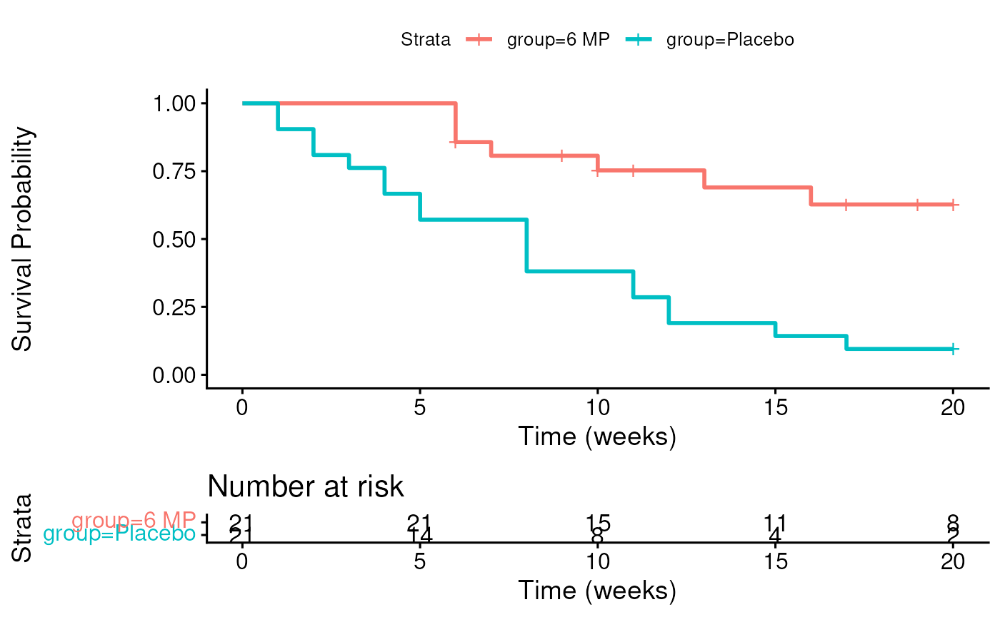

# Session 6 lab exercise: Survival Analysis part 1

**Learning objectives**

1.  Calculate Kaplan-Meier estimates of survival probability over time
2.  Plot survival curves for censored time-to-event data
3.  Perform and interpret log-rank test
4.  Define “informative” censoring

**Exercises**

1.  Calculate the follow-up table for 6 MP patients in the leukemia
    study

[`library`](https://rdrr.io/r/base/library.html)`(`[`readr`](https://readr.tidyverse.org)`)`` ``leuk`` ``<-`` `[`read_csv`](https://readr.tidyverse.org/reference/read_delim.html)`(``"leuk.csv"``)`

    ## Rows: 42 Columns: 3
    ## ── Column specification ────────────────────────────────────────────────────────
    ## Delimiter: ","
    ## chr (1): group
    ## dbl (2): time, cens
    ## 
    ## ℹ Use `spec()` to retrieve the full column specification for this data.
    ## ℹ Specify the column types or set `show_col_types = FALSE` to quiet this message.

2.  Plot the Kaplan-Meier estimate of the follow-up table from 1.
    [`library(survminer)`](https://rpkgs.datanovia.com/survminer/index.html)
    is recommendable.

[`library`](https://rdrr.io/r/base/library.html)`(`[`survival`](https://github.com/therneau/survival)`)`` `[`library`](https://rdrr.io/r/base/library.html)`(`[`survminer`](https://rpkgs.datanovia.com/survminer/index.html)`)`

    ## Loading required package: ggplot2

    ## Loading required package: ggpubr

    ## 
    ## Attaching package: 'survminer'

    ## The following object is masked from 'package:survival':
    ## 
    ##     myeloma

[`with`](https://rdrr.io/r/base/with.html)`(``leuk``, `[`Surv`](https://rdrr.io/pkg/survival/man/Surv.html)`(``time``, ``cens``)``)`

    ##  [1]  6   6   6   7  10  13  16  22  23   6+  9+ 10+ 11+ 17+ 19+ 20+ 25+ 32+ 32+
    ## [20] 34+ 35+  1   1   2   2   3   4   4   5   5   8   8   8   8  11  11  12  12 
    ## [39] 15  17  22  23

`fit`` ``<-`` ``survminer``::`[`surv_fit`](https://rdrr.io/pkg/survminer/man/surv_fit.html)`(`[`Surv`](https://rdrr.io/pkg/survival/man/Surv.html)`(``time``, ``cens``)`` ``~`` ``group``, data ``=`` ``leuk``)`` ``survminer``::`[`ggsurvplot`](https://rdrr.io/pkg/survminer/man/ggsurvplot.html)`(``fit``,`` `` xlab ``=`` ``"Time (weeks)"``,`` `` ylab ``=`` ``"Survival Probability"``,`` `` risk.table ``=`` ``TRUE``)`

    ## Ignoring unknown labels:
    ## • colour : "Strata"

3.  What is the 75th percentile of survival times for the 6 MP group?
    For the Placebo group? This is the time that 75% of the patients
    survive. This is also the time at which 25% of patients have had
    events.

[`quantile`](https://rdrr.io/r/stats/quantile.html)`(``fit``)`

    ## $quantile
    ##               25 50 75
    ## group=6 MP    13 23 NA
    ## group=Placebo  4  8 12
    ## 
    ## $lower
    ##               25 50 75
    ## group=6 MP     6 16 23
    ## group=Placebo  2  4  8
    ## 
    ## $upper
    ##               25 50 75
    ## group=6 MP    NA NA NA
    ## group=Placebo  8 12 NA

[`survdiff`](https://rdrr.io/pkg/survival/man/survdiff.html)`(`[`Surv`](https://rdrr.io/pkg/survival/man/Surv.html)`(``time``, ``cens``)`` ``~`` ``group``, data ``=`` ``leuk``)`

    ## Call:
    ## survdiff(formula = Surv(time, cens) ~ group, data = leuk)
    ## 
    ##                N Observed Expected (O-E)^2/E (O-E)^2/V
    ## group=6 MP    21        9     19.3      5.46      16.8
    ## group=Placebo 21       21     10.7      9.77      16.8
    ## 
    ##  Chisq= 16.8  on 1 degrees of freedom, p= 4e-05

4.  Suppose you were instructed to cap follow-up times at 20 weeks.
    Re-do the Kaplan-Meier plot for both groups, and re-do the logrank
    test.

[`library`](https://rdrr.io/r/base/library.html)`(`[`tidyverse`](https://tidyverse.tidyverse.org)`)`

    ## ── Attaching core tidyverse packages ──────────────────────── tidyverse 2.0.0 ──
    ## ✔ dplyr     1.2.1     ✔ stringr   1.6.0
    ## ✔ forcats   1.0.1     ✔ tibble    3.3.1
    ## ✔ lubridate 1.9.5     ✔ tidyr     1.3.2
    ## ✔ purrr     1.2.2     
    ## ── Conflicts ────────────────────────────────────────── tidyverse_conflicts() ──
    ## ✖ dplyr::filter() masks stats::filter()
    ## ✖ dplyr::lag()    masks stats::lag()
    ## ℹ Use the conflicted package (<http://conflicted.r-lib.org/>) to force all conflicts to become errors

`leuknew`` ``<-`` ``leuk`` `[`%>%`](https://magrittr.tidyverse.org/reference/pipe.html)` `[`mutate`](https://dplyr.tidyverse.org/reference/mutate.html)`(``newtime ``=`` `[`pmin`](https://rdrr.io/r/base/Extremes.html)`(``time``, ``20``)``)`` `[`%>%`](https://magrittr.tidyverse.org/reference/pipe.html)` `` `` `[`mutate`](https://dplyr.tidyverse.org/reference/mutate.html)`(``newcens ``=`` `[`ifelse`](https://rdrr.io/r/base/ifelse.html)`(``time`` ``<=`` ``20``, ``cens``, ``0``)``)`

Kaplan-Meier plot

`fit`` ``<-`` ``survminer``::`[`surv_fit`](https://rdrr.io/pkg/survminer/man/surv_fit.html)`(`[`Surv`](https://rdrr.io/pkg/survival/man/Surv.html)`(``newtime``, ``newcens``)`` ``~`` ``group``, data ``=`` ``leuknew``)`` ``survminer``::`[`ggsurvplot`](https://rdrr.io/pkg/survminer/man/ggsurvplot.html)`(``fit``,`` `` xlab ``=`` ``"Time (weeks)"``,`` `` ylab ``=`` ``"Survival Probability"``,`` `` risk.table ``=`` ``TRUE``)`

    ## Ignoring unknown labels:
    ## • colour : "Strata"

Logrank test

[`survdiff`](https://rdrr.io/pkg/survival/man/survdiff.html)`(`[`Surv`](https://rdrr.io/pkg/survival/man/Surv.html)`(``newtime``, ``newcens``)`` ``~`` ``group``, data ``=`` ``leuknew``)`

    ## Call:
    ## survdiff(formula = Surv(newtime, newcens) ~ group, data = leuknew)
    ## 
    ##                N Observed Expected (O-E)^2/E (O-E)^2/V
    ## group=6 MP    21        7       16      5.05        14
    ## group=Placebo 21       19       10      8.05        14
    ## 
    ##  Chisq= 14  on 1 degrees of freedom, p= 2e-04

5.  Give a hypothetical example of how censoring in this example might
    be “informative.”

If sicker patients were moved to another hospital where they weren’t
followed up on, and were also more likely to relapse, this would be
informative censoring.
