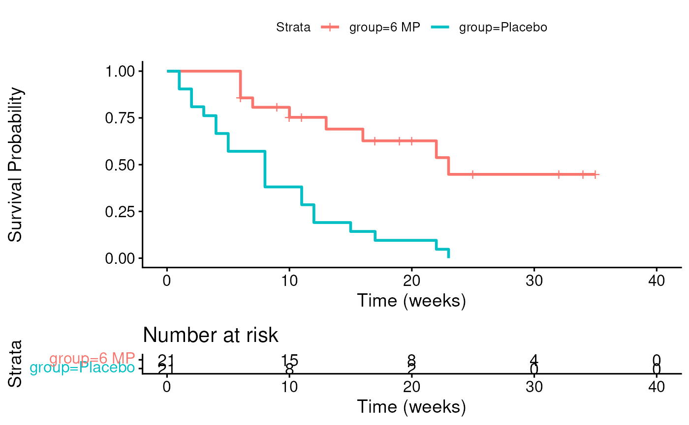

# Session 6: Survival Analysis I

## Learning objectives and outline

### Learning objectives

1.  Define main types of censoring
2.  Define the assumption of uninformative censoring
3.  Define survival function, hazard functions, cumulative event
    function
4.  Perform a Kaplan-Meier estimate
5.  Perform, interpret, and identify assumptions of the logrank test
6.  Define and calculate potential follow-up time
7.  Calculate median survival time

### Outline

1.  Introduction to censored data
    - Outcome variable: time-to-event
    - Types of censored data
    - Assumption of uninformative censoring
2.  Survival function and Kaplan-Meier estimator
3.  Comparing groups: Log-rank test

- Vittinghoff sections 3.1-3.5
- Tutorial Paper *Survival Analysis Part I: Basic concepts and first
  analyses* by Clark, Bradburn, Love, Altman. British Journal of
  Cancer (2003) 89, 232 – 238

## Introduction to censored data

### Outcome variable: time to event

- Generally time to the occurrence of a particular event, e.g. 
  - death
  - disease recurrence
  - or other experience of interest
- Time: The time from the beginning of an observation period t0
  (e.g. surgery) to:
  - an event, or
  - end of the study, or
  - loss of contact or withdrawal from the study

### Typical research questions

- What is the median survival time (in years) of patients diagnosed with
  a certain disease?
- What is the probability of those patients surviving for at least 5
  years?
- Are certain personal, behavioral, or clinical characteristics
  correlated with participant’s chance of survival?
- Is there a survival difference between groups?
  - e.g. treatment vs. control
  - e.g. exposed vs. unexposed

### Special considerations in survival analysis

- Survival data requires special techniques:
  - Survival data is generally not normally distributed
  - **Censoring** - observe individuals for differing lengths of time
    that may or may not result in an “event”
- Censoring is a key challenge in survival analysis. Consider a clinical
  study where:
  - patient 1 dies 1 month after diagnosis
  - patient 2 dies 12 years after diagnosis
  - patient 3 is lost to follow-up after 1 month
  - patient 4 is still alive after 12 years of follow-up

*Question \#1: which patients are “censored?”*

*Question \#2: how would you rank these patients in order of disease
severity?*

### Left / right / interval censoring

- *right censoring*: The event (if it occurs) happens past the end of
  the observation period
- *left censoring*: We observe the presence of a state or condition but
  do not know when it began.
  - Example: a study investigating the time to recurrence of a cancer
    following surgical removal of the primary tumor. If the patients
    were examined 3 months after surgery to determine recurrence, then
    those who had a recurrence would have a survival time that was left
    censored because the actual time of recurrence occurred less than 3
    months after surgery.
- *interval censoring*: individuals come in and out of observation.

Source: <https://data.princeton.edu/wws509/notes/c7.pdf>

### Classes of uninformative censoring

- *type 1 censoring*: The total duration of the study is fixed
  - a generalization is *fixed censoring*: each individual has a
    potentially different maximum observation time, but still fixed in
    advance
- *type 2 censoring*: The sample is followed as long as necessary until
  a pre-specified number of events have occurred
  - the length of the study is unknown in advance
- *random censoring*: the censoring times are independent random
  variables

These are all analyzed in essentially the same way.

Source: <https://data.princeton.edu/wws509/notes/c7.pdf>

## Informative / uninformative censoring

- *Uninformative censoring*: The most basic assumption we will make is
  that the censoring of an observation does not provide any information
  about survival other than that it exceeds the time of the censoring
- Can be violated if, for example, higher risk of death causes study
  dropout
- Similar to when we assume data missing at random or completely at
  random

### Survival function S(t)

- The Survival function at time t, denoted $`S(t)`$, is the probability
  of being event-free at t.\
- Equivalently, it is the probability that the survival time is greater
  than t.

### leukemia Example: see leuk.csv

- Study of 6-mercaptopurine (6-MP) maintenance therapy for children in
  remission from acute lymphoblastic leukemia (ALL)
- 42 patients achieved remission from induction therapy and were then
  randomized in equal numbers to 6-MP or placebo.
- Survival time studied was from randomization until relapse.

Survival times in weeks for Placebo group:

    ##  [1]  1  1  2  2  3  4  4  5  5  8  8  8  8 11 11 12 12 15 17 22 23

Survival times in weeks for Treatment group:

    ##  [1]  6   6   6   7  10  13  16  22  23   6+  9+ 10+ 11+ 17+ 19+ 20+ 25+ 32+ 32+
    ## [20] 34+ 35+

### A graphical look at the treatment group

(Initiation times (t0) are simulated between 0 and 26 weeks)

### leukemia study follow-up table

leukemia Follow-up Table

This is the **Kaplan-Meier Estimate** $`\hat S(t)`$ of the Survival
function $`S(t)`$.

## Survival function and Kaplan-Meier estimator

### Kaplan-Meier Estimate

    ## Ignoring unknown labels:
    ## • colour : "Strata"

### Median Survival Time

*Definition*: *Median Survival Time* is the time at which half of a
group (sample, population) is expected to experience an event (in this
example, death)

- Without censoring, median survival time can be calculated the obvious
  way
- With censoring, we need to use the Kaplan-Meier estimate of the
  survival function $`\hat S(t)`$

[`survfit`](https://rdrr.io/pkg/survival/man/survfit.html)`(`[`Surv`](https://rdrr.io/pkg/survival/man/Surv.html)`(``time``, ``cens``)``~``group``, data``=``leuk``)`

    ## Call: survfit(formula = Surv(time, cens) ~ group, data = leuk)
    ## 
    ##                n events median 0.95LCL 0.95UCL
    ## group=6 MP    21      9     23      16      NA
    ## group=Placebo 21     21      8       4      12

### Median Potential Follow-Up Time

*Definition*: *Median Potential Follow-Up Time* is the time for which
half of a sample would have been expected to be followe, *in the absence
of events*.

- Without any events, median follow-up time can be calculated the
  obvious way
- With events, a simple median will *under-estimate* the potential
  follow-up time. Use a reverse Kaplan-Meier estimate instead:

[`survfit`](https://rdrr.io/pkg/survival/man/survfit.html)`(`[`Surv`](https://rdrr.io/pkg/survival/man/Surv.html)`(``time``, ``1``-``cens``)``~``group``, data``=``leuk``)`

    ## Call: survfit(formula = Surv(time, 1 - cens) ~ group, data = leuk)
    ## 
    ##                n events median 0.95LCL 0.95UCL
    ## group=6 MP    21     12     25      17      NA
    ## group=Placebo 21      0     NA      NA      NA

*Note*: *Actual* median follow-up time is half as long for the placebo
group, but there is not reason to believe the potential follow-up times
were different

### Cumulative Event Function

*Definition*: The *cumulative event function* at time t, denoted
$`F(t)`$, is the probability that the event has occurred by time t, or
equivalently, the probability that the survival time is less than or
equal to t. Note $`F(t) = 1-S(t)`$.

### Hazard and Cumulative Hazard functions

- $`h(t)`$: hazard function, risk of event at a point in time
  - only calculated by software
- $`H(t) = -log[S(t)]`$: cumulative hazard function
  - not easily interpretable
  - cumulative force of mortality, or the number of events that would be
    expected for each individual by time t if the event were a
    repeatable process.
- Will be important next class for Cox Proportional Hazards

## Comparing Groups Using the Logrank Test

### Log-rank test

- *logrank test* is used to compare survival between two or more groups
  - $`H_0`$ is that the population survival functions are equal at all
    follow-up times
  - $`H_1`$ is that the population survival functions differ at at least
    one follow-up time
- logrank test is really just a *chi-square test* comparing expected
  vs. observed number of events in each group.
  - Observed is just what we see.
  - How to calculate expected?

### Log-rank test (cont’d)

Logrank test is just a chisquare test on the observed and expected
number of events:

[`survdiff`](https://rdrr.io/pkg/survival/man/survdiff.html)`(`[`Surv`](https://rdrr.io/pkg/survival/man/Surv.html)`(``time``, ``cens``)``~``group``, data``=``leuk``)`

    ## Call:
    ## survdiff(formula = Surv(time, cens) ~ group, data = leuk)
    ## 
    ##                N Observed Expected (O-E)^2/E (O-E)^2/V
    ## group=6 MP    21        9     19.3      5.46      16.8
    ## group=Placebo 21       21     10.7      9.77      16.8
    ## 
    ##  Chisq= 16.8  on 1 degrees of freedom, p= 4e-05

- Many alternatives are available, but log-rank should be the default
  unless you have good reason.
  - E.g. Wilcoxon (Breslow), Tarone-Ware, Peto tests

### Notes about the Logrank Test

- Non-parametric: no assumptions on the form of $`S(t)`$
- Log-rank test and K-M curves don’t work with continuous predictors
- Assumes *non-informative censoring*:
  - censoring is unrelated to the likelihood of developing the event of
    interest
  - for each subject, his/her censoring time is statistically
    independent from their failure time

### Summary

- Censoring requires special methods to make full use of the data
- Kaplan-Meier estimate provides non-parametric estimate of the survival
  function
  - non-parametric meaning that no form of the survival function is
    assumed; instead it is empirically estimated
- Logrank test provides a non-parametric hypothesis test
  - H0: identical survival functions of multiple strata
