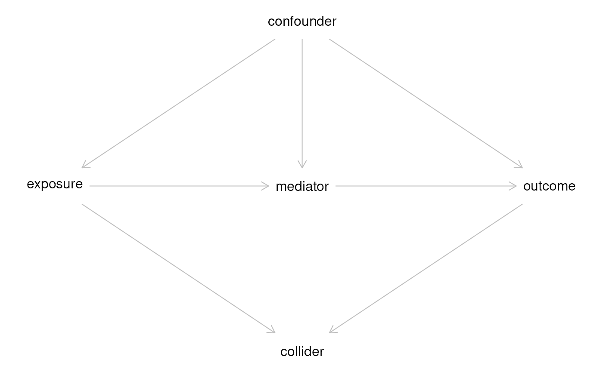

# Session 7 lab exercise: Cox proportional Hazards

**Learning objectives**

1.  Fit a Cox proportional hazard model
2.  Create a stratified Kaplan-Meier plot
3.  Fit exponential and Weibull accelerated failure time models
4.  Fit a model using strata and a time-dependent covariate
5.  Create a DAG using dagitty

**Exercises**

1.  Fit a Cox proportional hazard model to the Leukemia 6 MP clinical
    trial dataset
2.  Create a stratified Kaplan-Meier plot
3.  Fit exponential and Weibull accelerated failure time (AFT) models
4.  Fit a stratified coxph model with a time-dependent covariate using
    an example from ?coxph
5.  Draw a DAG starting from dagitty.net and re-create it in R

## Fit a Cox proportional hazard model to the Leukemia 6 MP clinical trial dataset

[`library`](https://rdrr.io/r/base/library.html)`(`[`survival`](https://github.com/therneau/survival)`)`` `[`library`](https://rdrr.io/r/base/library.html)`(`[`survminer`](https://rpkgs.datanovia.com/survminer/index.html)`)`` `[`library`](https://rdrr.io/r/base/library.html)`(`[`tidyverse`](https://tidyverse.tidyverse.org)`)`

`leuk`` ``<-`` ``readr``::`[`read_csv`](https://readr.tidyverse.org/reference/read_delim.html)`(``"leuk.csv"``)`` `[`%>%`](https://magrittr.tidyverse.org/reference/pipe.html)` `` `[`mutate`](https://dplyr.tidyverse.org/reference/mutate.html)`(``group ``=`` `[`factor`](https://rdrr.io/r/base/factor.html)`(``group``, levels ``=`` `[`c`](https://rdrr.io/r/base/c.html)`(``"Placebo"``, ``"6 MP"``)``)``)`

    ## Rows: 42 Columns: 3
    ## ── Column specification ────────────────────────────────────────────────────────
    ## Delimiter: ","
    ## chr (1): group
    ## dbl (2): time, cens
    ## 
    ## ℹ Use `spec()` to retrieve the full column specification for this data.
    ## ℹ Specify the column types or set `show_col_types = FALSE` to quiet this message.

## Create a stratified Kaplan-Meier plot

`kmfit`` ``<-`` ``survival``::`[`survfit`](https://rdrr.io/pkg/survival/man/survfit.html)`(`[`Surv`](https://rdrr.io/pkg/survival/man/Surv.html)`(``time``, ``cens``)`` ``~`` ``group``, data ``=`` ``leuk``)`` ``survminer``::`[`ggsurvplot`](https://rdrr.io/pkg/survminer/man/ggsurvplot.html)`(``kmfit``, risk.table ``=`` ``TRUE``, linetype``=``1``:``2``)`

    ## Ignoring unknown labels:
    ## • colour : "Strata"

## Fit exponential and Weibull accelerated failure time (AFT) models

`coxfit`` ``<-`` `[`coxph`](https://rdrr.io/pkg/survival/man/coxph.html)`(`[`Surv`](https://rdrr.io/pkg/survival/man/Surv.html)`(``time``, ``cens``)`` ``~`` ``group``, data ``=`` ``leuk``)`` ``expfit`` ``<-`` `[`survreg`](https://rdrr.io/pkg/survival/man/survreg.html)`(`[`Surv`](https://rdrr.io/pkg/survival/man/Surv.html)`(``time``, ``cens``)`` ``~`` ``group``, data ``=`` ``leuk``, dist ``=`` ``"exponential"``)`` ``weibullfit`` ``<-`` `[`survreg`](https://rdrr.io/pkg/survival/man/survreg.html)`(`[`Surv`](https://rdrr.io/pkg/survival/man/Surv.html)`(``time``, ``cens``)`` ``~`` ``group``, data ``=`` ``leuk``, dist ``=`` ``"weibull"``)`

[`summary`](https://rdrr.io/r/base/summary.html)`(``coxfit``)`` `[`summary`](https://rdrr.io/r/base/summary.html)`(``expfit``)`` `[`summary`](https://rdrr.io/r/base/summary.html)`(``weibullfit``)`

[`library`](https://rdrr.io/r/base/library.html)`(``stargazer``)`` `[`stargazer`](https://rdrr.io/pkg/stargazer/man/stargazer.html)`(``coxfit``, ``expfit``, ``weibullfit``, type ``=`` ``"html"``)`

|  |  |  |  |
|----|----|----|----|
|  |  |  |  |
|  | *Dependent variable:* |  |  |
|  |  |  |  |
|  | time |  |  |
|  | *Cox* | *exponential* | *Weibull* |
|  | *prop. hazards* |  |  |
|  | \(1\) | \(2\) | \(3\) |
|  |  |  |  |
| group6 MP | -1.572^(\*\*\*) | 1.527^(\*\*\*) | 1.267^(\*\*\*) |
|  | (0.412) | (0.398) | (0.311) |
|  |  |  |  |
| Constant |  | 2.159^(\*\*\*) | 2.248^(\*\*\*) |
|  |  | (0.218) | (0.166) |
|  |  |  |  |
|  |  |  |  |
| Observations | 42 | 42 | 42 |
| R² | 0.322 |  |  |
| Max. Possible R² | 0.988 |  |  |
| Log Likelihood | -85.008 | -108.524 | -106.579 |
| chi² (df = 1) |  | 16.485^(\*\*\*) | 19.652^(\*\*\*) |
| Wald Test | 14.530^(\*\*\*) (df = 1) |  |  |
| LR Test | 16.352^(\*\*\*) (df = 1) |  |  |
| Score (Logrank) Test | 17.247^(\*\*\*) (df = 1) |  |  |
|  |  |  |  |
| *Note:* | p\<0.1; p\<0.05; p\<0.01 |  |  |

Note, don’t compare likelihoods between Cox and AFT models.

## Fit a stratified coxph model with a time-dependent covariate using an example from `?coxph`

Create a simple test data set:

`test1`` ``<-`` `[`data.frame`](https://rdrr.io/r/base/data.frame.html)`(``time``=`[`c`](https://rdrr.io/r/base/c.html)`(``4``,``3``,``1``,``1``,``2``,``2``,``3``)``, `` `` status``=`[`c`](https://rdrr.io/r/base/c.html)`(``1``,``1``,``1``,``0``,``1``,``1``,``0``)``, `` `` x``=`[`c`](https://rdrr.io/r/base/c.html)`(``0``,``2``,``1``,``1``,``1``,``0``,``0``)``, `` `` sex``=`[`c`](https://rdrr.io/r/base/c.html)`(``0``,``0``,``0``,``0``,``1``,``1``,``1``)``)`` `` ``test1`

    ##   time status x sex
    ## 1    4      1 0   0
    ## 2    3      1 2   0
    ## 3    1      1 1   0
    ## 4    1      0 1   0
    ## 5    2      1 1   1
    ## 6    2      1 0   1
    ## 7    3      0 0   1

Fit a model stratified by `sex`, with the time-dependent covariate `x`:

[`coxph`](https://rdrr.io/pkg/survival/man/coxph.html)`(`[`Surv`](https://rdrr.io/pkg/survival/man/Surv.html)`(``time``, ``status``)`` ``~`` ``x`` ``+`` `[`strata`](https://rdrr.io/pkg/survival/man/strata.html)`(``sex``)``, ``test1``)`` `

    ## Call:
    ## coxph(formula = Surv(time, status) ~ x + strata(sex), data = test1)
    ## 
    ##     coef exp(coef) se(coef)     z     p
    ## x 0.8023    2.2307   0.8224 0.976 0.329
    ## 
    ## Likelihood ratio test=1.09  on 1 df, p=0.2971
    ## n= 7, number of events= 5

## Draw a DAG starting from dagitty.net and re-create it in R

[`library`](https://rdrr.io/r/base/library.html)`(`[`dagitty`](https://www.dagitty.net)`)`` ``g`` ``<-`` `[`dagitty`](https://rdrr.io/pkg/dagitty/man/dagitty.html)`(``'`` ``dag {`` ``bb="-2,-3,3,3"`` ``collider [pos="0,1"]`` ``confounder [pos="0,-1"]`` ``exposure [exposure,pos="-1,0"]`` ``mediator [pos="0,0"]`` ``outcome [outcome,pos="1,0"]`` ``confounder -> exposure`` ``confounder -> outcome`` ``confounder -> mediator`` ``exposure -> collider`` ``exposure -> mediator`` ``mediator -> outcome`` ``outcome -> collider`` ``}`` ``'``)`` `[`plot`](https://rdrr.io/r/graphics/plot.default.html)`(``g``)`

