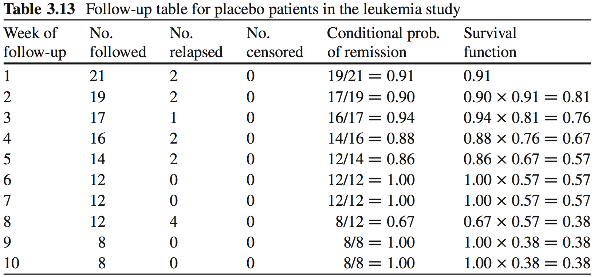
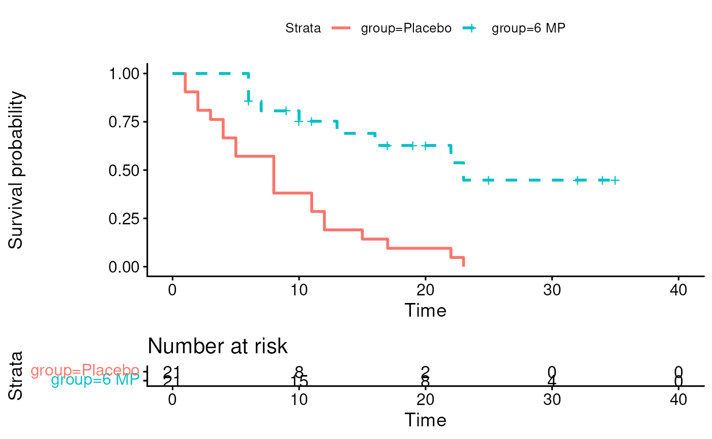
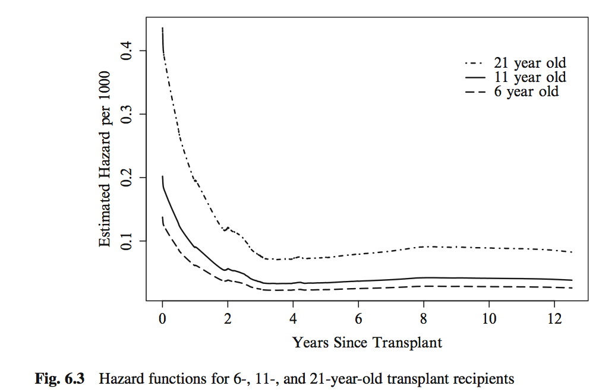
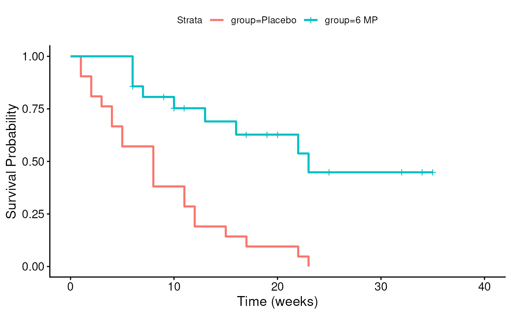
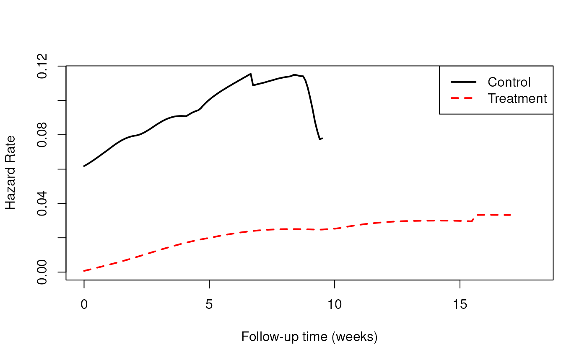
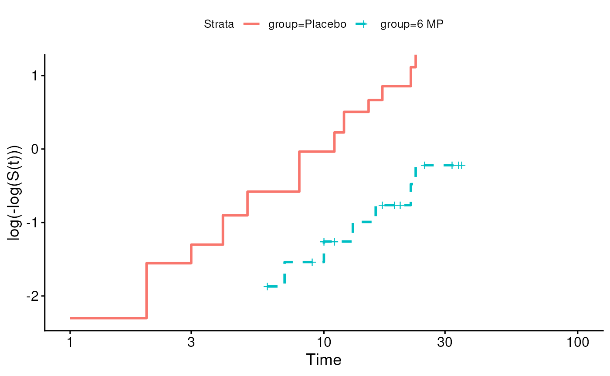

# Session 7: Survival Analysis 2

## Learning objectives and outline

### Learning objectives

1.  Define proportional hazards
2.  Perform and interpret Cox proportional hazards regression
3.  Define time-dependent covariates and their use
4.  Identify the differences between parametric and semi-parametric
    survival models
5.  Identify situations when a parametric survival model might be useful

### Outline

1.  Review of survival and hazard functions
2.  The Cox proportional hazards model
    - interpretation and inference
    - what are proportional hazards
    - when hazards aren’t proportional
3.  Parametric vs semi-parametric survival models

- Vittinghoff sections 6.1-6.2, 6.4

## Review of survival and hazard functions

### Recall leukemia Example

- Study of 6-mercaptopurine (6-MP) maintenance therapy for children in
  remission from acute lymphoblastic leukemia (ALL)
- 42 patients achieved remission from induction therapy and were then
  randomized in equal numbers to 6-MP or placebo.
- Survival time studied was from randomization until relapse.

### Leukemia follow-up table



leukemia Follow-up Table

This is the **Kaplan-Meier Estimate** $`\hat S(t)`$ of the Survival
function $`S(t)`$.

### Leukemia Kaplan-Meier plot



### The hazard function h(t)

- *Definition*: The *survival function* at time t, denoted $`S(t)`$, is
  the probability of being event-free at t. Equivalently, it is the
  probability that the survival time is greater than t.

- *Definition*: The *cumulative event function* at time t, denoted
  $`F(t)`$, is the probability that the event has occurred by time t, or
  equivalently, the probability that the survival time is less than or
  equal to t. $`F(t) = 1-S(t)`$.

- *Definition*: The *hazard function* $`h(t)`$ is the short-term event
  rate for subjects who have not yet experienced an event.

  - $`h(t)`$ is the probability of an event in the time interval
    $`[t, t+s]`$ (s is small), given that the individual has survived up
    to time t
    ``` math
    h(t) = \lim_{s \to 0} \frac{Pr(t \leq T < t+s | T \ge t)}{s}
    ```

### Leukemia dataset $`S(t)`$

Survival function $`S(t)`$


### Leukemia dataset $`h(t)`$

Hazard function $`h(t)`$


[SAS and R Source
code](http://sas-and-r.blogspot.com/2010/06/example-741-hazard-function-plotting.md)

### The Hazard Ratio (HR)

- If we are comparing the hazards of a control and a treatment group, it
  could in general be a function of time:
  - $`HR(t) = h_T(t) / h_C(t)`$
- Interpretation: the risk of event for the treatment group compared to
  the control group, as a function of time

### The Proportional Hazards Assumption

- *Definition*: Under the *proportional hazards assumption*, the hazard
  ratio does not vary with time. That is, $`HR(t) \equiv HR`$.

- In other words, $`HR`$ does not vary with time

  - $`HR(t)`$ is a constant, $`HR`$, at *all times* t
  - this assumption is about the population, of course there will be
    sampling variation

### A nice proportional hazards dataset



Vittinghoff Figure 6.3, p. 210

### The hazard function h(t) (leukemia dataset)



    ## # A tibble: 2 × 2
    ##   group   haz    
    ##   <fct>   <list> 
    ## 1 Placebo <muhaz>
    ## 2 6 MP    <muhaz>



### Log-minus-log plot



### Recall previous regression models

``` math
E[y_i|x_i] = \beta_1 x_{1i} + \beta_2 x_{2i} + ... + \beta_p x_{pi}
```

- $`x_p`$ are the predictors or independent variables
- $`y`$ is the outcome, response, or dependent variable
- $`E[y|x]`$ is the expected value of $`y`$ given $`x`$
- $`\beta_p`$ are the regression coefficients

For logistic regression:
``` math
Logit(P(x_i)) = log \left( \frac{P(x_i)}{1-P(x_i)} \right) = \beta_1 x_{1i} + \beta_2 x_{2i} + ... + \beta_p x_{pi}
```

For log-linear regression:
``` math
log(E[y_i|x_i]) = \beta_1 x_{1i} + \beta_2 x_{2i} + ... + \beta_p x_{pi}
```

## Cox proportional hazards model

### Cox proportional hazards model

- Cox proportional hazards regression assesses relationship between a
  right-censored, time-to-event outcome and predictors:
  - categorical variables (e.g., treatment groups)
  - continuous variables
    ``` math
    log(HR(x_i)) = log \frac{h(t|x_i)}{h_0(t)} = \beta_1 x_{1i} + \beta_2 x_{2i} + ... + \beta_p x_{pi}
    ```
- $`HR(x_i)`$ is the hazard of patient $`i`$ relative to baseline
- $`h(t|x_i)`$ is the time-dependent hazard function $`h(t)`$ for
  patient $`i`$
- $`h_0(t)`$ is the *baseline hazard function*

Multiplicative or additive model?

### Interpretation of coefficients

- Coefficients $`\beta`$ for a categorical / binary predictor:
  - $`\beta`$ is the $`log`$ of the ratio of hazards for the comparison
    group relative to reference group ($`log(HR)`$)
- Coefficients $`\beta`$ for a continuous predictor:
  - $`\beta`$ is the $`log`$ of the ratio of hazards for someone having
    a one unit higher value of $`x`$ (1 year, 1mm Hg, etc)
- If the hazard ratio ($`exp(\beta)`$) is close to 1 then the predictor
  does not affect survival
- If the hazard ratio is less than 1 then the predictor is protective
  (associated with improved survival)
- If the hazard ratio is greater than 1 then the predictor is associated
  with increased risk (= decreased survival)

### Hypothesis testing and CIs

- Wald Test or Likelihood Ratio Test for coefficients
  - $`H_0: \beta=0, H_a: \beta \neq 0`$
  - equivalent to $`H_0: HR=1, H_a: HR \neq 1`$
- CIs typically obtained from Wald Test, reported for $`HR`$

### Cox PH regression for Leukemia dataset

    ## Call:
    ## coxph(formula = Surv(time, cens) ~ group, data = leuk)
    ## 
    ##   n= 42, number of events= 30 
    ## 
    ##              coef exp(coef) se(coef)      z Pr(>|z|)    
    ## group6 MP -1.5721    0.2076   0.4124 -3.812 0.000138 ***
    ## ---
    ## Signif. codes:  0 '***' 0.001 '**' 0.01 '*' 0.05 '.' 0.1 ' ' 1
    ## 
    ##           exp(coef) exp(-coef) lower .95 upper .95
    ## group6 MP    0.2076      4.817   0.09251    0.4659
    ## 
    ## Concordance= 0.69  (se = 0.041 )
    ## Likelihood ratio test= 16.35  on 1 df,   p=5e-05
    ## Wald test            = 14.53  on 1 df,   p=1e-04
    ## Score (logrank) test = 17.25  on 1 df,   p=3e-05

### Cox PH is a semi-parametric model

- Cox proportional hazards model is *semi-parametric*:
  - assumes proportional hazards (PH), but no assumption on $`h_0(t)`$
  - robust if PH assumption is not violated
  - time-dependent covariates may resolve apparent violations of the PH
    assumption.

### Summary: proportional hazards assumption

- Constant hazard *ratio* between groups over time (proportional
  hazards)
- A linear association between the natural log of the relative hazard
  and the predictors (log-linearity)
  - A multiplicative relationship between the predictors and the hazard
- Uninformative censoring

### What to do when proportional hazards doesn’t hold?

- **Time-dependent covariates**
- **Definition**: A time-dependent covariate is a predictor whose values
  may vary with time.
- **Basic rule**: You cannot look into the future in your analysis (even
  though it took place in the past) E.g.:
  - breast cancer chemotherapy patients divided into groups based on how
    much of the planned dose they received
  - patients divided into groups based on early response to treatment
    (shrinkage of tumor, lowering of cholesterol, etc)
  - interpolation of the values of a laboratory test linearly between
    observation times
  - removing subjects who do not finish the treatment plan
  - imputing the date of an adverse event as midway between observation
    times

Source: [Using Time Dependent Covariates and Time Dependent Coefficients
in the Cox
Model](https://cran.r-project.org/web/packages/survival/vignettes/timedep.pdf)

### Immortal time bias example

- Immortal time bias is an example of looking into the future.
- E.g. Yee *et al.* reported that new statin users reported a 26%
  reduction in the risk of diabetes progression with one year or more of
  treatment relative to never-users (adjusted HR 0.74, 95% CI: 0.56 to
  0.97).
  - New users excludes those who had received a lipid lowering drug from
    three years before to six months after cohort entry
- HR\>1 was expected:people whose diabetes progresses are more likely to
  develop cardiovascular disease, an indication for statins.
- This is a result of an analysis error. Why?

&nbsp;

- Yee *et al.* Statin use in type 2 diabetes mellitus is associated with
  a delay in starting insulin
  (<http://onlinelibrary.wiley.com/doi/10.1111/j.1464-5491.2004.01263.x/full>)

### Immortal time bias example (cont’d)

- What was the analysis error?
  - “new statin user” group was defined based on future initiation:
    knowledge unknown at the time of entry into the study
  - guaranteed no events for statin users from cohort entry to start of
    statin use
  - thus all persons in the *treated* group are “immortal” from time 0
    until the initiation of statin treatment
  - this period of immortality made treatment look more effective

## Parametric survival models

### What are “parametric” survival models?

- “Parametric” models estimate additional *parameters* for the baseline
  hazard, e.g.:
  - **Weibull**: hazard function is a polynomial
  - **exponential**: hazard function is constant over time, survival
    function is exponential (special case of Weibull): e.g. healthy
    population with randomly occurring events
  - many other options for assumption of distributions
- In most common implementation a log-transform of the time variable is
  used
  - then can be interpreted as *Accelerated Failure Time* (AFT) models.

### Coefficients in parametric models

- The interpretation of $`\beta`$ coefficients is different:
  - Cox model: $`log(HR)`$
  - AFT models: $`log(survival time ratio)`$
  - The sign is *opposite* (*i.e.* if one is positive the other is
    negative)

### Why use a parametric survival model?

- Can be more powerful if assumption is correct
  - may help with small numbers of events
- Extra capabilities:
  - smooth estimation of baseline hazard
  - extrapolation
  - complicated censoring
- Easy to interpret: coefficients are $`log(survival time ratio)`$
- Easy to fit: replace
  [`survival::coxph`](https://rdrr.io/pkg/survival/man/coxph.html) with
  [`survival::survreg`](https://rdrr.io/pkg/survival/man/survreg.html)

### Why not to use a parametric survival model?

- Depend on correct specification of baseline hazard model
- Even if correctly specified, may not provide much improvement in
  efficiency
- Still make a proportionality assumption, on survival functions
