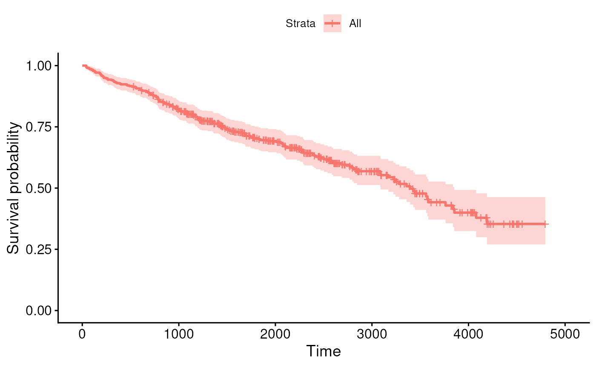
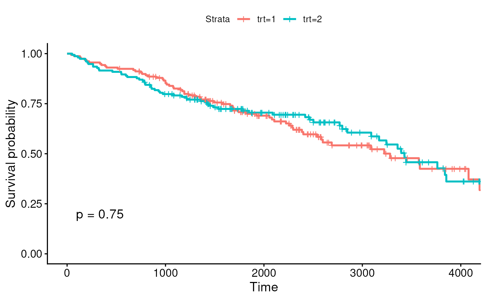
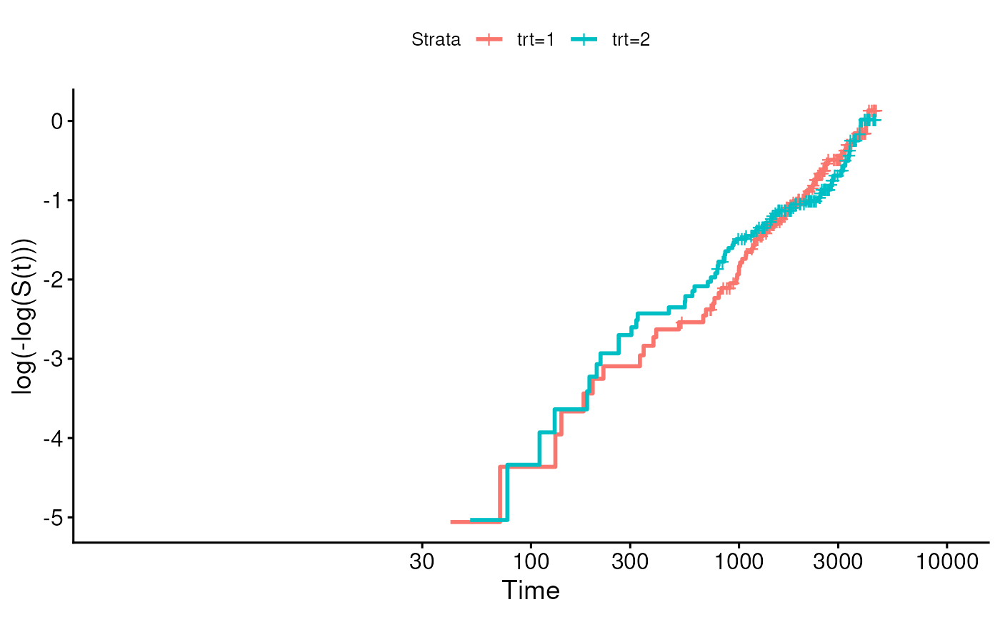

# Session 8 lab exercise: What it's about

**Learning objectives**

1.  Make stratified and unstratified Kaplan-Meier plots
2.  Perform Cox proportional hazards regression
3.  Assess proportional hazards assumption

**Exercises**

## Load the Primary Biliary Cirrhosis (pbc) dataset from the survival package

- Mayo Clinic trial in primary biliary cirrhosis (PBC) of the liver
  conducted between 1974 and 1984, $`n=424`$ patients.
- Randomized placebo controlled trial of the drug D-penicillamine.
  - 312 cases from RCT, plus additional 112 not from RCT.
- Primary outcome is (censored) time to death

[`library`](https://rdrr.io/r/base/library.html)`(`[`survival`](https://github.com/therneau/survival)`)`` `[`data`](https://rdrr.io/r/utils/data.html)`(``pbc``)`` `[`summary`](https://rdrr.io/r/base/summary.html)`(``pbc``)`

    ##        id             time          status            trt       
    ##  Min.   :  1.0   Min.   :  41   Min.   :0.0000   Min.   :1.000  
    ##  1st Qu.:105.2   1st Qu.:1093   1st Qu.:0.0000   1st Qu.:1.000  
    ##  Median :209.5   Median :1730   Median :0.0000   Median :1.000  
    ##  Mean   :209.5   Mean   :1918   Mean   :0.8301   Mean   :1.494  
    ##  3rd Qu.:313.8   3rd Qu.:2614   3rd Qu.:2.0000   3rd Qu.:2.000  
    ##  Max.   :418.0   Max.   :4795   Max.   :2.0000   Max.   :2.000  
    ##                                                  NAs    :106    
    ##       age        sex        ascites            hepato          spiders      
    ##  Min.   :26.28   m: 44   Min.   :0.00000   Min.   :0.0000   Min.   :0.0000  
    ##  1st Qu.:42.83   f:374   1st Qu.:0.00000   1st Qu.:0.0000   1st Qu.:0.0000  
    ##  Median :51.00           Median :0.00000   Median :1.0000   Median :0.0000  
    ##  Mean   :50.74           Mean   :0.07692   Mean   :0.5128   Mean   :0.2885  
    ##  3rd Qu.:58.24           3rd Qu.:0.00000   3rd Qu.:1.0000   3rd Qu.:1.0000  
    ##  Max.   :78.44           Max.   :1.00000   Max.   :1.0000   Max.   :1.0000  
    ##                          NAs    :106       NAs    :106      NAs    :106     
    ##      edema             bili             chol           albumin     
    ##  Min.   :0.0000   Min.   : 0.300   Min.   : 120.0   Min.   :1.960  
    ##  1st Qu.:0.0000   1st Qu.: 0.800   1st Qu.: 249.5   1st Qu.:3.243  
    ##  Median :0.0000   Median : 1.400   Median : 309.5   Median :3.530  
    ##  Mean   :0.1005   Mean   : 3.221   Mean   : 369.5   Mean   :3.497  
    ##  3rd Qu.:0.0000   3rd Qu.: 3.400   3rd Qu.: 400.0   3rd Qu.:3.770  
    ##  Max.   :1.0000   Max.   :28.000   Max.   :1775.0   Max.   :4.640  
    ##                                    NAs    :134                     
    ##      copper          alk.phos            ast              trig       
    ##  Min.   :  4.00   Min.   :  289.0   Min.   : 26.35   Min.   : 33.00  
    ##  1st Qu.: 41.25   1st Qu.:  871.5   1st Qu.: 80.60   1st Qu.: 84.25  
    ##  Median : 73.00   Median : 1259.0   Median :114.70   Median :108.00  
    ##  Mean   : 97.65   Mean   : 1982.7   Mean   :122.56   Mean   :124.70  
    ##  3rd Qu.:123.00   3rd Qu.: 1980.0   3rd Qu.:151.90   3rd Qu.:151.00  
    ##  Max.   :588.00   Max.   :13862.4   Max.   :457.25   Max.   :598.00  
    ##  NAs    :108      NAs    :106       NAs    :106      NAs    :136     
    ##     platelet        protime          stage      
    ##  Min.   : 62.0   Min.   : 9.00   Min.   :1.000  
    ##  1st Qu.:188.5   1st Qu.:10.00   1st Qu.:2.000  
    ##  Median :251.0   Median :10.60   Median :3.000  
    ##  Mean   :257.0   Mean   :10.73   Mean   :3.024  
    ##  3rd Qu.:318.0   3rd Qu.:11.10   3rd Qu.:4.000  
    ##  Max.   :721.0   Max.   :18.00   Max.   :4.000  
    ##  NAs    :11      NAs    :2       NAs    :6

## Create a `Surv` object using variables “time” and “status”, add this to the pbc dataframe

Here “1” are patients who received transplants, and are thus removed
from risk of death, at least due to liver cirrhosis. Transplantation may
thus be related to risk, and not qualify as uninformative censoring. It
could actually be considered a “competing hazard” because high-risk
patients may be prioritized for liver transplant - a topic we don’t get
to in this course. Instead, we will simply treat 0 (end of study) and 1
as censored, 2 (death) as an event.

[`library`](https://rdrr.io/r/base/library.html)`(`[`dplyr`](https://dplyr.tidyverse.org)`)`

    ## 
    ## Attaching package: 'dplyr'

    ## The following objects are masked from 'package:stats':
    ## 
    ##     filter, lag

    ## The following objects are masked from 'package:base':
    ## 
    ##     intersect, setdiff, setequal, union

`pbc2`` ``<-`` ``pbc`` `[`%>%`](https://magrittr.tidyverse.org/reference/pipe.html)` `` `[`mutate`](https://dplyr.tidyverse.org/reference/mutate.html)`(``cens ``=`` ``status`` ``>`` ``1.5``)`` `[`%>%`](https://magrittr.tidyverse.org/reference/pipe.html)` `` `[`mutate`](https://dplyr.tidyverse.org/reference/mutate.html)`(``y ``=`` `[`Surv`](https://rdrr.io/pkg/survival/man/Surv.html)`(``time``, ``cens``)``)`

## Plot a KM curve for all participants using `library(survminer)` function `ggsurvplot()`.

[`library`](https://rdrr.io/r/base/library.html)`(`[`survminer`](https://rpkgs.datanovia.com/survminer/index.html)`)`

    ## Loading required package: ggplot2

    ## Loading required package: ggpubr

    ## 
    ## Attaching package: 'survminer'

    ## The following object is masked from 'package:survival':
    ## 
    ##     myeloma

`fit`` ``<-`` `[`survfit`](https://rdrr.io/pkg/survival/man/survfit.html)`(``y`` ``~`` ``1``, data ``=`` ``pbc2``)`` `[`ggsurvplot`](https://rdrr.io/pkg/survminer/man/ggsurvplot.html)`(``fit``)`

## Stratify by treatment and add a p-value to this plot (see `?ggsurvplot`).

`fit2`` ``<-`` `[`survfit`](https://rdrr.io/pkg/survival/man/survfit.html)`(``y`` ``~`` ``trt``, data ``=`` ``pbc2``)`` `[`ggsurvplot`](https://rdrr.io/pkg/survminer/man/ggsurvplot.html)`(``fit2``, pval ``=`` ``TRUE``)`

## Check whether these p-values correspond to results from a log-rank test.

[`survdiff`](https://rdrr.io/pkg/survival/man/survdiff.html)`(``y`` ``~`` ``trt``, data ``=`` ``pbc2``)`

    ## Call:
    ## survdiff(formula = y ~ trt, data = pbc2)
    ## 
    ## n=312, 106 observations deleted due to missingness.
    ## 
    ##         N Observed Expected (O-E)^2/E (O-E)^2/V
    ## trt=1 158       65     63.2    0.0502     0.102
    ## trt=2 154       60     61.8    0.0513     0.102
    ## 
    ##  Chisq= 0.1  on 1 degrees of freedom, p= 0.7

## Perform a Cox proportional hazards regression, using the “trt” variable as a predictor.

`fitcox`` ``<-`` `[`coxph`](https://rdrr.io/pkg/survival/man/coxph.html)`(``y`` ``~`` ``trt``, data ``=`` ``pbc2``)`` `[`summary`](https://rdrr.io/r/base/summary.html)`(``fitcox``)`

    ## Call:
    ## coxph(formula = y ~ trt, data = pbc2)
    ## 
    ##   n= 312, number of events= 125 
    ##    (106 observations deleted due to missingness)
    ## 
    ##         coef exp(coef) se(coef)      z Pr(>|z|)
    ## trt -0.05722   0.94438  0.17916 -0.319    0.749
    ## 
    ##     exp(coef) exp(-coef) lower .95 upper .95
    ## trt    0.9444      1.059    0.6647     1.342
    ## 
    ## Concordance= 0.499  (se = 0.025 )
    ## Likelihood ratio test= 0.1  on 1 df,   p=0.7
    ## Wald test            = 0.1  on 1 df,   p=0.7
    ## Score (logrank) test = 0.1  on 1 df,   p=0.7

## Create a log-minus-log plot to test the proportional hazards assumption.

Using a simpler method from survminer:

[`library`](https://rdrr.io/r/base/library.html)`(`[`survminer`](https://rpkgs.datanovia.com/survminer/index.html)`)`` `[`ggsurvplot`](https://rdrr.io/pkg/survminer/man/ggsurvplot.html)`(``fit2``, fun ``=`` ``"cloglog"``)`

## Plot Schoenfeld residuals and perform Schoenfeld test for the above Cox model

`fitzph`` ``<-`` `[`cox.zph`](https://rdrr.io/pkg/survival/man/cox.zph.html)`(``fitcox``)`` `[`plot`](https://rdrr.io/r/graphics/plot.default.html)`(``fitzph``)`

`fitzph`

    ##        chisq df    p
    ## trt    0.612  1 0.43
    ## GLOBAL 0.612  1 0.43
