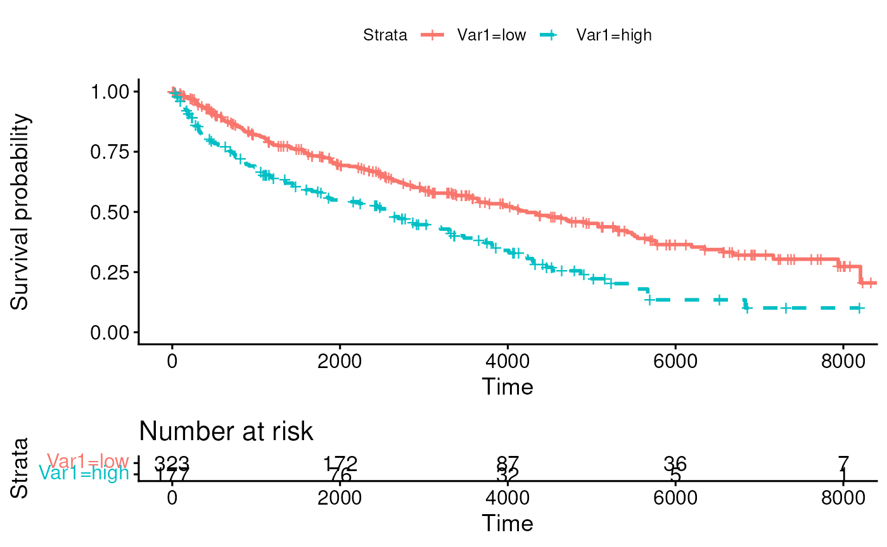
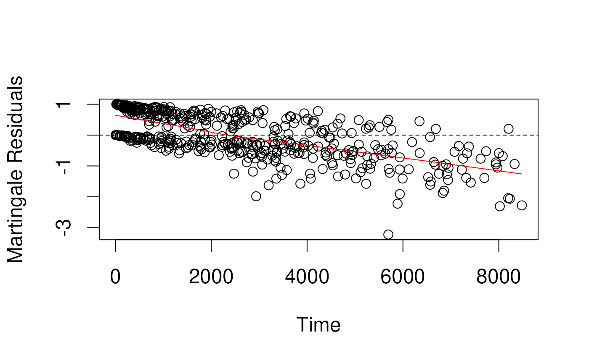
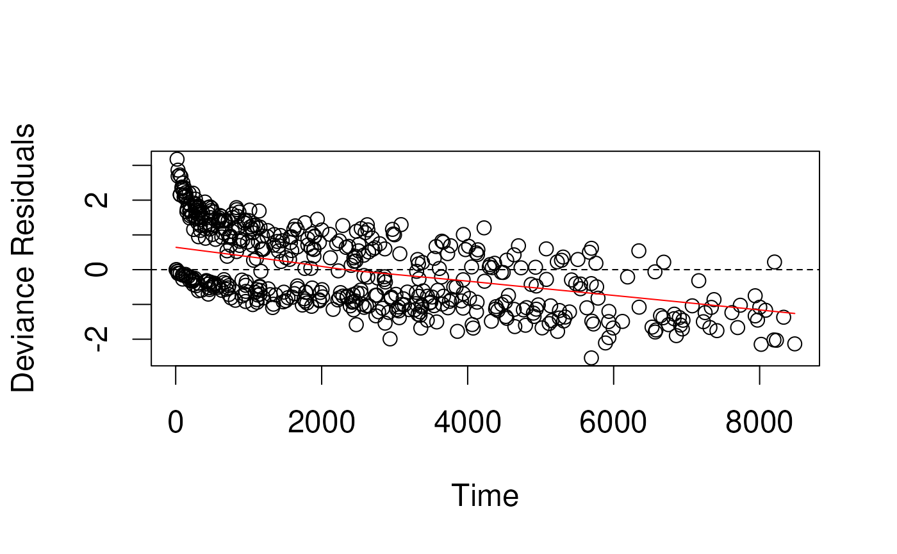
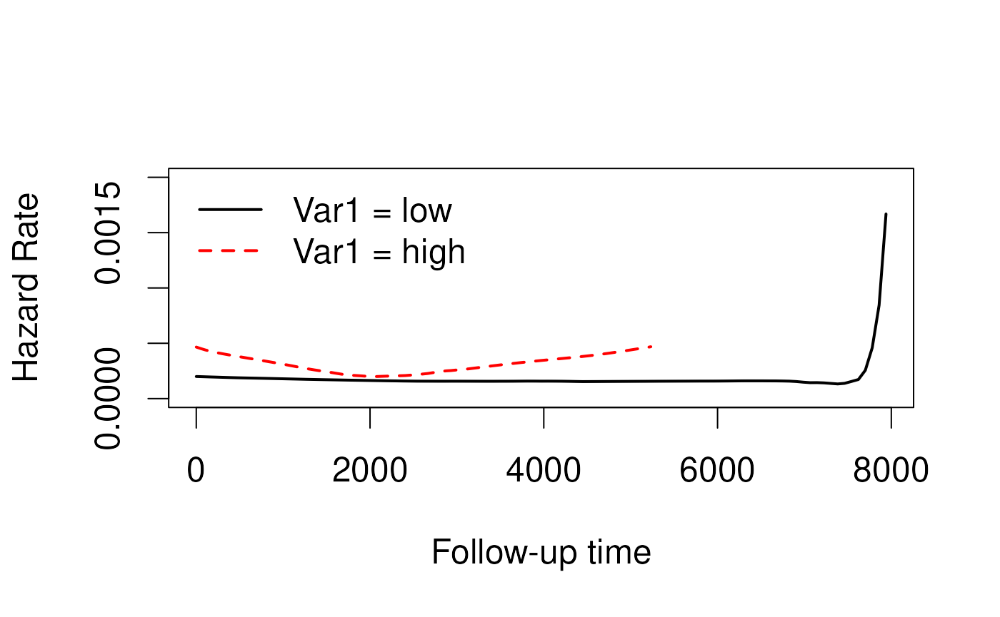
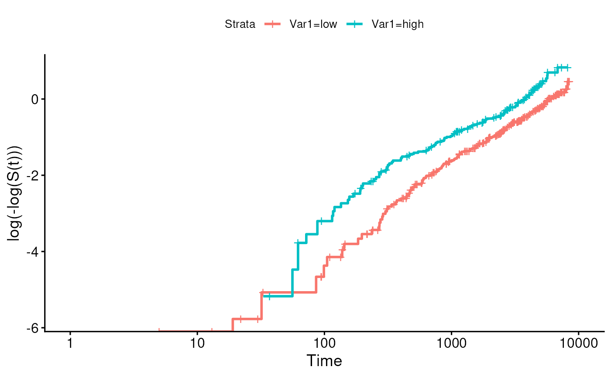
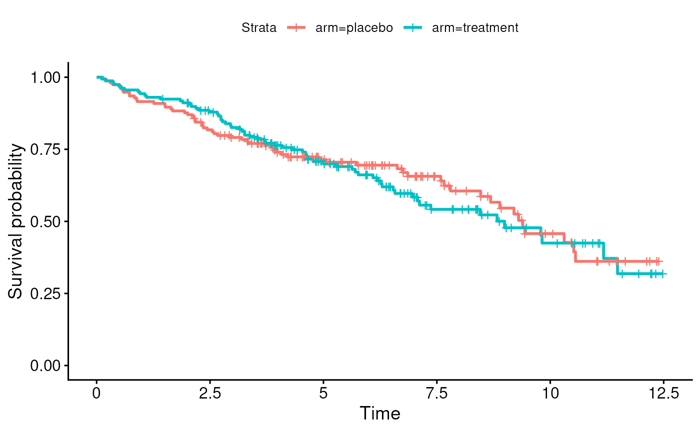
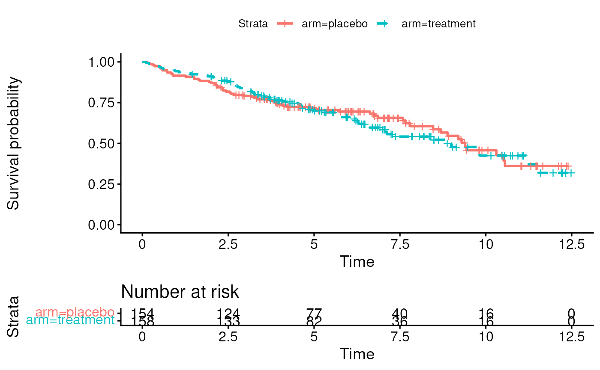
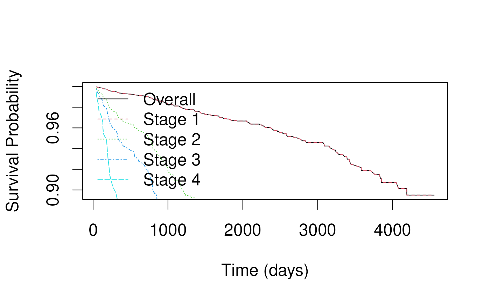
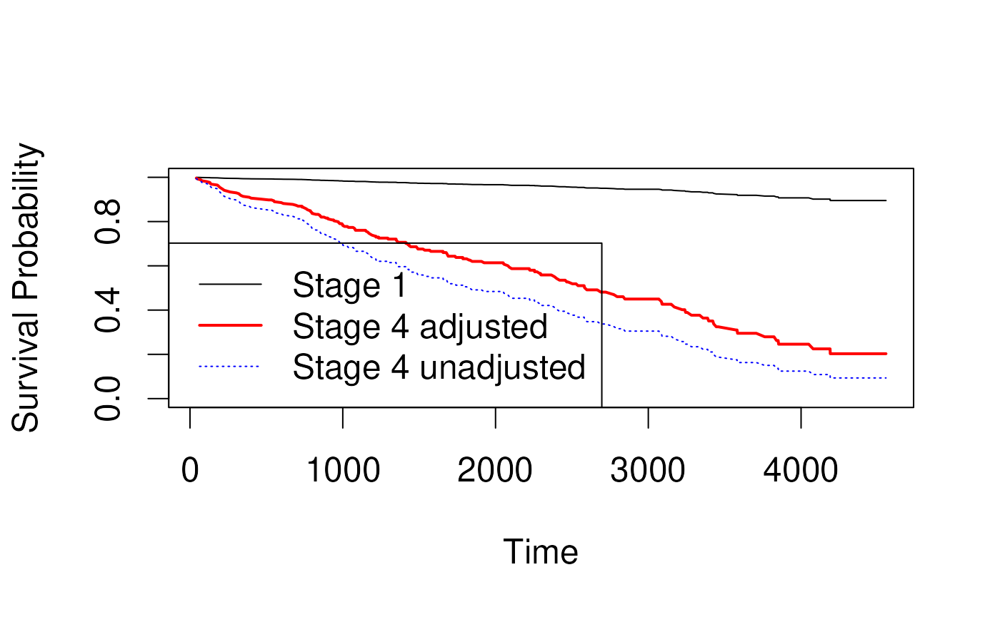

# Session 8: Survival analysis part 3

## Learning objectives and outline

### Learning objectives

1.  Check model assumptions and fit of the Cox model
    - residuals analysis
    - log-minus-log plot
2.  Fit and interpret multivariate Cox models
    - perform tests for trend
    - predict survival for specific covariate patterns
    - predict survival for adjusted coefficients
3.  Explain stratified analysis
4.  Identify situations of competing risks
5.  Describe the application of Propensity Score analysis

- Vittinghoff sections 6.2-6.4

### Outline

1.  Review
2.  Assumptions of Cox PH model
3.  Tests for trend
4.  Predictions for specific covariate patterns
5.  Stratification
6.  Competing risks
7.  Propensity Score analysis to control for confounding

## Review

### Cox proportional hazards model

- Cox proportional hazard regression assesses the relationship between a
  right-censored, time-to-event outcome and multiple predictors:
  - categorical variables (e.g., treatment groups)
  - continuous variables

``` math
log(HR(x_i)) = log \frac{h(t|x_i)}{h_0(t)} = \beta_0 + \beta_1 x_{1i} + \beta_2 x_{2i} + ... + \beta_p x_{pi}
```

- $`HR(x_i)`$ is the hazard of patient $`i`$ relative to baseline

- $`h(t|x_i)`$ is the time-dependent hazard function $`h(t)`$ for
  patient $`i`$

- $`h_0(t)`$ is the *baseline hazard function*, and is the negative of
  the slope of the $`S_0(t)`$, the baseline *survival* function.

- Multiplicative model

### Caveats and Assumptions

- Categories with no events
  - can occur when the group is small or its risk is low
  - HRs with respect to such a reference group are infinite
  - hypothesis tests and CIs are difficult / impossible to interpret
- Assumptions of Cox PH model
  - Constant hazard ratio over time (proportional hazards)
  - Linear association between log(HR) and predictors (log-linearity) /
    multiplicative relationship between hazard and predictors
  - Independence of survival times between individuals in the sample
  - Uninformative censoring: a censored participant is the same as an
    uncensored participant with the same covariates at still in the risk
    set after that time

## Checking assumptions of Cox model

### Residuals analysis

- Residuals are used to investigate the lack of fit of a model to a
  given subject.
- For Cox regression, there’s no easy analog to the usual “observed
  minus predicted” residual

### 

[`suppressPackageStartupMessages`](https://rdrr.io/r/base/message.html)`(`[`library`](https://rdrr.io/r/base/library.html)`(`[`pensim`](https://waldronlab.io/pensim/)`)``)`` `[`set.seed`](https://rdrr.io/r/base/Random.html)`(``1``)`` ``mydat`` ``<-`` `[`create.data`](https://waldronlab.io/ProjectAsPackage/reference/create.data.html)`(`` `` nvars ``=`` `[`c`](https://rdrr.io/r/base/c.html)`(``1``, ``1``)``,`` `` nsamples ``=`` ``500``,`` `` cors ``=`` `[`c`](https://rdrr.io/r/base/c.html)`(``0``, ``0``)``,`` `` associations ``=`` `[`c`](https://rdrr.io/r/base/c.html)`(``0.5``, ``0.5``)``,`` `` firstonly ``=`` `[`c`](https://rdrr.io/r/base/c.html)`(``TRUE``, ``TRUE``)``,`` `` censoring ``=`` `[`c`](https://rdrr.io/r/base/c.html)`(``0``, ``8.5``)`` ``)``$``data`

Rename variables of simulated data, and make one variable categorical:

[`suppressPackageStartupMessages`](https://rdrr.io/r/base/message.html)`(`[`library`](https://rdrr.io/r/base/library.html)`(`[`dplyr`](https://dplyr.tidyverse.org)`)``)`` ``mydat`` ``<-`` ``mydat`` `[`%>%`](https://magrittr.tidyverse.org/reference/pipe.html)` `[`rename`](https://dplyr.tidyverse.org/reference/rename.html)`(``Var1 ``=`` ``a.1``, Var2 ``=`` ``b.1``)`` `[`%>%`](https://magrittr.tidyverse.org/reference/pipe.html)` `` `[`mutate`](https://dplyr.tidyverse.org/reference/mutate.html)`(``Var1 ``=`` `[`cut`](https://rdrr.io/r/base/cut.html)`(``Var1``,`` `` breaks ``=`` ``2``,`` `` labels ``=`` `[`c`](https://rdrr.io/r/base/c.html)`(``"low"``, ``"high"``)``)``,`` `` time ``=`` `[`ceiling`](https://rdrr.io/r/base/Round.html)`(``time`` ``*`` ``1000``)``)`

### Simulated data to test residuals methods

[`summary`](https://rdrr.io/r/base/summary.html)`(``mydat``)`

    ##    Var1          Var2               time           cens      
    ##  low :323   Min.   :-2.99695   Min.   :   5   Min.   :0.000  
    ##  high:177   1st Qu.:-0.79008   1st Qu.: 691   1st Qu.:0.000  
    ##             Median :-0.02126   Median :1970   Median :1.000  
    ##             Mean   :-0.04594   Mean   :2529   Mean   :0.526  
    ##             3rd Qu.: 0.68933   3rd Qu.:3874   3rd Qu.:1.000  
    ##             Max.   : 3.05574   Max.   :8481   Max.   :1.000

### Kaplan-Meier plot of simulated data, stratified by Var1

    ## Ignoring unknown labels:
    ## • colour : "Strata"



### Martingale residuals

- censoring variable $`c_i`$ (1 if event, 0 if censored) minus the
  estimated cumulative hazard function $`H(t_i, X_i, \beta_i)`$ (1 -
  survival function)
  - E.g., for a subject censored at 1 year ($`c_i=0`$), whose predicted
    cumulative hazard at 1 year was 30%, Martingale =
    $`0 - 0.30 = -0.30`$.
  - E.g. for a subject who had an event at 6 months, and whose predicted
    cumulative hazard at 6 months was 80%, Margingale =
    $`1 - 0.8 = 0.2`$.
- Problem: not symmetrically distributed, even when model fits the data
  well

### Martingale residuals in simulated data



### Deviance residuals in simulated data

- Deviance residuals are scaled Martingale residuals
- Should be more symmetrically distributed about zero?
- Observations with large deviance residuals are poorly predicted by the
  model 

### Schoenfeld residuals

- technical definition: contribution of a covariate at each event time
  to the partial derivative of the log-likelihood
- intuitive interpretation: the observed minus the expected values of
  the covariates at each event time.
- a random (unsystematic) pattern across event times gives evidence the
  covariate effect is not changing with respect to time
- If it is systematic, it suggests that as time passes, the covariate
  effect is changing.

### Schoenfeld residuals for simulated data


### Schoenfeld test for proportional hazards

- Tests correlation between scaled Schoenfeld residuals and time
- Equivalent to fitting a simple linear regression model with time as
  the predictor and residuals as the outcome
- Parametric analog of smoothing the residuals against time using LOWESS
- If the hazard ratio is constant, correlation should be zero.
  - Positive values of the correlation suggest that the log-hazard ratio
    increases with time.

&nbsp;

    ##          chisq df     p
    ## Var1   0.00887  1 0.925
    ## Var2   4.92734  1 0.026
    ## GLOBAL 5.07415  2 0.079

### The hazard function h(t), stratified by Var1



### Log-minus-log plot

- Used to check proportional hazards assumption



### Example: Primary Biliary Cirrhosis (PBC)

- Mayo Clinic trial in primary biliary cirrhosis (PBC) of the liver
  conducted between 1974 and 1984, n=424 patients.
- randomized placebo controlled trial of the drug D-penicillamine.
  - 312 cases from RCT, plus additional 112 not from RCT.
- Primary outcome is (censored) time to death

### Kaplan-Meier plot of treatment and placebo arms



## Tests for trend

### What are tests for trend?

- For models including an ordinal variablepush
- Such as PBC stage (1, 2, 3, 4), age category, …
  - Is there a linear / quadratic / cubic relationship between
    coefficients and their order?
  - Test by LRT or Wald Test


### Fitting a test for trend in R

- Just define stage as an *ordered factor* and tests for trend are done
  automatically:

`pbc.os`` ``<-`` `` `[`mutate`](https://dplyr.tidyverse.org/reference/mutate.html)`(``pbc.os``, stageordered ``=`` `[`factor`](https://rdrr.io/r/base/factor.html)`(``stage``, ordered ``=`` ``TRUE``)``)`` ``fit`` ``<-`` `[`coxph`](https://rdrr.io/pkg/survival/man/coxph.html)`(`[`Surv`](https://rdrr.io/pkg/survival/man/Surv.html)`(``time``, ``os``)`` ``~`` ``stageordered``, data ``=`` ``pbc.os``)`` `[`summary`](https://rdrr.io/r/base/summary.html)`(``fit``)`` `

    ## Call:
    ## coxph(formula = Surv(time, os) ~ stageordered, data = pbc.os)
    ## 
    ##   n= 312, number of events= 125 
    ## 
    ##                   coef exp(coef) se(coef)      z Pr(>|z|)   
    ## stageordered.L  2.1759    8.8099   0.6801  3.199  0.00138 **
    ## stageordered.Q -0.3469    0.7069   0.5248 -0.661  0.50867   
    ## stageordered.C  0.3209    1.3784   0.2990  1.073  0.28316   
    ## ---
    ## Signif. codes:  0 '***' 0.001 '**' 0.01 '*' 0.05 '.' 0.1 ' ' 1
    ## 
    ##                exp(coef) exp(-coef) lower .95 upper .95
    ## stageordered.L    8.8099     0.1135    2.3231    33.410
    ## stageordered.Q    0.7069     1.4146    0.2527     1.977
    ## stageordered.C    1.3784     0.7255    0.7671     2.477
    ## 
    ## Concordance= 0.702  (se = 0.022 )
    ## Likelihood ratio test= 52.74  on 3 df,   p=2e-11
    ## Wald test            = 43.92  on 3 df,   p=2e-09
    ## Score (logrank) test = 53.85  on 3 df,   p=1e-11

Highly significant tests of overall fit by LRT, Wald, and logrank test.

## Predictions for specific covariate patterns

### How to predict survival from a Cox model?

- The Cox model is a *relative* risk model
  - only predicts relative risks between pairs of subjects
- Key is to calculate the overall $`S(t)`$, then multiply it by the
  relative hazard for the specific covariate pattern.
- In this example we plot the baseline survival for all stages together,
  then for stages 1-4 separately.

### Predicted survival for specific covariate patterns



### Multivariate regression

- Same coding and objectives as for
  [`lm()`](https://rdrr.io/r/stats/lm.html) and
  [`glm()`](https://rdrr.io/r/stats/glm.html)
  - controlling for confounding
  - testing for mediation
  - testing for interaction

### 

`fit`` ``<-`` `[`coxph`](https://rdrr.io/pkg/survival/man/coxph.html)`(`[`Surv`](https://rdrr.io/pkg/survival/man/Surv.html)`(``time``, ``os``)`` ``~`` ``age`` ``+`` ``sex`` ``+`` ``edema`` `` ``+`` ``stage`` ``+`` ``arm``, data ``=`` ``pbc.os``)`` `[`summary`](https://rdrr.io/r/base/summary.html)`(``fit``)`

    ## Call:
    ## coxph(formula = Surv(time, os) ~ age + sex + edema + stage + 
    ##     arm, data = pbc.os)
    ## 
    ##   n= 312, number of events= 125 
    ## 
    ##                   coef exp(coef)  se(coef)      z Pr(>|z|)    
    ## age           0.027618  1.028003  0.009362  2.950  0.00318 ** 
    ## sexf         -0.317540  0.727938  0.248839 -1.276  0.20193    
    ## edema0.5      0.538715  1.713804  0.275287  1.957  0.05036 .  
    ## edema1        2.080422  8.007845  0.276959  7.512 5.84e-14 ***
    ## stage2        1.535263  4.642546  1.034854  1.484  0.13793    
    ## stage3        1.998217  7.375893  1.016097  1.967  0.04923 *  
    ## stage4        2.666263 14.386101  1.016234  2.624  0.00870 ** 
    ## armtreatment  0.057946  1.059658  0.189200  0.306  0.75940    
    ## ---
    ## Signif. codes:  0 '***' 0.001 '**' 0.01 '*' 0.05 '.' 0.1 ' ' 1
    ## 
    ##              exp(coef) exp(-coef) lower .95 upper .95
    ## age             1.0280    0.97276    1.0093     1.047
    ## sexf            0.7279    1.37374    0.4470     1.186
    ## edema0.5        1.7138    0.58350    0.9992     2.940
    ## edema1          8.0078    0.12488    4.6534    13.780
    ## stage2          4.6425    0.21540    0.6108    35.288
    ## stage3          7.3759    0.13558    1.0067    54.040
    ## stage4         14.3861    0.06951    1.9630   105.430
    ## armtreatment    1.0597    0.94370    0.7313     1.535
    ## 
    ## Concordance= 0.77  (se = 0.022 )
    ## Likelihood ratio test= 107.6  on 8 df,   p=<2e-16
    ## Wald test            = 120.8  on 8 df,   p=<2e-16
    ## Score (logrank) test = 177.1  on 8 df,   p=<2e-16

### Predicted survival for adjusted coefficients

- Can create Kaplan-Meier curves for crude or unadjusted coefficients
  - Section 6.3.2.3 in Vittinghoff
- Idea is to estimate hazard ratio in an unadjusted model:

`unadjfit`` ``<-`` `[`coxph`](https://rdrr.io/pkg/survival/man/coxph.html)`(`[`Surv`](https://rdrr.io/pkg/survival/man/Surv.html)`(``time``, ``os``)`` ``~`` ``stage``, data ``=`` ``pbc.os``)`` `[`coef`](https://rdrr.io/r/stats/coef.html)`(``unadjfit``)`

    ##   stage2   stage3   stage4 
    ## 1.607014 2.149500 3.062775

### Predicted survival for adjusted coefficients (cont’d)

- and in an adjusted model:

`adjfit`` ``<-`` `[`coxph`](https://rdrr.io/pkg/survival/man/coxph.html)`(`[`Surv`](https://rdrr.io/pkg/survival/man/Surv.html)`(``time``, ``os``)`` ``~`` ``age`` ``+`` ``sex`` ``+`` ``edema`` `` ``+`` ``stage`` ``+`` ``arm``, data ``=`` ``pbc.os``)`` `[`coef`](https://rdrr.io/r/stats/coef.html)`(``adjfit``)`

    ##          age         sexf     edema0.5       edema1       stage2       stage3 
    ##    0.0276179   -0.3175396    0.5387152    2.0804217    1.5352629    1.9982170 
    ##       stage4 armtreatment 
    ##    2.6662626    0.0579460

### Predicted survival for adjusted coefficients (cont’d)

- The survival function will be calculated for a “baseline” group, say
  stage 1, then exponentiated with the adjusted coefficient, e.g.:
  ``` math
  [S_{stage=1}(t)]^{exp(\beta_{stage=4})}
  ```



## Stratification

### What is stratification?

- relevant to all kinds of regression, not just survival analysis

- when analysis is separated into groups or strata

  - must have an adequate number of events in each stratum (at least 5
    to 7)
  - can be used to adjust for variables with strong impact on survival
  - can help solve proportional hazards violations

- Strata have different baseline hazards

- Coefficients / Hazard Ratios are calculated within stratum then
  combined.

- Vittinghoff 6.3.2

### How to stratify

**Example - in R, strata() can be added to any model formula**

`mycox`` ``<-`` `[`coxph`](https://rdrr.io/pkg/survival/man/coxph.html)`(`[`Surv`](https://rdrr.io/pkg/survival/man/Surv.html)`(``time``, ``os``)`` ``~`` ``trt`` ``+`` `[`strata`](https://rdrr.io/pkg/survival/man/strata.html)`(``stage``)``, `` `` data ``=`` ``pbc.os``)`` `[`summary`](https://rdrr.io/r/base/summary.html)`(``mycox``)`

    ## Call:
    ## coxph(formula = Surv(time, os) ~ trt + strata(stage), data = pbc.os)
    ## 
    ##   n= 312, number of events= 125 
    ## 
    ##        coef exp(coef) se(coef)      z Pr(>|z|)
    ## trt -0.1063    0.8992   0.1814 -0.586    0.558
    ## 
    ##     exp(coef) exp(-coef) lower .95 upper .95
    ## trt    0.8992      1.112    0.6302     1.283
    ## 
    ## Concordance= 0.494  (se = 0.025 )
    ## Likelihood ratio test= 0.34  on 1 df,   p=0.6
    ## Wald test            = 0.34  on 1 df,   p=0.6
    ## Score (logrank) test = 0.34  on 1 df,   p=0.6

## Competing Risks Data

### What are competing risks?

- Example from Vittinghoff 6.5: The MrOS study (Orwoll et al. 2005)
  followed men over 65 to examine predictors of bone fracture and low
  BMD (subclinical bone loss)
- At end of study participants had:
  - developed fracture (outcome of interest),
  - remained alive without fracture (incomplete follow-up), or
  - died prior to fracture (incomplete follow-up)

Orwoll, E. *et al.* (2005). Design and baseline characteristics of the
osteoporotic fractures in men (MrOS) study–a large observational study
of the determinants of fracture in older men. Contemporary Clinical
Trials, 26(5), 569–585.

### Why not treat died prior to fracture and alive without fracture as censored?

- Recall the independent censoring assumption (Vittinghoff 6.6.4):
  - censored people are similar to those who remain at risk in terms of
    developing the event of interest;
  - censoring is independent of the event of interest.
  - For patients who died this assumption is highly suspect

### Reasons for right censored data

- Cut-off date of analysis (administrative censoring):
  - Censoring usually independent
- Loss to follow-up
  - Independence may be problematic if sicker individuals discontinue
    participant in study (lack of energy, too ill, return to home
    country)
  - or if healthier individuals discontinue participation (don’t feel
    the need to continue, start new life in other country)
- Competing risks:
  - Often informative.
  - In competing risks analysis, independence between competing risks is
    not required

### Very brief summary of competing risk methods

- 1-to-1 mapping between hazard and cumulative incidence function is
  lost in competing risks
- Standard Kaplan-Meier estimator is biased for competing risks data
  - Aalen-Johansen estimator is better choice
- *Gary’s test* is analogous to log-rank test
- cause-specific standard Cox PH model might be useful for prognostic
  (causal) testing, but not estimating a population Hazard Ratio

### Resources for competing risk methods

- Z. Zhang, Survival analysis in the presence of competing risks, Ann
  Transl Med. 2017 Feb; 5(3): 47. PMID:
  [28251126](https://www.ncbi.nlm.nih.gov/pubmed/28251126)
- [cmprsk](https://CRAN.R-project.org/package=cmprsk) package
- [riskRegression](https://cran.r-project.org/package=riskRegression)
  package

## Propensity score analysis

### What is propensity score analysis?

- an alternative to multivariate regression to control for hypothesized
  confounders in observational studies:

&nbsp;

    outcome ~ exposure + counfounder1 + confounder2

- a stratification approach that is more practical than stratifying on
  multiple hypothesized confounders
- an approach to summarizing many covariates into a single score
- a convenient approach to controlling for many hypothesized confounders

### Propensity score approach to correction for confounders

- *Step 1*: fit the propensity score model (no outcome) that predicts
  propensity for exposure based on confounders:

&nbsp;

    exposure ~ counfounder1 + confounder2

- *Step 2*: use propensity predictions to match or stratify participants
  with similar propensity (for example, stratifying on quintiles of
  propensity)

- *Step 3*: check adequacy of matching or stratification, ie by
  comparing attributes of matched participants

- *Step 4*: test hypothesis *among matched participants*:

&nbsp;

    outcome ~ exposure

### Propensity score references

- P.C. Austin (2011), An Introduction to Propensity Score Methods for
  Reducing the Effects of Confounding in Observational Studies.
  Multivariate Behavioral Research, 46:3, 399-424, DOI:
  [10.1080/00273171.2011.568786](http://dx.doi.org/10.1080/00273171.2011.568786)
- R. d’Agostino (1998), Tutorial in Biostatistics: propensity score
  methods for bias reduction in the comparison of a treatment to a
  non-randomized control group. Stat. Med. 17, 2265-2281.
  <http://www.stat.ubc.ca/~john/papers/DAgostinoSIM1998.pdf>
- You don’t need any special package to do basic propensity score
  matching (e.g. stratifying by quintiles), but the
  [MatchIt](https://cran.r-project.org/package=MatchIt) package provides
  multiple matching approaches, diagnostics, good documentation
