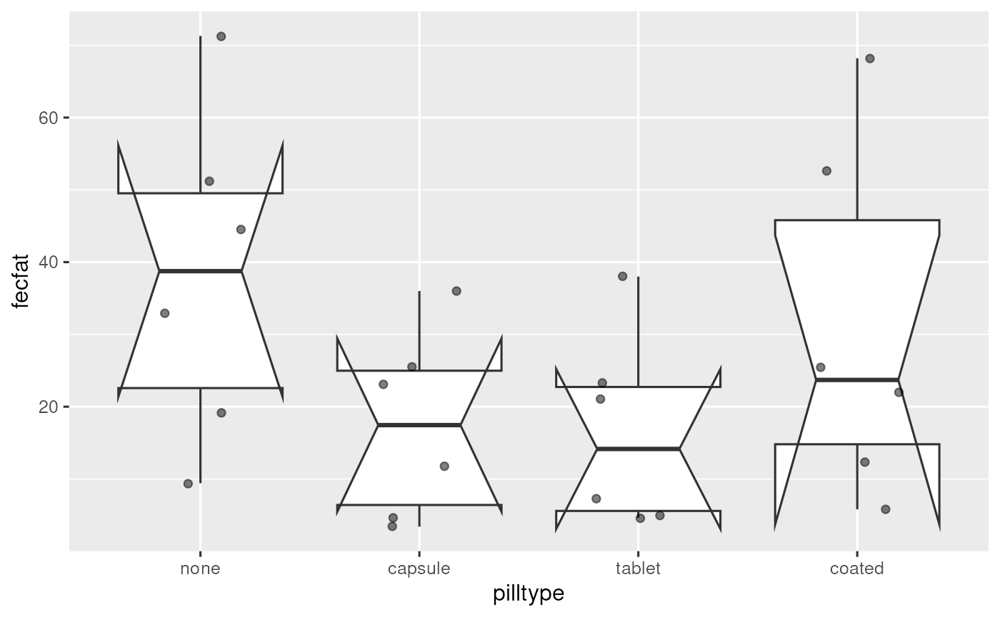
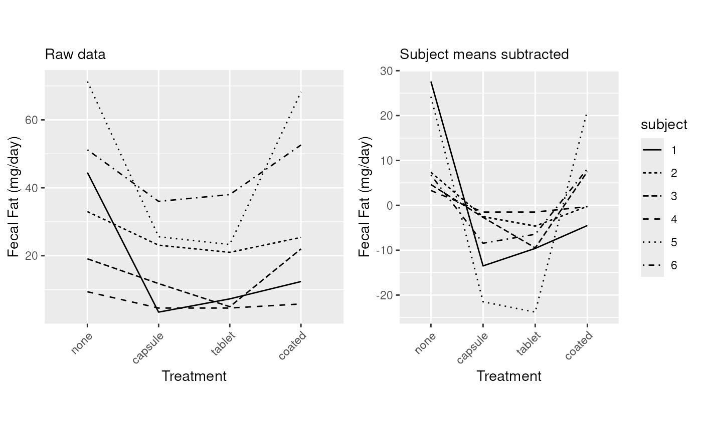
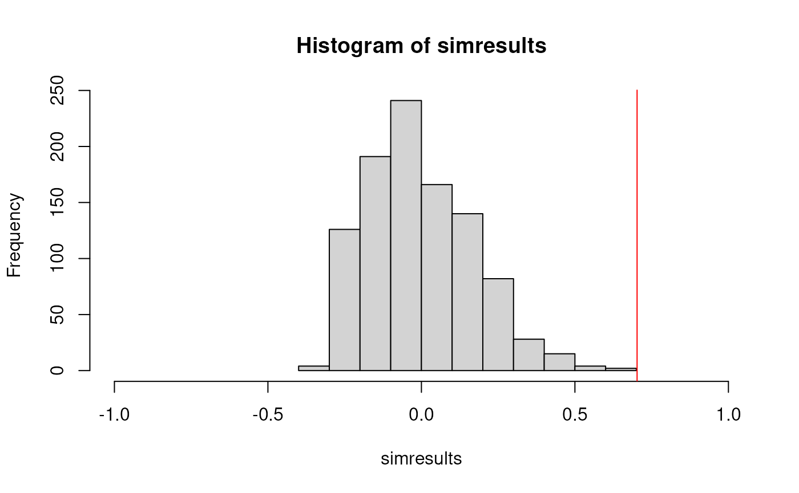

# Session 9 lab exercises: Repeated Measures and Longitudinal Analysis I

**Learning objectives**

1.  Create and interpret a notched barplot
2.  Create spaghetti / line plots for grouped data
3.  Use `pivot_wider` to create a wide-format dataframe
4.  Do a manual ICC calculation
5.  Write a function
6.  Perform a permutation simulation

**Exercises**

## Read the fecal fat dataset and convert pilltype and subject to factors

[`library`](https://rdrr.io/r/base/library.html)`(`[`readr`](https://readr.tidyverse.org)`)`` `[`library`](https://rdrr.io/r/base/library.html)`(`[`dplyr`](https://dplyr.tidyverse.org)`)`` ``dat`` ``<-`` `[`read_csv`](https://readr.tidyverse.org/reference/read_delim.html)`(``"fecfat.csv"``)`` `[`%>%`](https://magrittr.tidyverse.org/reference/pipe.html)` `` `[`mutate`](https://dplyr.tidyverse.org/reference/mutate.html)`(``pilltype ``=`` `[`factor`](https://rdrr.io/r/base/factor.html)`(``pilltype``, levels``=`[`c`](https://rdrr.io/r/base/c.html)`(``"none"``, ``"capsule"``, ``"tablet"``, ``"coated"``)``)``)`` `[`%>%`](https://magrittr.tidyverse.org/reference/pipe.html)` `` `[`mutate`](https://dplyr.tidyverse.org/reference/mutate.html)`(``subject ``=`` `[`factor`](https://rdrr.io/r/base/factor.html)`(``subject``)``)`

## Create a notched boxplot of the data.

[`library`](https://rdrr.io/r/base/library.html)`(`[`ggplot2`](https://ggplot2.tidyverse.org)`)`` `[`ggplot`](https://ggplot2.tidyverse.org/reference/ggplot.html)`(``dat``, `[`aes`](https://ggplot2.tidyverse.org/reference/aes.html)`(``x ``=`` ``pilltype``, y ``=`` ``fecfat``)``)`` ``+`` `` `[`geom_boxplot`](https://ggplot2.tidyverse.org/reference/geom_boxplot.html)`(``notch ``=`` ``TRUE``, outlier.shape ``=`` ``NA``)`` ``+`` `` `[`geom_jitter`](https://ggplot2.tidyverse.org/reference/geom_jitter.html)`(``width ``=`` ``0.2``, alpha ``=`` ``0.5``)`` ``+`` `` `[`theme_grey`](https://ggplot2.tidyverse.org/reference/ggtheme.html)`(``base_size ``=`` ``12``)`` ``+`` `` `[`theme`](https://ggplot2.tidyverse.org/reference/theme.html)`(``legend.position ``=`` ``"none"``)`

    ## Notch went outside hinges
    ## ℹ Do you want `notch = FALSE`?
    ## Notch went outside hinges
    ## ℹ Do you want `notch = FALSE`?
    ## Notch went outside hinges
    ## ℹ Do you want `notch = FALSE`?
    ## Notch went outside hinges
    ## ℹ Do you want `notch = FALSE`?

## Interpret the notches. What is wrong with the usual interpretation in this example?

If the observations are independent (ie assumptions of a one-way AOV are
met), notches can be used to visually perform a pairwise hypothesis test
for difference of medians.

It’s wrong here because these are grouped / hierarchical data, and
observations are not independent.

## Subtract subject means from the fecal fat data, manually and using residuals of a one-way AOV

`dat`` ``<-`` ``dat`` `[`%>%`](https://magrittr.tidyverse.org/reference/pipe.html)` `[`group_by`](https://dplyr.tidyverse.org/reference/group_by.html)`(``subject``)`` `[`%>%`](https://magrittr.tidyverse.org/reference/pipe.html)` `` `` `[`mutate`](https://dplyr.tidyverse.org/reference/mutate.html)`(``fecfatminusmean ``=`` ``fecfat`` ``-`` `[`mean`](https://rdrr.io/r/base/mean.html)`(``fecfat``)``)`` `[`%>%`](https://magrittr.tidyverse.org/reference/pipe.html)` `` `[`ungroup`](https://dplyr.tidyverse.org/reference/group_by.html)`(``)`` `[`%>%`](https://magrittr.tidyverse.org/reference/pipe.html)` `` `[`mutate`](https://dplyr.tidyverse.org/reference/mutate.html)`(``fecfatminusmean2 ``=`` `[`residuals`](https://rdrr.io/r/stats/residuals.html)`(`[`lm`](https://rdrr.io/r/stats/lm.html)`(``fecfat`` ``~`` ``subject``, data ``=`` ``.``)``)``)`

## Make line plots for each subject, with and without subject mean centering

`p1`` ``<-`` `[`ggplot`](https://ggplot2.tidyverse.org/reference/ggplot.html)`(``dat``, `[`aes`](https://ggplot2.tidyverse.org/reference/aes.html)`(``x ``=`` ``pilltype``, y ``=`` ``fecfat``, group ``=`` ``subject``, lty ``=`` ``subject``)``)`` ``+`` `` `[`geom_line`](https://ggplot2.tidyverse.org/reference/geom_path.html)`(``)`` ``+`` `` `[`labs`](https://ggplot2.tidyverse.org/reference/labs.html)`(``subtitle ``=`` ``"Raw data"``)`` ``+`` `` `[`theme`](https://ggplot2.tidyverse.org/reference/theme.html)`(``axis.text.x ``=`` `[`element_text`](https://ggplot2.tidyverse.org/reference/element.html)`(``angle ``=`` ``45``, vjust ``=`` ``1``, hjust``=``1``)``)`` ``+`` `` `[`xlab`](https://ggplot2.tidyverse.org/reference/labs.html)`(``"Treatment"``)`` ``+`` `[`ylab`](https://ggplot2.tidyverse.org/reference/labs.html)`(``"Fecal Fat (mg/day)"``)`` ``+`` `` `[`theme`](https://ggplot2.tidyverse.org/reference/theme.html)`(``legend.position ``=`` ``"none"``)`` ``p2`` ``<-`` `[`ggplot`](https://ggplot2.tidyverse.org/reference/ggplot.html)`(``dat``, `[`aes`](https://ggplot2.tidyverse.org/reference/aes.html)`(``x ``=`` ``pilltype``, y ``=`` ``fecfatminusmean``, group ``=`` ``subject``, lty ``=`` ``subject``)``)`` ``+`` `` `[`geom_line`](https://ggplot2.tidyverse.org/reference/geom_path.html)`(``)`` ``+`` `` `[`labs`](https://ggplot2.tidyverse.org/reference/labs.html)`(``subtitle ``=`` ``"Subject means subtracted"``)`` ``+`` `` `[`theme`](https://ggplot2.tidyverse.org/reference/theme.html)`(``axis.text.x ``=`` `[`element_text`](https://ggplot2.tidyverse.org/reference/element.html)`(``angle ``=`` ``45``, vjust ``=`` ``1``, hjust``=``1``)``)`` ``+`` `` `[`xlab`](https://ggplot2.tidyverse.org/reference/labs.html)`(``"Treatment"``)`` ``+`` `[`ylab`](https://ggplot2.tidyverse.org/reference/labs.html)`(``"Fecal Fat (mg/day)"``)`` `[`library`](https://rdrr.io/r/base/library.html)`(``gridExtra``)`

    ## 
    ## Attaching package: 'gridExtra'

    ## The following object is masked from 'package:dplyr':
    ## 
    ##     combine

[`grid.arrange`](https://rdrr.io/pkg/gridExtra/man/arrangeGrob.html)`(``p1``, ``p2``, ncol``=``2``, respect``=``TRUE``)`

## Convert to a wide-format dataset and remove the subject column

[`library`](https://rdrr.io/r/base/library.html)`(`[`tidyr`](https://tidyr.tidyverse.org)`)`` ``dat`` `[`%>%`](https://magrittr.tidyverse.org/reference/pipe.html)` `` `[`select`](https://dplyr.tidyverse.org/reference/select.html)`(``-`[`starts_with`](https://tidyselect.r-lib.org/reference/starts_with.html)`(``"fecfatminus"``)``)`` `[`%>%`](https://magrittr.tidyverse.org/reference/pipe.html)` `` `[`pivot_wider`](https://tidyr.tidyverse.org/reference/pivot_wider.html)`(``names_from ``=``pilltype``, values_from ``=`` ``fecfat``)`` `[`%>%`](https://magrittr.tidyverse.org/reference/pipe.html)` `` `[`select`](https://dplyr.tidyverse.org/reference/select.html)`(``-``subject``)`

    ## # A tibble: 6 × 4
    ##    none tablet capsule coated
    ##   <dbl>  <dbl>   <dbl>  <dbl>
    ## 1 44.5    7.30    3.40  12.4 
    ## 2 33     21      23.1   25.4 
    ## 3 19.1    5      11.8   22   
    ## 4  9.40   4.60    4.60   5.80
    ## 5 71.3   23.3    25.6   68.2 
    ## 6 51.2   38      36     52.6

## Write a function to calculate subject and residual variance and ICC of this dataset as a vector

`ICCfun`` ``<-`` ``function``(``x``)`` ``{`` `` ``fit2way`` ``<-`` `[`lm`](https://rdrr.io/r/stats/lm.html)`(``fecfat`` ``~`` ``subject`` ``+`` ``pilltype``, data ``=`` ``x``)`` `` ``subjvar_uncorrected`` ``<-`` ``x`` `[`%>%`](https://magrittr.tidyverse.org/reference/pipe.html)` `[`group_by`](https://dplyr.tidyverse.org/reference/group_by.html)`(``subject``)`` `[`%>%`](https://magrittr.tidyverse.org/reference/pipe.html)` `` `[`summarize`](https://dplyr.tidyverse.org/reference/summarise.html)`(``MEAN ``=`` `[`mean`](https://rdrr.io/r/base/mean.html)`(``fecfat``)``, .groups ``=`` ``"drop"``)`` `[`%>%`](https://magrittr.tidyverse.org/reference/pipe.html)` `` `[`pull`](https://dplyr.tidyverse.org/reference/pull.html)`(``MEAN``)`` `[`%>%`](https://magrittr.tidyverse.org/reference/pipe.html)` `` `[`var`](https://rdrr.io/r/stats/cor.html)`(``)`` `` ``correction`` ``<-`` `[`sum`](https://rdrr.io/r/base/sum.html)`(`[`residuals`](https://rdrr.io/r/stats/residuals.html)`(``fit2way``)`` ``^`` ``2``)`` ``/`` ``15`` ``/`` ``4`` `` ``subjvar`` ``<-`` ``subjvar_uncorrected`` ``-`` ``correction`` `` ``residualvar`` ``<-`` `[`sum`](https://rdrr.io/r/base/sum.html)`(`[`residuals`](https://rdrr.io/r/stats/residuals.html)`(``fit2way``)`` ``^`` ``2``)`` ``/`` ``15`` `` ``ICC`` ``<-`` ``subjvar`` ``/`` ``(``subjvar`` ``+`` ``residualvar``)`` `` ``output`` ``<-`` `[`c`](https://rdrr.io/r/base/c.html)`(``subjvar``, ``residualvar``, ``ICC``)`` `` `[`names`](https://rdrr.io/r/base/names.html)`(``output``)`` ``<-`` `[`c`](https://rdrr.io/r/base/c.html)`(``"subjectvar"``, ``"residualvar"``, ``"ICC"``)`` `` `[`return`](https://rdrr.io/r/base/function.html)`(``output``)`` ``}`` ``ICCfun``(``dat``)`

    ##  subjectvar residualvar         ICC 
    ## 252.6692760 106.9988878   0.7025066

## Create a simulated dataset where subjects are randomized for each treatment

[`set.seed`](https://rdrr.io/r/base/Random.html)`(``1``)`` ``datrand`` ``<-`` ``dat`` `[`%>%`](https://magrittr.tidyverse.org/reference/pipe.html)` `` `` `[`group_by`](https://dplyr.tidyverse.org/reference/group_by.html)`(``pilltype``)`` `[`%>%`](https://magrittr.tidyverse.org/reference/pipe.html)` `` `[`mutate`](https://dplyr.tidyverse.org/reference/mutate.html)`(``subject ``=`` `[`sample`](https://rdrr.io/r/base/sample.html)`(``subject``)``)`` `[`%>%`](https://magrittr.tidyverse.org/reference/pipe.html)` `` `[`arrange`](https://dplyr.tidyverse.org/reference/arrange.html)`(``subject``)`

## compare ICC for your original and simulated dataset

`ICCfun``(``dat``)`

    ##  subjectvar residualvar         ICC 
    ## 252.6692760 106.9988878   0.7025066

`ICCfun``(``datrand``)`

    ##  subjectvar residualvar         ICC 
    ##  62.8746156 296.7935482   0.1748128

## Repeat the simulation 999 times, and compare to your original dataset

`simulateData`` ``<-`` ``function``(``x``)``{`` `` ``x`` `[`%>%`](https://magrittr.tidyverse.org/reference/pipe.html)` `` `[`group_by`](https://dplyr.tidyverse.org/reference/group_by.html)`(``pilltype``)`` `[`%>%`](https://magrittr.tidyverse.org/reference/pipe.html)` `` `[`mutate`](https://dplyr.tidyverse.org/reference/mutate.html)`(``subject ``=`` `[`sample`](https://rdrr.io/r/base/sample.html)`(``subject``)``)`` `[`%>%`](https://magrittr.tidyverse.org/reference/pipe.html)` `` `[`arrange`](https://dplyr.tidyverse.org/reference/arrange.html)`(``subject``)`` ``}`

[`set.seed`](https://rdrr.io/r/base/Random.html)`(``1``)`` ``simresults`` ``<-`` `[`replicate`](https://rdrr.io/r/base/lapply.html)`(``n``=``999``, ``ICCfun``(``simulateData``(``dat``)``)``[``3``]``)`

[`hist`](https://rdrr.io/r/graphics/hist.html)`(``simresults``, xlim ``=`` `[`c`](https://rdrr.io/r/base/c.html)`(``-``1``, ``1``)``)`` `[`abline`](https://rdrr.io/r/graphics/abline.html)`(``v ``=`` ``ICCfun``(``dat``)``, col ``=`` ``"red"``)`

[`sum`](https://rdrr.io/r/base/sum.html)`(``simresults`` ``>`` ``ICCfun``(``dat``)``)`

    ## [1] 0
