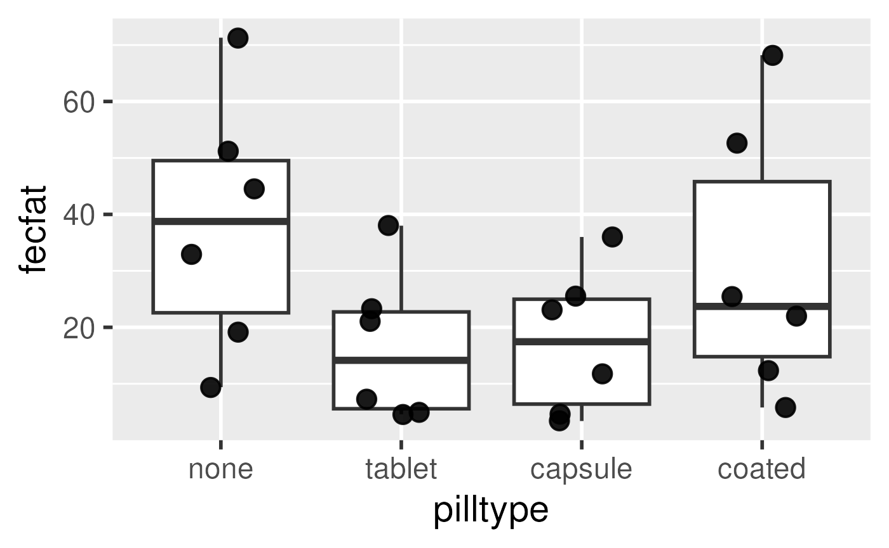
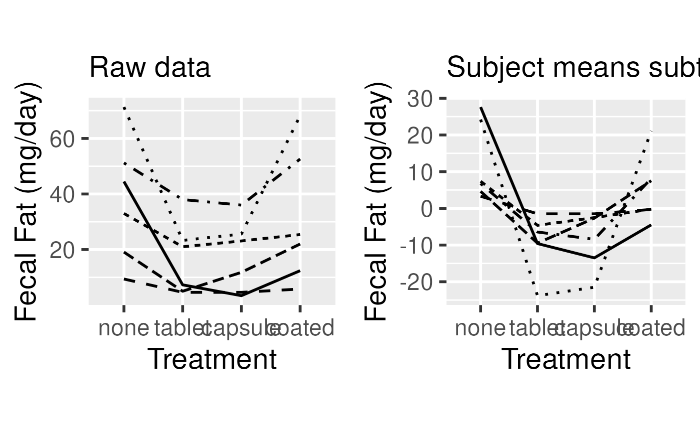

# Session 9: Repeated Measures and Longitudinal Analysis I

## Learning objectives and outline

### Learning objectives

Learning objectives:

1.  Identify and define hierarchical and longitudinal data
2.  Analyze correlated data using Analysis of Variance
3.  Define and calculate Intraclass Correlation
4.  Identify and define random and fixed effects

Textbook sections:

- Vittinghoff sections 7.1 (7.2-7.3 next class)

### Outline

1.  Introduction to hierarchical and longitudinal data
2.  Fecal Fat example
3.  Correlations within subjects (ICC)
4.  Random and fixed effects

## Intro: hierarchical and longitudinal data

### What are hierarchical and longitudinal data?

- Knee radiographs are taken yearly in order to understand the onset of
  osteoarthritis
- An indicator of heart damage is measured at 1, 3, and 6 days following
  a brain hemorrhage.
- Groups of patients in a urinary incontinence trial are assembled from
  different treatment centers
- Susceptibility to tuberculosis is measured in family members
- A study of the choice of type of surgery to treat a brain aneurysm
  either by clipping the base of the aneurysm or implanting a small
  coil. The study is conducted by measuring the type of surgery a
  patient receives from a number of surgeons at a number of different
  institutions.

### What is the distinction between hierarchical and longitudinal data?

- Longitudinal data are repeated measures over time
- Longitudinal data are a type of hierarchical data
  - repeated measures are correlated, and nested within the
    observational unit (individual)
- Other non-longitudinal data can also be hierarchical

*Definition*: Hierarchical data are data (responses or predictors)
collected from or specific to different levels within a study.

### Important features of this type of data

1.  The outcomes are correlated across observations
2.  The predictor variables can be associated with different levels of a
    hierarchy. *e.g.* we might be interested in:
    - the volume of operations at the hospital,
    - whether it is a for-profit or not-for-profit hospital,
    - years of experience of the surgeon or where surgeons were trained,
    - how the choice of surgery type depends on the age and gender of
      the patient.

## Fecal Fat example

### A Repeated Measures Example

- Lack of digestive enzymes in the intestine can cause bowel absorption
  problems.
  - This will be indicated by excess fat in the feces.
  - Pancreatic enzyme supplements can alleviate the problem.
  - fecfat.csv: a study of fecal fat quantity (g/day) for individuals
    given each of a placebo and 3 types of pills

Fecal Fat dataset

### Option 1: non-hierarchical analysis (wrong)

### Option 1: non-hierarchical analysis (wrong)

`fit1way`` ``<-`` `[`lm`](https://rdrr.io/r/stats/lm.html)`(``fecfat`` ``~`` ``pilltype``, data``=``dat``)`

|           |  Df |  Sum Sq | Mean Sq | F value | Pr(\>F) |
|-----------|----:|--------:|--------:|--------:|--------:|
| pilltype  |   3 | 2008.60 |  669.53 |    1.86 |  0.1687 |
| Residuals |  20 | 7193.36 |  359.67 |         |         |

One-way analysis of variance table for fecal fat dataset {.table
border="1"}

- Does not account for similarity of measurements within individual
- Would be correct if each treatment were given to a different
  individual

### Option 2: 2-way AOV

- Accounts for individual differences in mean fecal fat
- Fits a coefficient for mean fecal fat per individual
- Getting closer

&nbsp;

    ## Warning: Using `size` aesthetic for lines was deprecated in ggplot2 3.4.0.
    ## ℹ Please use `linewidth` instead.
    ## This warning is displayed once per session.
    ## Call `lifecycle::last_lifecycle_warnings()` to see where this warning was
    ## generated.

### Option 2: 2-way AOV

`fit1way`` ``<-`` `[`lm`](https://rdrr.io/r/stats/lm.html)`(``fecfat`` ``~`` ``pilltype``, data``=``dat``)`

|           |  Df |  Sum Sq | Mean Sq | F value | Pr(\>F) |
|-----------|----:|--------:|--------:|--------:|--------:|
| pilltype  |   3 | 2008.60 |  669.53 |    1.86 |  0.1687 |
| Residuals |  20 | 7193.36 |  359.67 |         |         |

One-way analysis of variance table for fecal fat dataset {.table
border="1"}

`fit2way`` ``<-`` `[`lm`](https://rdrr.io/r/stats/lm.html)`(``fecfat`` ``~`` ``subject`` ``+`` ``pilltype``, data``=``dat``)`

Two-way analysis of variance table. Note the similarity of the pilltype
row.
